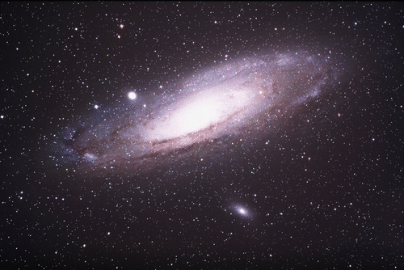
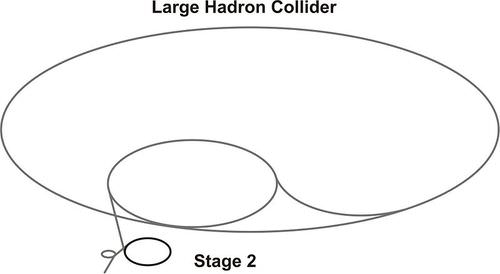
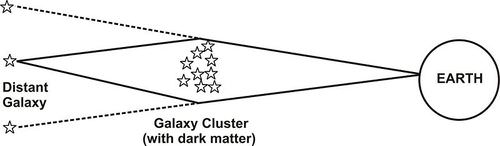
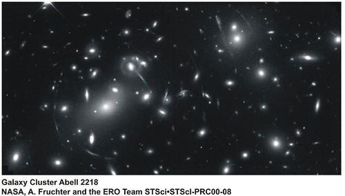
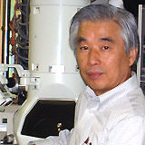
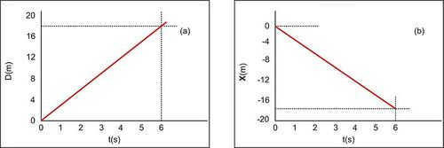
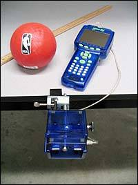
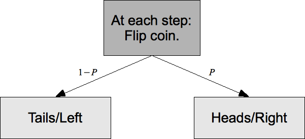

<!--
author:   CK-12

email:    LiaScript@web.de

version:  0.0.1

language: en

narrator: US English Female

comment:  The CK-12 21st Century Physics FlexBook® textbook is a collaborative effort of the Secretaries of Education and Technology and the Department of Education that seeks to elevate the quality of physics instruction across the Commonwealth of Virginia.

logo:     ../cover.jpg

tags:      science, Physics

-->

# CK-12 21st Century Physics - A Compilation of Contemporary and Emerging Technologies

> This document was automatically translated to LiaScript from
>
> https://www.ck12.org/book/ck-12-21st-century-physics-a-compilation-of-contemporary-and-emerging-technologies/

## 1.0 State of Virginia Introduction

<article>

</article>

### 1.1 Background and Overview of Goals

<article>

**Welcome to Virginia's** **_21st Century Physics: A Compilation of Contemporary and Emerging Technologies,_** **a result of Virginia’s FlexBook® Pilot Project.**

**This project was motivated by the confluence of two independent desires and capabilities:**

* The recommendations of a 2007 Standards of Learning (SOL) review panel of practicing scientists and engineers that VA SOL should include contemporary and emerging science content as well as laboratory activities that incorporate industry state-of-the-practice equipment; and that Virginia should support an open-source software platform, such as a Wiki, for the timely publication of teacher-developed curriculum.

* The mission of the CK-12 Foundation to provide a collaborative online authoring environment that enables the production of free and open content aligned to curriculum standards and customizable for each student.

**This particular pilot aims at several outcomes:**

* Supplementing currently used Virginia physics textbooks by making valuable contemporary and emerging physics ideas available to all teachers at a single URL.

* Making laboratory activities that employ industry state-of-the-practice equipment available to all teachers.

* Providing a path for continuous improvement from teachers themselves through comments and new ideas after using a chapter with their physics classes.

**This pilot FlexBook® project seeks many other outcomes:**

* Can working teachers provide useful contemporary, emerging, and laboratory curriculum content in addition to their normal teaching duties?
* What intellectual property (IP) issues may be barriers to or facilitators of open-source content?
* Is the CK-12 FlexBook® system a good open-content platform for Virginia’s purposes?
* What additional features would make the CK-12 FlexBook® platform even more useful to Virginia?
* What quality assurance process is required to make appropriate content available to all teachers and students?
* Is a book of many chapters by many authors in many voices readable and comprehensible by most students?
* Does this FlexBook® resource provide valuable contemporary and emerging physics content that supplements current physics SOL?
* Is the content readily available to ALL of Virginia’s physics teachers at a single Web-based source?
* Can we provide timely and valuable feedback to CK-12 that will help them continually improve their FlexBook® system for teachers’ use?
* Can we provide suggestions from Virginia’s teachers and students to CK-12 regarding Web 2.0 needs?
* Can we supply Virginia’s education policy-makers with concrete examples of the 2007 physics panel’s recommendations to help inform their 2010 review of Virginia physics SOL?
* Does this project give us a sense of the qualitative value of e-formats replacing some textbook purchases?
* Can we determine whether to extend this type of project to the instruction side of the DOE and to other disciplines?

</article>

### 1.2 Pilot Outcomes Expanded

<article>

**Making contemporary and emerging physics ideas available to all teachers in Virginia**

The 2007 SOL review panel was composed of practicing scientists and engineers drawn from universities, government laboratories, and the technology industry across the Commonwealth of Virginia. They found that current Virginia chemistry and physics SOL are more representative of the mid-20th century than the beginning of the 21st century. For example, in the area of nuclear physics, essential knowledge and understanding is limited to protons and neutrons without mention of quarks and gluons. There is no mention of LED, LCD, or plasmas, but cathode ray tubes are explicitly recognized. Organic chemistry is left out of Virginia’s high school chemistry SOL and nanoscience or nanotechnology receives not a mention. The panel recommended that a number of existing content areas be excised and contemporary and emerging content be added.

The panel saw evidence of the K-12 world being isolated from the contemporary world of work and research and was made anecdotally aware of teachers with less than minimal qualifications in coursework background. The resulting conclusion was that a reliable, timely, and easily available content source must be provided for all teachers. Because of delays involved with getting new material identified, published, and approved through traditional textbooks, the panels recommended that the Department of Education support an open-collaborative software “Wiki.” The Wiki would be open to all physics and chemistry teachers to post curriculum they developed and taught. It would focus particularly on contemporary and emerging content. After teaching a lesson, the teacher could add notes or suggestions on the Wiki, thus continuously improving its content. This would also enable a virtual learning community of K-12 teachers from throughout the Commonwealth.

**Making laboratory activities that employ industry state-of-the-practice equipment available to all teachers**

The scientists and engineers on the SOL review panels recognized that hands-on experiments and laboratories are the glue that connects science theory to real-world phenomena. They recommended that at least 20 percent of a course be devoted to laboratories or demonstrations and that students use the same state-of-the-practice equipment that they would soon find in the technology workplace and college.

**The FlexBook® laboratory chapters are addressed to three audiences:**

* Teachers who have little or no experience with labs
* Teachers who teach labs but may be using obsolete equipment and technology
* Teachers who would like to use the FlexBook® labs as a jumping-off point in developing their own labs

For the first group of teachers, some of whom have limited experience and proficiency in lab science in general or physics labs in particular, the FlexBook® write-ups should provide equipment lists and cookbook instruction. This will at least provide for some hands-on work with state-of-the-practice technology.

The second group of teachers will be introduced to new equipment manufacturers and taught how to incorporate state-of-the-practice technology into engaging physics laboratories.

The third group of teachers may find some of the equipment and its capabilities to be new and can use this information to develop their own labs with more advanced technology.

</article>

### 1.3 Quality Control

<article>

**Version 0.9:** All chapters in Release 0.9 underwent three levels of review:

* A technical review by a university research physicist
* Peer review by three other authors
* Review by several students including three 10th grade high school students and a college freshman (non-science major)

**Version 1.0:** All chapters in Release 1.0 underwent one additional level of review via the public feedback we received from our open mailing list.

All content is configuration controlled. While it can be copied and edited by users on the CK-12 FlexBook Platform®, the original FlexBook® content cannot be changed by readers. The chapters will be updated from time to time based on the authors’ experiences and comments from readers and users. These updates will be noted by their release numbers.

</article>

### 1.4 The Future

<article>

_21st Century Physics: A Compilation of Contemporary and Emerging Technologies_ provides a starting point for continuous improvement from teachers themselves through comments and new ideas following use of a chapter with their physics classes.

We live in a very dynamic world of discovery, technology development, and ideation in physics. Hardcopy books cannot engage in conversations regarding today’s or even recent physics developments. The Web, however, does provide a medium for such conversations. The FlexBook® textbook proposes several approaches to teaching labs and 21st century content. The chapters are configuration controlled in that users cannot edit them. However, we look to the day when users of chapters can comment directly in the FlexBook® resource on what they saw as strengths and weaknesses of the chapter, how they changed the chapter to better suit their needs, and make recommendations on improving the chapter. This could lead to stranded conversations with the author and with other users, and contribute to an even better chapter in the next FlexBook® release.

</article>

### 1.5 Organization of this FlexBook® Textbook

<article>

There are 11 chapters in Release 1.0. The first eight deal with contemporary topics of theory and applications including gravitation, nuclear and particle physics, nanoscience, and 21st century technologies used for medical imaging and visual display. The final three chapters focus on laboratory work employing state-of-the-practice equipment and the rapidly developing field of modeling and simulation.

The reader will find that, unlike traditional textbooks of the last century, the chapters of this book read more like a collection of diverse essays, as all are written by different authors, and each reflect an individual’s unique voice. This style has become the norm in a world where students increasingly access data from the World Wide Web and pull together the pieces that they feel tell them a proper story. We offer this book as a starting point for a proper 21st century story of physics and hope that today’s students find it useful.

</article>

### 1.6 FlexBook® Chapter Synopses

<article>

**Toward Understanding Gravitation** by Andrew Jackson, Harrisonburg City Schools. This chapter addresses our changing understanding of gravitation and in doing so, introduces the student to a few interesting areas of astronomy and cosmology including dark matter and dark energy. It should be an appropriate extension to a study of Newton’s universal law of gravitation, but deals with gravitation from a purely conceptual approach. The appropriate high school level mathematical treatment would pertain to Newton’s universal law of gravitation and it is assumed that students will study this from traditional text or with their teachers. The chapter is set up in a dialogue style that has a wonderful heritage in physics going back to Galileo’s _Dialogue Concerning the Two Chief World Systems_, published in 1632.

**Nuclear Energy** by David Stern, Greenbelt, Maryland, is a short non-mathematical course introducing high school physics students and interested non-scientists to the physics of the atomic nucleus and to phenomena associated with nuclear fission. The commercial release of nuclear energy is discussed, including problems of controlling the reactor and the waste it produces.

**The Standard Model** by Michael Fetsko, Henrico County Schools. The first part of this chapter helps explain a couple of the remaining fundamental questions of physics: What are the building blocks of matter and what are the forces that hold these particles together? The current theory involves six quarks, six leptons, and four force carriers. All of these particles are organized into a table called the Standard Model of Particle Physics. Is the Standard Model complete or are there changes coming in the future?

**Beyond the Standard Model** by Tony Wayne, Albemarle County Schools. This chapter explains a number of current experiments in particle physics, the large particle colliders, and other equipment and instrumentation used in attempts to tease data that validates or rejects several emerging theories on the fundamental building blocks of matter.

**Modern Physics** by Angela Cutshaw, Newport News City Schools. This chapter has been cast into a series of 11 major questions in an effort to lead the student through an understanding of how modern physics came about, some of its components, some of the still lingering problems in its theories, and some of its implications. Examples of some of the questions are: What is quantum mechanics and why did it develop? What part of physics was not complete? What is relativity and why did it develop? What are quarks and what role do they play inside the atom?

**Nanoscience** by Tapas Kar, Utah State University. Nanoscience is the discovery and study of novel phenomena at the molecular scale (between 10 and 100 nm) and the creation of new concepts to describe them. New discoveries in science have enabled us to create more application-oriented products, new devices and electronic gadgets. Nanotechnology is the fabrication, production and application of man-made devices and systems by controlled manipulation of size and shape at that small scale.

**Biophysics (Medical Imaging)** by David Slykhuis, James Madison University; Mark Mattson, James Madison University; and Tom O’Neill, Shenandoah Valley Governor’s School. Today we have access to incredibly advanced non-invasive imaging technology for the analysis of our health. However, to most students, methods such as $x-$rays, MRI, and ultrasound are just black boxes that give the doctor a “magic” result. This chapter addresses these three major medical imaging technologies and their foundations in physics. Ultrasound is available in the first FlexBook® release (v 1.0), followed by sections on MRI and $x-$ray in later releases.

**Kinematics** by John Ochab, J. Sargeant Reynolds Community College. Understanding how things move is fundamental to our understanding of the physical universe. Critical to this understanding is the ability to portray motion in a manner that is clear, accurate, precise, efficient, and reproducible. In the first part of the chapter, “Motion and How to Describe It,” we identify the terms used to characterize motion and illustrate the graphical methods used to represent motion visually. In the second part of the chapter, we study the work done by one or more forces on one or more bodies, determine the types of energy involved, and draw connections between the work done on the bodies and the energy changes in the bodies. Information is presented in tutorial format and includes an introduction to using motion sensors with a computer.

**Laboratory Activities** by Bruce Davidson, Newport News City Schools. This chapter presents $15$ physics experiments that utilize $21$st century technology to conduct investigations that can be used in the high school classroom. The PASCO Xplorer GLX handheld interface is highlighted with downloadable labs on linear motion, Newton’s laws of motion, friction, momentum, conservation of energy, kinetic energy, energy transfer, and sound waves.

**Modeling and Simulation** by Mark Clemente, Virginia Beach City Schools/National Institute of Aerospace. Modeling and simulation have been used for design, test, evaluation, and training in the industry for several decades. With the advances in technology and computer capabilities in recent years, modeling and simulation are now tools for instruction that are accessible to most classroom teachers. This chapter presents several examples of how physics content can be taught using modeling and simulation.

**Modeling and Simulating NASA's Launch Abort System** by Randall Caton, Bigfork, Minnesota. Complex systems abound in our world and it is valuable to model and simulate them to better understand how they work and improve their design. Student learners will modify a model based on Newton's Laws and simplifying assumptions that can be applied in a computer environment (Etoys) to simulate the motion of NASA’s Launch Abort System. The concepts of position, velocity, acceleration, force, and mass are introduced in the context of Newton's Laws. Students will learn by doing by starting with a simple model using constant acceleration and modify the model to simulate air drag, the varying force of gravity, the "real rocket", the 2 dimensional case and a two-stage rocket.

</article>

### 1.7 About the Authors

<article>

**Mark Clemente: Author, Virginia Beach City Schools/National Institute of Aerospace, Virginia**

Mark Clemente received his undergraduate degree in chemistry from the University of Pennsylvania in 1986 and his master's degree in education from Old Dominion University in 1996. He is a National Board of Professional Teaching Standards Certified Teacher and is currently an Educator-in-Residence at the National Institute of Aerospace (NIA), “on loan” from Virginia Beach City Public Schools. Mark has 11 years of experience teaching chemistry in Virginia Beach. During that time, he has written and reviewed science curriculum, served as a Science Department Chair at his school, conducted many professional development workshops for teachers in the school district, and served as an adjunct instructor for Virginia Wesleyan College’s School of Education. As an Educator-in-Residence, Mark is currently coordinating a modeling and simulation demonstration school project. The purpose of this project is to use modeling and simulation as an instructional strategy within mathematics and science instruction and to demonstrate ways to integrate mathematics and science instruction through the use of models and simulations.

**Bruce Davidson: Author, Newport News, Virginia**

Bruce Davidson has an MS in physical science education from Old Dominion University. A retired physics and biology teacher, he is currently working part-time for Newport News Public Schools in Newport News, Virginia. He currently works with new as well as experienced science teachers integrating technology and the hands-on experience into classroom instruction. He also provides professional development to science teachers using handheld data collectors to enhance students’ experimental experience. Outside of the classroom you will find him kayaking, biking and hiking. He currently lives with his wife and son (17 years) in Newport News, VA.

**Michael Fetsko: Author, Henrico County Schools, Virginia**

Mike Fetsko is currently a physics teacher at Godwin High School in Richmond, Virginia. He received his BS in multiple science from LeMoyne College and an MST in physics from the State University of New York at Plattsburgh. He has been teaching all levels of high school physics since 1993 and he is always looking at ways to incorporate innovative ideas and content into his curriculum.

**Andrew Jackson: Author, Harrisonburg City Schools, Virginia**

Andy Jackson teaches physics and astronomy at Harrisonburg High School in Harrisonburg, Virginia. He teaches half-time, is the K-12 science coordinator for Harrisonburg City Public Schools, and part-time physics lab instructor at James Madison University. Andy received his BS in physics from JMU in 1987 and has been teaching various levels of physics since. Andy has been an active member of the Virginia Instructors of Physics since its inception and served as president from 1998–2006. He is a life member of the Virginia Association of Science Teachers (VAST) and has served VAST as Physics Chair, PDI Chair, and was President of VAST in 2008.

**Tapas Kar, PhD: Author, Utah State University, Utah**

Tapas Kar is an Assistant Professor with the Department of Chemistry and Biochemistry at Utah State University (USU). Prior to working at USU he taught and did research at Southern Illinois University Carbondale (SIUC). Tapas focuses his research and teaching in the area of nanoscience and nanotechnolgy. He introduced nanotechnology courses at USU and currently teaches nanochemistry courses.

**John S. Ochab, Jr., PhD: Author, J. Sargeant Reynolds Community College, Virginia**

John Ochab was born in a suburb of Boston, MA. He attended the University of Massachusetts (at Boston) and obtained a BA in Biology. He worked as a biochemiocal laboratory technician for 3 years (with journal aknowledgements) and as a toxicologist for one year. He then decided to go into physics. After taking courses in advanced mathematics and physics (at M.I.T. and at Boston University), he entered graduate school at Clark university, (Worcester, MA) where he obtained an MA in physics (nuclear solid state). He then entered the University of Maine (at Orono) were he obtained a PhD in experimental surface physics. Upon graduation, he worked in the industry for such companies as Spectra Physics, GTE Sylvania, as well as smaller companies. He also did research in high temperature superconducting thin films at Brookhaven National Laboratory in Long Island, NY.

Due to the financial crises of the late 1980s, he moved to California, where he trained process engineers in semiconductor metrology and taught physics part-time at local community colleges. John then moved to West Virginia and taught physics, physical and engineering physics, and after getting married, moved with his wife to Virginia. He has been teaching algebra and calculus-based physics at J. Sargeant Reynolds Community college ever since. He has first-author publications in _Journal of Surface Science_, and co-authored publications in the _Physical Review Letters_, _Journal of Applied Physics_, and _Physicsa C._ He is a member of the American Association of Physics Teachers, the Virginia Academy of Science, and was a long-standing member of the American Institute of Physics.

**Dr. David A. Slykhuis: Author, James Madison University, Virginia**

Dr. David Slykhuis is Chair of the Physics/Physical Science Academy. Dr. Slykhuis has been at James Madison University since the fall of 2004. His primary responsibilities lie in the preparation of science teachers in the middle and secondary education program. His research interest involves the use of technology in K-16 science classrooms to increase student achievement. Dr. Slykhuis received his PhD in science education from North Carolina State University in May of 2004. He has five years of high school classroom experience, teaching primarily chemistry and physics.

**David P. Stern: Author, Greenbelt, Maryland**

Dr. Stern received his MS in physics from the Hebrew University in Jerusalem, his doctorate from the Israel Institute of Technology, and retired after 40 years of research with NASA Goddard SFC on the Earth's magnetosphere. He has produced extensive education resources on the Web, including "From Stargazers to Starships." He has also written space-related history, poems and a middle-school mathematics enrichment text, _Math Squared_.

**Randall Caton: Author, Bigfork, Minnesota**

Randy Caton was born in Minnesota and went to the University of Minnesota, the University of Pennsylvania, and the City University of New York, where he received his doctorate in Physics. He has worked in experimental solid-state physics in the areas of electrical properties of solids, heat capacity, low temperature physics, dilute magnetic alloys, superconductive materials, rare-earth alloys, and metallic glasses. He has taught introductory and advanced physics courses and laboratories to classes ranging from 5 to 700 students for 30 years and has incorporated Peer Instruction and Just-In-Time-Teaching and other learning tools. He has directed several science education programs for teachers and students from 1986 to 2008. He is currently retired and lives in northern Minnesota. He has used Etoys (a free, open-source multimedia authoring environment) to develop web-based activities for NASA programs, physics courses and the chapter in this online book.

**Jim Batterson: Project Manager, Newport News, Virginia**

Jim Batterson taught high school physics and mathematics, worked as a scientific programmer for LTV Corporation, and, from 1980 until his retirement in 2008, was a research engineer at NASA Langley Research Center. At NASA he was responsible for flight research on the dynamics and control of aerospace vehicles, served as Head of the Dynamics and Control Branch, and later as Deputy Director for Strategic Development. He has also served on a number of community boards including the Newport News (Virginia) School Board and New Horizons Regional Education Center Board. While at NASA, he served on assignments to the Office of Science and Technology Policy, the National Nanotechnology Coordination Office, NASA Headquarters, and, most recently, to the Office of Virginia’s Secretary of Education.

</article>

## 2.0 Toward Understanding Gravitation.

<article>

Andrew Jackson. "Toward Understanding Gravitation", _21st Century Physics_.

</article>

### 2.1 Preface—A Note to the Teacher and Student Regarding Background Information and Pedagogy

<article>

Nearly every physics textbook has an adequate section regarding Newton’s universal gravitation, Cavendish’s work and an introduction of Kepler’s laws of planetary motion. Therefore, in this work I will not attempt to _teach_ those topics, but will assume that students have a basic understanding of the physics involved as it pertains to an understanding of gravity. Many textbooks do not contain a treatment on current understanding and development of the ideas regarding gravitation. Those that do often place this material as footnotes to a chapter or as chapters late in the text that a typical class may never cover. This chapter of the _21st Century Physics_ will attempt to address our changing understanding of gravitation and in doing so also introduce the student to a few interesting areas of astronomy and cosmology. This chapter should be an appropriate extension to a study of Newton’s universal law of gravitation. The presentation deals with gravitation from a purely conceptual approach. The appropriate high school level mathematical treatment would pertain to Newton’s universal law of gravitation and it is assumed that the students will study from traditional text or with their teachers.

The chapter is set up in dialogue style. This technique has a wonderful heritage in physics going back to Galileo’s _Dialogue Concerning the Two Chief World Systems_ published in 1632. **Bold Print** statements represent questions asked by a student with the appropriate answers following. It is my practice and suggestion that a treatment of universal gravitation in a high school physics class be approached in a historical manner starting with Aristotle and extending to as near the present understanding as possible.

</article>

### 2.2 Toward an Understanding of Gravitation (With a Few Interesting Side Trips)

<article>

What is Gravity?
----------------

If we begin our view of gravity from an Aristotelian view, you may find that it is not far from your own initial thoughts on gravity. Aristotle $(\sim 350 \;\mathrm{BCE})$ taught that the heavenly bodies moved in perfect circular orbits around the Earth. The more mundane things here on Earth tended to move toward their natural place. For some objects, like rocks and people, that natural place was to be drawn toward the center of the Earth. For other objects like fire, smoke, and steam that natural place was to the heavens.

It was quite a long time after Aristotle that the English language included the word **gravity** in the sense that you think of it in your science class. The Latin word _gravis_ means heavy, but it was not until the mid $1600s$ that the term **gravity** was used to describe a force that gives objects their weight. Here is a formal definition from the Online Etymology Dictionary, http://www.etymonline.com/index.php?search=gravity.

Common to Aristotle's and all earlier "theories" of the motion of heavenly bodies is the belief \[dogma\] that the Earth is at the center of the center of the universe and that they orbit in the perfect geometric form, namely a circle.

Aristotle’s description of how and why things fell or orbited was attacked often and by many. Many Arabic mathematicians and physicists tackled the issues in the middle ages, which lead to some of the same statements eventually made and published by Galileo and Newton. These ideas published by Newton and Galileo are the ideas you are likely to find in your physics text.

**So Aristotle had it wrong, but now we know the truth about gravity—right?**

Well, in a word—no. Physicists have answered many questions about gravity, but they have created many more questions, too.

What Do We Know About Gravity Now?
----------------------------------

The modern era of astronomy begins with Copernicus. The Aristotelian astronomy \[developed largely by Ptolemy\] had use a hierarchy of circles to accurately describe the motion of heavenly body. Copernicus found that the description is simplified if the sun is placed at the center and the Earth and the other planets revolve around it; in particular, it leads to a simple explanation of retrograde motion.

Kepler’s, Galileo’s, and Newton’s work with regard to gravity is well supported in your physics book, I am sure. This is the traditional material of introductory physics. I will just touch on a couple of important points to support ideas I wish to develop in this chapter. You will need to use other resources to pick up on the "traditional details" like solving mathematics-based physics problems. In this chapter, I hope to help you understand how our current knowledge about gravity has developed. I hope you will understand how ideas were built on top of one another, how questions got answered, and how new questions came to be while some old questions still remain. I hope you will also get a sense for how technology and data collection played a roll in answering and developing important questions about gravity.

**So, what we know about gravity starts with Kepler? What did he figure out?**

Johannes Kepler $(\sim 1600)$ was a gifted mathematician. Around 1600 he began working with one of the world’s most gifted astronomers, Tycho Brahe. It is important for you to know that at this time Kepler and his contemporary Galileo understood and believed Copernicus’ theory of a sun-centered solar system. Kepler applied his gifts of geometry to more than three decades of precision data regarding the position of Mars in the sky. By 1619 Kepler had published his three laws of planetary motion.

1.  All planets move in elliptical orbits with the Sun at one focus.
2.  A line connecting a planet to the Sun sweeps out equal areas of space in equal amounts of time.
3.  The period of a planet's orbit squared is directly proportional to the cube of its orbital radius.

It is so easy to state and learn these laws that it may lead you to think they were easy to figure out. If you would like to gain a little understanding of Kepler’s accomplishments you should look over the details of how he came to these three conclusions at http://www-groups.dcs.st-and.ac.uk/~history/Extras/Keplers_laws.html.

It is also very useful for you to have a good understanding of these laws and the nature of ellipses, so here is a little project for you to do.

Elliptical Homework
-------------------

Get a scrap piece of cardboard, two push-pins, a loop of string, and a pencil.

Push the two pins into the cardboard.

Place the loop of string on the cardboard with the two pins in the loop.

Use a pencil to pull the loop away from the pens to make the loop tight against the pencil and the two pins.

Move the pencil around in a circle (it’s an ellipse) keeping the loop tight as you draw.

The shape you have is an ellipse. The two pin holes are the two foci. Mark one as "Sun.” The drawn curve is the path of a planet around the Sun. See if you can sketch in the idea of Kepler’s Second Law of Planetary Motion.

The eccentricity of an elliptical orbit is found by measuring the two distances shown and dividing the difference between them by the larger. Therefore, the eccentricity of a circle is equal to zero.

The eccentricity for Mars is about $0.09$, which is much larger than Earth’s. What does that tell you about how elliptical the orbits of the planets are? Can you use a string, pin, and pencil to create an ellipse with $e = 0.09$?

If you make the loop of string a bit shorter and draw another ellipse it will represent the path of another planet. See if you can apply an understanding of Kepler’s third law of planetary motion to the two ellipses. This would be an excellent thing to talk through with another student or teacher once you have given it some thought on your own.

**OK—I drew a couple of ellipses and I think I understand Kepler’s laws of planetary motion. But if they are laws, he got it all figured out, right?**

It is so important to understand the scientific meaning of the words: _law_, _theory_, and _hypothesis_. Before we go on with more physics about gravity, let’s take an important aside.

An Important Aside
------------------

What is a scientific law? How does it differ from a hypothesis or a theory? How does a theory become a law? These are all great questions that you really need to be able to answer. The earlier in your science studies you understand these differences and relationships the better. A scientific hypothesis is not just a "best guess." It’s an idea of how something works or an explanation based on the evidence available. It is a statement limited to a specific situation and must be testable. In other words, it should be something that could be proven wrong.

A scientific law is a statement of fact that is believed to be always true, but offers no explanation. The law of inertia is a wonderful example. It is understood that objects at rest will stay at rest unless a force causes them to move. Scientists do not have an explanation for WHY objects cannot begin moving from a state of rest without a force acting on them, but such a thing has never been observed and we believe it to be universally true. Kepler’s laws of planetary motion fit the description of scientific laws well when they were initially stated. In the early $1600s$ we did not understand that the Sun and planets were exerting forces on each other through gravitation. Kepler put together decades of data and found that for the six known planets, all of them behaved as described by his three statements. His laws offer no explanation for WHY the planets behave this way, thus they are planetary laws. Newton’s universal law of gravitation fits this description as well. It does not tell us HOW two different masses exert forces on each other, it simply describes it and names it. The question “How does a theory become a law?” is a trick question. The answer is—it cannot! Scientific theories EXPLAIN things. A theory in science provides a big picture understanding and view that helps to explain many different phenomena. For example, the atomic theory says that matter is made of discrete units of matter that maintain their "identity" through physical and chemical change. This atomic theory is very useful in understanding chemical reactions and much more.

Therefore, in science, the theory of evolution is not less certain than the law of universal gravitation. They do very different jobs. The theory of evolution EXPLAINS HOW speciation occurs through natural selection and Newton’s law of universal gravitation states what we observe without explanation. We are still in search of a THEORY of gravitation. There are a few promising hypotheses, however.

**Theories and laws. I’ll try to remember the difference. What about this universal law of gravitation?**

I will leave the majority of the teaching of Newton’s universal law of gravitation to your traditional textbook or Internet sources. Go read up on it and do a few problems and come back. One place you can do this is the Physics Classroom at http://www.physicsclassroom.com/Class/circles/u6l3a.cfm.

**OK. I solved some problems and I’m back. Seems like Newton got it all figured out.**

 as painted in 1689 by Godfrey Kneller.")

In Newton’s life (1643-1727) he came to understand that all masses attracted each other with a force that was directly proportional to the product of the masses and inversely proportional to the distance between them squared. BUT, neither he nor his contemporaries were able to turn this proportionality into an equality. It is not terribly difficult to think up an experiment to try to measure the constant of proportionality in this equation $F = \frac{GMm} {d^2}$ where $G$ is some constant that turns the mathematics from a proportionality to an equation. With equations you can solve problems.

First, you might think of taking two objects of mass $M$ and $m$ and placing them $d$ apart. Now all you need to do is measure the force of attraction and solve for $G$. While this is simple to think of, it is far beyond the ability of simple force scales to measure the incredibly small force of attraction between the two masses, even if the masses are huge. The best scales of Newton’s era were not up to the task. Another simple experiment you may think of is to take a known mass $m$ and find out how much it weighs. This would be the force $F$ of attraction to the mass of the Earth when separated by a distance equal to the Earth’s radius. During Newton’s time the radius of the Earth was well known, but the value of its mass was not known. One equation with two unknowns, the mass of the Earth and the value of $G$, makes for an unsolvable problem.

Newton died with two major aspects of universal gravitation left unexplained: the value of the universal gravitation constant $G$, and an explanation for HOW gravity reached out through space and exerted a force. After all, if you want to exert a force on a friend you have to physically touch him or throw something at him. For example, it wasn't obvious that the Earth and the Moon were doing either to each other. So how were the Earth and the Moon pulling on each other with gravity?

**My physics textbook has a value for $G$, so somebody figured that part out. Cavendish, right?**

Yes, that’s correct. By the end of the $18th$ century, Henry Cavendish utilized a sophisticated piece of equipment to measure the gravitational attraction between massive lead balls. Comparing this amount of force of attraction to the sphere’s weight (their attraction to the sphere Earth) he was able to determine the density of the Earth. This allowed others to then determine the mass of the Earth and ultimately (as far as understanding gravity at least) the value of $G$, the universal gravitation constant.

Today that value is known to be $6.67428 \times 10^{-11}\;\mathrm{m}^3\;\mathrm{kg}^{-1}\;\mathrm{s}^{-2}$ with an uncertainty of about $\pm 0.00067 \times 10^{-11}\;\mathrm{m}^3\;\mathrm{kg}^{-1}\;\mathrm{s}^{-2}$. Or put another way, about $\pm 0.01$%.

**Wow. They know the value of $G$ really well!**

No, not very well at all in some respects. To put that in perspective, we know the mass of the electron with 2000 times more certainty, Planck’s constant with 2000 times more certainty, and the electron’s charge with 4000 times more certainty than we know the Universal Gravitation Constant! http://physics.nist.gov/cuu/Constants/index.html. Another interesting thing about the universal gravitation constant is that we don’t have any strong evidence to believe it is necessarily universal or constant. In conjunction with Newton’s law of gravitation it does work very well for examining the motions of the planets around the Sun and for getting spaceships to the Moon, Mars, and even the outer fringes of our solar system with great precision. But, there are still some pretty basic questions that can be asked for which we don’t know the answers. Such as, has $G$ always been this value from the big bang until now? Is $G$ the same value near the super massive black hole in the center of our galaxy as it is here in a physics lab? What does the value of $G$ really tell us about the fabric of our universe?

**Um, I’ll hold onto those for later. We have a universal law of gravitation, and we know the value of $G-$at least pretty well. Any luck on how gravity applies a force without touching?**

Yes, and this question brings us into the $20th$ century and to the famous physicist Albert Einstein (1879 - 1955). In 1905 Albert Einstein had a rather remarkable year. Notice in the 1904 picture of Einstein that he is not the iconic old man with unruly hair. This is Albert Einstein at the age of $25$, at his sharpest. In 1905 he published three amazing papers. These papers explained the photoelectric effect, explained Brownian motion, and introduced his special theory of relativity. All three are amazing and you may wish to do some studying on any or all of these topics. However, it is the third paper on the special theory of relativity that will forge a connection to gravity for us. In this paper he postulates that the speed of light is a constant in all inertial reference frames and that it is the ultimate speed limit in the universe. The paper postulates that the law of physics are the same (or are "invariant") for all observers moving with a constant velocity. Einstein’s paper did away with a need for "luminous ether," changed concepts of time and space and the concept of simultaneity, but still did not deal with gravity.

In 1915 Einstein published his paper on general theory of relativity, in which he postulated that the laws of physics are the same for observers moving with constant acceleration (that's why it is more "general" than the "special" relativity). In this paper, Einstein introduces the concept that mass bends the fabric of space and time and that this warping of space and time IS gravity.

**Bending space and time…science fiction? And, if I did believe it, how does it account for gravity exerting a force without touching?**

Not fiction, way stranger than science fiction, because it really happens. This amazingly complex idea is easy and fun to model. Time for some more homework.

Warping the Fabric of Space
---------------------------

Materials: large metal coffee can, bubble solution, pipette or eye dropper, and mineral oil

The empty coffee can has one end that is open and one that is closed. Punch or drill a hole through the side of the can near the closed end. A couple of holes the size of a pencil would be good. Dip the open end of the can into the bubble solution. A film of bubble solution should cover the opening. Use the pipette to place a drop of oil in the center of the film of bubble solution. Place another drop on the film off center. Watch what happens. Why do the drops attract each other? Experiment with placing the drops in different ways. Can you create a drop that orbits another drop?

An alternative to this experiment can be done with a trash bag slit to make a single layer of plastic anchored between tables with various balls placed on its surface or if you have a trampoline it can serve nicely as a model universe.

**OK—I’m through playing with oil drops on a soap film. Remind me how that experiment models general relativity and the warping of space and time.**

The film represented space (or at least two dimensions of it). The oil drop was modeling a massive star. The drop’s mass bent the space (bubble film) around it. When another drop was placed nearby, it felt "attracted" to the first one because it just slid downhill to it. The first drop didn’t reach out and grab the second drop, instead it created a bend in space that affected the motion of the second drop. With a little practice you can easily create two small drops orbiting a larger drop similar to planets orbiting the Sun.

**And what about time?**

It doesn’t really model that part. But it should help you see how mass can bend the space around it. It turns out time is just another dimension. There are three dimensions of space and one of time in our normal everyday world. When you are in class you are separated from the people to either side, in front and behind you, and in the classroom above you (assuming there’s a floor above you) by three dimensions of space. You are separated from the person who uses your desk next by a period by time. In his work on general relativity, Einstein’s mathematics led him to believe mass distorted space and time.

**I’m a science student. I want some evidence. Does this really happen?**

Remarkable claims demand remarkable evidence. Einstein knew that others would be skeptical—it is the nature of science! He even offered a few ways for others to test his ideas. One test he suggested was to look at Mercury’s orbit. It is so close to the Sun that the way the Sun warps space around it should affect Mercury’s orbit. General relativity correctly accounted for some motions of Mercury that were known and could not be explained by Newtonian gravitation. He also suggested utilizing a total eclipse of the Sun to see if the positions of stars located behind the Sun would appear to be shifted because their light had to pass so close to our massive Sun.

In 1919 the first attempts were made at making these measurements. These results were inconclusive but subsequent measurements during an eclipse in 1922 matched wonderfully with Einstein’s predictions. This science was newsworthy in 1919.

**Cool. Did general relativity predict any other interesting astronomical occurrences?**

Boy, it certainly did. It was so amazing that Einstein didn’t believe it himself! His mathematics indicated that something was totally wrong according to what was held to be true at that time. It was so remarkable that Einstein introduced a “constant” to get rid of it and to make the mathematics fit the “known” reality.

**What was it? What did it indicate?**

General relativity showed that the universe should either be expanding or contracting—that it could not simply “be.” It could not exist in a static manner.

**But I thought that the universe is expanding—at least I think I’ve heard that.**

Right. But in the first half of the $20th$ century that is NOT what scientists held to be true. Many religions have a moment of creation as part of their theology. The scientific community of the early 1900s did not share that paradigm. The widely held scientific view of the universe was very different from what it is today in many ways. One substantial way it was different was that most scientists believed that the universe was and always had been very much the way it was seen to be at that time.

**And how was it “seen to be” at that time?**

All the stars that you can see with the naked eye in the clearest, darkest night sky are part of our Milky Way galaxy. In fact, the terms _Milky Way_ and _galaxy_ represented the same celestial bodies in the late 1800s. In fact, even if you have a really nice backyard telescope, all of the stars you can see belong to the Milky Way galaxy. In the mid-1800s that was the extent of our knowledge. Astronomers of the time would have referred to “the galaxy” and the faint glow of it in our sky as “the Milky Way.” What we now call our galaxy was considered to be the entire universe. There were a few interesting non-star things in the sky known as nebulae (cloudy spots). You can see a lovely nebula in the constellation Orion in the three stars that make his sword. You can also see a much smaller (smaller in appearance from Earth that is) nebula in the constellation Andromeda known then as the Andromeda nebula.

**I thought that was called the Andromeda galaxy.**

 is barely visible to the naked eye in the constellation Andromeda. It is the only object visible with the naked eye in the northern hemisphere that is not within the Milky Way galaxy.")

It is now. In the late 1800s some very large telescopes were created. When astronomers looked at some nebulae like the Andromeda nebula and the Whirlpool nebula, they were able to observe individual stars. Because such large telescopes were needed to resolve these into individual stars, it meant that these stars were VERY far away. Examining other nebula like the Orion nebula showed they were truly wisps of glowing and reflecting gas. We also made observations of our own galaxy that led us to understand that we actually exist in a flattened out collection of stars. At this point, we then realized that the universe was MUCH larger than our own cluster of stars and actually contained many far-flung collections of stars. The term _galaxy_ was eventually re-tooled to describe the isolated large clusters of stars and the word _universe_ came to mean all of the known space including these island galaxies.

The term _Milky Way_ came to be the name of our galaxy. So three terms—_Milky Way_, _galaxy_, and _universe_, which were originally synonymous, came to mean three different things as our understanding of the structures in space evolved from the late 1800s into the 1920s. A galaxy is a collection of billions of stars held together by mutual gravitation, the Milky Way is our galaxy, and the universe is ALL of it with some $100$ billion individual galaxies each containing billions of stars.

**So the universe is a lot bigger than we thought, and it contains lots of galaxies. But what does this have to do with gravity?**

In the early to mid–1900s, astronomers turned their attention to these very distant galaxies to try to determine how big the universe was. There is some very interesting history of astronomy that I’m going to have to leave out. These amazing details are provided at http://cosmictimes.gsfc.nasa.gov/teachers/guide/1929/guide/andromeda_farther.html. The full story involves some fascinating discoveries and early contributions of women in astronomy. The end result is often attributed to Edwin Hubble. One major physics concept that played a key role in Hubble’s discovery, as well as later work regarding our universe and galaxies, is the Doppler effect.

**I think I’ve heard of that, but can you review for me?**

Sure. The standard example is what you observe when a train is coming toward you blowing its horn. As the train approaches, the frequency of the sound you hear is transformed to a higher pitch by the train’s motion. As the train passes you, the sound of the horn will drop to a lower pitch as it travels away from you. If you don’t have a speeding train nearby, just tune your TV to a NASCAR race. When the coverage cuts to the camera stationed right down along the track you will hear a change. The sound that the engines make shifts frequency as the engines pass the camera. The sound shifts from a high-pitched whine to a deep roar. As the cars race toward you (the camera) the pitch is shifted to a higher frequency. When the car then moves away from you it is shifted to a lower frequency. A microphone riding alongside the car would hear a frequency in between the two. This is a noticeable effect because the speed of the observer is a significant fraction of the speed of the sound. As the car rushes toward you, the vibrations causing the roar of the engine are occurring closer and closer to you and thus taking less time to travel to you. Therefore, they arrive at your ears with less time between them, which makes the pitch higher. Of course, the similar argument applies to the car moving away from you. A more detailed explanation can be found at the Physics Classroom, http://www.glenbrook.k12.il.us/GBSSCI/PHYS/Class/waves/u10l3d.html. This is known as the "Doppler effect," and applies to all waves, including electromagnetic waves such as light. We do not observe the Doppler effect with light in every day life because the speeds of the observer and source are a very small fraction of the speed of light.

And a much more detailed explanation with history and mathematics can be found at http://www.phy6.org/stargaze/Sun4Adop2.htm.

What Hubble concluded from his work and the work of others was that the light arriving from distant galaxies had been _Doppler shifted_. It had been shifted toward the red end of the spectrum, which meant the galaxies were moving away from us (or vice versa) at speeds that are significant compared to the speed of the wave—which in this case is the speed of light! Note, though, that this does not mean that the Earth is at the center of the universe. Imagine the universe as a bread pudding with the raisins representing the galaxies, and pick any raisin to represent our galaxy. As the pudding expands, the distance between the raisin you picked and any other raisin increases just as distant galaxies move away from us. This shows that the observed expansion of the universe does not imply that the milky way is at its center.

What he determined was the more distant the galaxy was, the faster it was moving away from us. Every direction he pointed the giant Mount Wilson telescope, every distant galaxy was moving away from us. The conclusion: The universe is expanding!

**That’s what Einstein’s general theory of relativity predicted!**

Good, I see that you’ve been paying attention. But, at that time it was such a radical departure from what was “known” to be true, that even Einstein couldn’t believe what his own work was telling him. In hindsight, it makes perfect sense. Here on Earth you can throw a ball up in the air. Because it’s under the influence of gravity it can either be moving upward and slowing down or it can be moving downward and speeding up. The one thing it can’t do is just sit in the air without accelerating. The same thing is true of the universe. Since all the galaxies are pulling on each other with gravity it makes sense that it could either be collapsing in on itself and speeding up as it does so, or expanding outward but slowing its rate of expansion due to gravity trying to pull it all together. Once Hubble’s data and conclusions were presented, Einstein proclaimed the addition of the stabilizing constant his biggest mistake.

**This is the big bang, right?**

Correct again. If the universe is expanding today, it had to be a bit smaller yesterday. Play the film backwards in your mind, and eventually the universe had a beginning and took up no space at all. Run it forward in time and you have the Big Bang—the creation of the universe. You’ll understand, of course, that such a major shift in the understanding of the universe doesn’t happen easily or overnight. There were many very bright scientists who tried very hard to argue that the universe wasn’t truly expanding. One prominent astronomer, Fred Hoyle, was still arguing against the possibility in the 1950s when he used the term “big bang” to ridicule the concept that the universe had a beginning and was presently expanding. The name stuck, but unfortunately it is somewhat misleading.

**How so?**

A “big bang” sounds like a loud explosion. Of course, in space there is no sound. Also, an explosion, like a stick of dynamite in a rock quarry, throws energy and matter out into space. The big bang did not throw energy and matter out into space. It is the creation OF space and time and eventually matter condensed out of the energy (but that is “matter” for another chapter!).

**So if the universe is expanding, what’s it expanding into?**

Nothing. It is creating more space and time. It’s no more or less confusing than to ask where does the time for tomorrow come from. It doesn’t exist today, but by the end of tomorrow there will have been one more day in the life of the universe. The dimension of time expanded.

**Is there other evidence for the big bang besides Hubble’s receding galaxies?**

Lots of evidence. Because the idea of the big bang assumes the universe started very small it also started off with immense heat and energy. Because it has not been expanding for an infinite amount of time, there should be some remnants of that energy left over in empty space. In the mid-1960s Arno Penzias and Robert Wilson were working for Bell Laboratories with microwave communication. While doing this work they accidentally discovered that no matter where they aimed their microwave receiver they received a constant background static. It was determined that this signal came from the leftover energy from the big bang and is called _background cosmic radiation_. This cosmic microwave background radiation (CMBR) tells us the temperature of space is about $2.7$ Kelvin. This level of background radiation had been predicted earlier by George Gamow. It is always a great test of theory to PREDICT something and then later find out that it really exists! Another case of this occurred in the findings of the Cosmic Background Explorer (COBE) satellite. It was launched in 1989 to look for variations in the background radiation. Earlier examinations from Earth showed the CMBR to be very constant in every direction. This fit the theory, but it couldn’t be perfectly constant or there wouldn’t be clumps of matter (galaxies and stars) like we have now. COBE mapped the entire sky looking for minute variations in the CMBR and found exactly what theories predicted should be there—variations of about one part in $100,000$.

Another piece of evidence that should be mentioned is that the general theory of relativity indicates there should be expansion.

**OR Contraction.**

Correct. If the ball can be thrown up, it can fall back down. Does this analogy extend to the universe? This is a question still being debated. If the universe could contract then we already have a name for it—the big crunch. There are those that believe this is a possibility and if it is then the universe would be right back where it started and could perhaps have a big bang again. Others believe the mathematics shows the big bang to be a singular event. However, recent findings make the notion of a big crunch even less likely.

**What findings?**

In 1998 it was discovered that not only is the universe expanding but the rate of expansion is accelerating. That is very exciting and odd. If we return to the analogy of throwing the ball upward, the ball is not only moving upward but it is picking up speed! For the ball to do this, there must be some force continuing to push it upward. The same idea applies to the universe. This force is known as dark energy or Einstein’s cosmological constant and it must be pushing "outward" to cause the universe to accelerate its expansion.

**So Einstein was wrong when he thought he made a mistake?**

Maybe. But you should recognize he didn’t add the constant to address acceleration of expansion. He added the constant to push out against gravity to create a static universe—a form of the universe that clearly doesn’t exist.

**So, does dark energy exist?**

It’s an idea with lots of support. But it does have its problems. It’s not supported or predicted by any bigger theory. It has not been detected in any direct way and it has to make up the majority of the energy in our universe! On the other hand, something has to be causing the accelerated expansion of the universe. So until something better comes along, dark energy is a favorite.

**We’ve come a long way. Can you summarize things up to this point?**

I’ll try. Gravity is a force of attraction between masses. We can describe it very well mathematically with Newton’s universal law of gravitation. The universal gravitation constant, G, in the equation is one of the fundamental constants in physics and one of the least well known. Einstein’s general theory of relativity explains how gravity is a warping of the fabric of space–time and also predicts an expanding or contracting universe. The outwardly pushing cosmological constant he added to maintain a static universe may indeed be real and an expression of dark energy, which is causing the universe to accelerate its expansion. There is experimental support for the general theory of relativity and the big bang but currently there is no independent evidence for dark energy.

**Universal gravitation and general theory of relativity can explain planets orbiting, an expanding universe, spiral galaxies, rocks falling to the ground, my weight, and lots of other things, not just the accelerating expansion of the universe.**

Well, there is a problem with the spiral galaxies. They don’t behave quite the way universal gravitation predicts they should and it doesn’t seem to be explained by Einstein’s work either.

**Maybe it’s dark energy again.**

Good guess, but probably not. The most accepted answer is Dark Matter, but let me explain the problem first before we jump to an answer. Here is a picture of the Whirlpool galaxy. It was one of the first galaxies in which scientists resolved individual stars and led us to realize how vast our universe was. Newton’s laws and Kepler’s laws of planetary motion should apply to stars in the galaxy orbiting around the massive center (the bright core in the middle) of the galaxy. Remember Kepler’s laws of planetary motion tell us that planets far from the center should take longer to go around the core than planets near the center. This is his third law: The period squared is directly proportional to the radius cubed. This means that stars far from the center take longer to go around in their orbit AND they are moving more slowly. Note, they take more time to go around because they are going a longer distance, but it’s not just that. Kepler’s law says they will be moving more slowly, not just take longer to go around.

In 1975 Vera Rubin determined that the vast majority of stars in several spiral galaxies were all traveling the SAME speed regardless of their distance from the galactic core. This observation means one of two things: Either the stars are not obeying Newton’s laws or there is a great deal of matter fairly evenly dispersed between all the stars that we cannot see or detect other than through its gravitational interaction with the visible stars. This matter is not just dust and planets (often referred to as dim matter). Calculations show that in many cases that matter needs to be $50 - 75$ percent of the total mass of the spiral galaxies to account for their orbital mechanics. Interestingly, not all galaxies seem to have the same mix of dark matter to normal matter. Some have hardly any dark matter while some may be made of nearly entirely dark matter.

**So dark matter really exists?**

It’s very similar to dark energy in that respect. The vast majority of astronomers and physicists accept that it is probable but are really anxious to see some more supporting data, unification with other theories, and explanations of its nature.

**Dark matter to keep the galaxies spinning right, and dark energy to account for the acceleration of expansion of the universe. Sounds like they’re just making this stuff up to account for what they can’t explain with "normal" physics.**

Precisely! This is the way physics often works. First, observe a phenomenon you can’t explain. Second, come up with an explanation. Sometimes the explanation involves things that are already understood and when things get really exciting it involves things no one has ever thought of! Then physicists around the world try to make observations, do experiments, or deal with the mathematics to either lend independent support to or tear down the new idea. Since dark energy is only going into its second decade and dark matter is only working on its fourth, these ideas are in the stage where people are looking for evidence to prove them wrong or for evidence to support them.

**Oh, now I have lots of questions. You said often.**

Right. The other way physics often works is now that we have these two relatively new ideas, physicists and astronomers are actively looking for things these theories _predict_. Sure these two phenomena were made up to describe things we already saw and couldn’t explain. But does the presence of dark matter and dark energy predict things we haven’t seen that we can go look for?

**Like the general theory of relativity predicted light would be bent by the curvature of space near our Sun!**

Right again. Finding this prediction to be true provided support for other claims of the theory.

**What will it take to prove that dark matter and dark energy are correct?**

It will never be proven correct. Bending of light didn’t “prove” General Relativity correct, it just provided support for the theory. No amount of data, observations and calculations will prove a scientific theory or law to be true. The more data, observations and supporting calculations we have, the more trust we may have in a particular idea and the more we may build upon it. However, it only takes ONE observation of a fact that DOESN’T support the law or theory to send physicists scurrying for a new idea or adjustment to the old one.

**Didn’t Vera Rubin’s observation of the way galaxies were spinning and the 1998 observation of the acceleration of the expansion of the universe show that the physics we were using was wrong?**

That would be one view. If you go back to the page with the picture of Dr. Rubin, you will see that I said _“Either the stars are not obeying Newton’s laws or there is a great deal of matter fairly evenly dispersed between all the stars that we cannot see or detect other than through its gravitational interaction with the visible stars.”_ You see there are really two choices—come up with a new idea or make adjustments to the old one. In the case of dark matter you either need a lot of rather mysterious matter that doesn’t glow with any type of electromagnetic wave (radio, $x-$ray, visible light) or block any type of electromagnetic wave, OR you need to adjust other accepted laws of physics. The vast majority of astronomers and physicists have chosen to opt for the mysterious dark matter.

**The majority. So there are those out there who don’t?**

Correct. There is ongoing scientific debate on whether string theory does or does not predict dark matter, but I won’t attempt to (nor am I capable of) explain string theory. However, there are at least two alternate views regarding issues related to gravitation that have received some support and are, at the very least, interesting to examine. MOND is a concept that illustrates a minority view in a very interesting and understandable manner. MOND stands for modification of newtonian dynamics. Developed by Mordehai Milgrom, this theory adjusts Newton’s laws of motion to match observation of the way galaxies spin. This is in contrast to assuming there is an abundance of Dark Matter so the dynamics match Newton’s laws. An excellent article by Dr. Milgrom explaining the idea of MOND may be found at http://www.astro.umd.edu/~ssm/mond/sad0802Milg6p.pdf.

**I’ll go read the article, but what does MOND actually say?**

Do go read the article, but essentially what MOND does is claim that when acceleration is less than some minimum value then the force on an object is no longer equal to mass times acceleration (Newton’s second law) but equal to mass times acceleration _squared_. Making this assumption allows many things (not all, mind you) to work correctly without the need for dark matter.

**And you said “at least two alternate views”?**

John Moffat of the University of Toronto has proposed a “Non-Symmetric Gravitational Theory.” Here Newtonian dynamics is left unchanged, but general relativity is altered from the way Einstein had it. If non-symmetrical gravitation theory is true it also avoids dark matter and accounts for the galactic rotation curves. Dr. Moffat’s book _Reinventing Gravity_ explains this at a popular level that you might find interesting to read.

**All right then. We either need dark matter, MOND, non-symmetric gravitation, or something else for explaining certain phenomenon, like the mechanics of spiral galaxies and dark energy or something else to explain the accelerating expansion of the universe. I’ll wait and see which idea(s) come out on top.**

Wonderful, me too. And remember, it won’t be that one gets proven correct, it will simply be that one theory is capable of explaining more phenomena and is supported by more observations.

**I hesitate to ask this, but what else is being searched for related to gravitation?**

Well, since you asked….In 1918 Einstein predicted that when massive objects (neutron stars, quark stars, black holes, supernova) explode, spin, or collide they should create ripples through the space-time fabric. These ripples are dubbed “gravity waves.” As of yet, physicists have had no luck in finding them. Once we do find them (if they exist) it is reasonable to assume they would carry information with them about the object that generated them. NASA will soon (hopefully!) be launching LISA to search for these gravity waves. You can check out http://lisa.nasa.gov/ for all the details of how LISA will accomplish this and what it hopes to discover. Meanwhile, here on Earth, LIGO is looking for the same phenomenon. Details regarding LIGO can be found at http://www.ligo.caltech.edu/.

The other holy grail related to gravitation is the graviton. The graviton is the hypothetical particle that may “carry” the force of gravity. This is in the same sense that the photon is the particle that transmits electromagnetic radiation. In many sources you will see the word “mediate”—the graviton would _mediate_ the force of gravity. It seems that actually detecting a graviton will be far in our future if indeed it is ever possible. Detection and analysis of gravity waves may eventually allow more concrete knowledge of whether gravitons actually exist or not.

**Now I’d like to suggest some activities or assignments for you to do to assess your understanding of portions of the content of this chapter.**

1.  Create two ellipses in the manner described at the beginning of this chapter and use them to describe and explain Kepler’s laws of planetary motion.
2.  Explain why Newton’s universal law of gravitation is a law and not a theory or hypothesis.
3.  Go to http://imagine.gsfc.nasa.gov/docs/science/know_l1/dark_matter.html and read about dark matter. Read the article regarding MOND linked earlier in this chapter. Write an essay explaining which theory you believe is most likely to be found valid.
4.  Create the coffee-can-and-soap-film universe explained in this chapter. Describe the experiments you were able to conduct and explain how this models aspects of the general theory of relativity. Explain in what ways this is NOT a good model of Einstein’s notion of gravitation.
5.  Go to http://cosmictimes.gsfc.nasa.gov/teachers/guide/1929/guide/andromeda_farther.html and read the details of what preceded Hubble’s determination that distant galaxies are receding from us. Click on the link at the bottom regarding Harvard’s Computers and read the four biographies. Create a timeline showing the discoveries in these five different articles that lead to an understanding of an expanding universe. In your own words, explain the role that women played in uncovering the big bang.

</article>

### 2.3 Virginia Physics Standards of Learning

<article>

This chapter fulfills sections PH.1, PH.3, PH.4, PH.12 of the Virginia Physics Curriculum.

</article>

## 3.0 Nuclear Energy

<article>

David Stern. "Nuclear Energy", _21st Century Physics_.

</article>

### 3.1 Introduction

<article>

This chapter is a short non-mathematical course introducing high school physics students and interested non-scientists to the physics of the atomic nucleus and to phenomena associated with nuclear fission. You can also access a summary of this chapter on David Stern's website, http://www.phy6.org/stargaze/SnucEnerA-0.htm , as well as the entire chapter at http://www.phy6.org/stargaze/SnucEnerA-1.htm .

Introduction to Nuclear Energy
------------------------------

Nuclear Energy is the source of the sun's heat, creating sunlight and thus the ultimate source of most energy used by humanity.

Nuclear energy has become an important energy resource for producing electricity in the United States and elsewhere. It may become even more important in the future, at least in the period when environmental problems limit the burning of carbon.

Yet explaining it is not easy, requiring some familiarity with modern physics. A general understanding is all that can be offered here. A quantitative understanding and relevant calculations need too many prerequisites at a higher level. This is a very condensed overview, and $15$ additional references (marked #1 to #15) are scattered throughout with the chapter and listed at the end. They add relevant additional material at the same level; most are on the World Wide Web, and can be accessed from your computer.

The Foundations: Atoms and Nuclei
---------------------------------

To begin with, _certain facts will be assumed_. Make sure you understand them—if not, seek material to help you do so! The stories of their discovery are interesting, but take us too far afield (see reference #1 for a quick overview, #14 for a historical overview). The facts (key words in **bold** face):

**1.** Matter is composed of tiny **atoms.** Atoms in nature exist in $92$ varieties (**chemical elements**), ignoring here additional elements created artificially (and noting that technetium is too unstable to have survived on Earth). Atoms may combine chemically to create the great variety of **molecules** existing on Earth, corresponding to all materials found or created artificially.

**2.** Chemical properties of atoms are determined by **electrical forces**—from lightweight, negatively charged **electrons,** balanced by an equal number of much heavier **protons** with an equal but positive electric charge. Atoms also contain **neutrons,** which are similar to protons, but without electric charge.

Whole atoms, with equal numbers of both, have zero net electric charge. Certain chemical molecules however (acids, bases, and salts) are formed by some atoms borrowing an electron from others with which they are combined. Because water weakens electrical forces at molecular dimensions, when such compounds are dissolved in **water,** the electrical components missing an electron or having an extra borrowed one (**ions**) may sometimes temporarily **separate.** Such solutions (e.g., sea water) therefore conduct electricity and their ions may sometimes be separated by an electric current (for more, see reference #2). Ionic compounds melted by heat (e.g., molten salt) and compounds dissolved in them may also be separated by electric current.

In addition, ions form in rarefied gases when sufficient voltage is applied (and in other ways). They carry electric currents in fluorescent light fixtures (helped by free electrons), also in the ionosphere and in more distant space.

**3.** Electrons may also be boiled off a hot object in a vacuum (#3). Other methods allow the creation in a vacuum of free positive or free negative ions (atoms that have lost one or more electrons, or have attached extra electrons). Any of these may be accelerated in the laboratory by accelerators to velocities close to that of light, and given high energies. Much of our information about atoms comes from studies of collisions of such fast particles with atoms.

**4.** The element with the lightest atom is **hydrogen**, and its positive part is known as a **proton**, $1836$ times heavier than the electron. The atomic weight of other atoms gives the approximate number of times their atom is heavier than that of hydrogen, e.g., $4$ for the main component of helium, $12$ for that of carbon, $14$ for nitrogen, $16$ for oxygen, and so on, up to $238$ for the main variety of uranium, the heaviest atom found in nature.

The nucleus of helium has the positive charge of $2$ protons, although it is 4 times heavier. Similarly carbon has only 6 times the charge. That suggests these nuclei contain an equal number of uncharged protons, known as **neutrons.** The free neutron (discovered by Chadwick in 1931) is ejected from certain nuclear collisions (see further below), but is **unstable**—after an average of about 10 minutes it becomes a proton, electron, and a very light uncharged neutrino. One gram of hydrogen, $4$ grams of helium, $12$ of carbon etc. all contain $N_{A} = 6.022 \times 10^{23}$ atoms, a constant known as **Avogadro's number.** That too is the number of **molecules** in $2$ grams of hydrogen (molecule $\mathrm{H}_2$), $18$ grams of water (molecule $\mathrm{H}_2\mathrm{O}$, $44$ grams of carbon dioxide (molecule $\mathrm{CO}_2$) and so forth—numbers formed by adding atomic weights of a component to give the **molecular mass.**

**5.** To denote an element in nature, an abbreviated symbol is used, e.g., $H$ for hydrogen, $O$ for oxygen, $C$ for carbon, $U$ for uranium, $Na$ for sodium (Natrium), $Pb$ for lead (Plumbum), $Cl$ for chlorine, $Fe$ for iron (Ferrum) etc. Actually, most atoms in nature have several varieties (**isotopes**), differing in weight by very close to the weight of a nucleon (i.e., proton or neutron). To denote a specific isotope, a **superscript** giving its atomic weight is added to its symbol. For instance, chlorine in nature is a mixture dominated by approximately $75$% $^{35}\mathrm{Cl}$ and $25$% $^{37}\mathrm{Cl}$. Hydrogen $(H)$ has $3$ known isotopes: Ordinary hydrogen $^{1}\mathrm{H}$, "heavy" hydrogen $^{2}\mathrm{H}$ (also known as **deuterium** $D$) forming $1/6000$ of atoms in nature, and tritium $^{3}\mathrm{H}$, which is **unstable,** must be produced artificially, and decays with an average time of 12.5 years (**half life,** time after which only half its atoms are left). It turns into a helium isotope $^{3}\mathrm{He}$ as it emits an electron and one of its neutrons (see $7$ below) becomes a proton.

**6.** Apart from the electrons, the mass of the atom is concentrated in a very compact **atomic nucleus.**

**7.** The nucleus of the most common isotope of helium has twice the positive charge of the proton, but close to four times the mass. It turns out it contains two protons and two **neutrons,** particles similar to protons but slightly heavier and with no electric charge. Light atoms have about an equal number of protons and neutrons, e.g., $6+6$ in $^{12}C$, $8+8$ in $^{16}O$. In heavier atoms neutrons have the majority, which increases as atomic weight rises, e.g., $^{238}\mathrm{U}$ has $92$ protons and $146$ neutrons. Isotopes of the same element have the same number of protons (which equals the number of electrons and determines the chemical properties) but different numbers of neutrons. This imbalance (further discussed below) plays a crucial role in the release of nuclear energy by the **fission chain reaction.**

**8.** Atomic nuclei may be **unstable**—in particular, in very **heavy elements** and in isotopes whose number of neutrons differs significantly from their number in the most prevalent isotope. Unstable nuclei may undergo **radioactive decay** to a more stable state.

Most radioactive nuclei do so by emitting one of three kinds of **nuclear radiation** denoted for historical reasons by the first $3$ letters of the Greek alphabet—$(\alpha, \beta, \gamma)$ or (**alpha, beta, gamma**) radiation.

**Alpha** $(\alpha)$ **particles** are nuclei of helium, and emitting them changes an atom to one with two fewer protons and two fewer neutrons (the alpha particle, after being slowed down by collisions, combines with two electrons of its surroundings to become regular helium, while the emitting atom sheds two electrons, which keep the surrounding material neutral). Alpha particles have a very short range in matter and can hardly penetrate skin. However, they cause great damage if ingested into the body—as in the case of Alexander Litvinenko, a Russian officer given asylum in London, who died in November 2006 after being poisoned with $\alpha -$emitting polonium.

**Beta particles** are fast electrons or positrons (the anti-particle of the electron) emitted when a neutron is converted into a proton or a proton is converted into a neutron, respectively. This usually involves neutrons inside an unstable nucleus. However, free neutrons produced in high-energy collisions in the lab (from accelerated particles, also by natural alpha particles hitting beryllium nuclei) also undergo such conversion, with a half-life of about 10 minutes, producing a proton, an electron and an uncharged, almost massless **neutrino** or its twin anti-neutrino, either of which can pass through matter almost unhindered.

**Gamma rays** are similar to $x-$rays, a form of electromagnetic radiation _(see next item below)_ similar to light or radio waves. Just as visible light can be emitted at well-defined energies by atomic electrons in **excited** atoms jumping from one **energy level** to a lower one, gamma rays arise from nuclei passing from an excited energy level to another one—possibly to the lowest level, the stable **ground state.**

**9.** The word **radiation** should be used with caution. Physicists usually apply it to **electromagnetic** $(EM)$ **radiation,** a family of disturbances propagating through space and including radio waves, microwaves, light (visible, infra-red, and ultra-violet), $x-$rays, gamma rays, and ranges between the named ones. These differ in wavelength and are described qualitatively in (#4).

**Nuclear radiation** emitted from unstable nuclei may be electromagnetic (gamma rays) or consist of particles with mass (alpha and beta rays), perhaps accompanied by gamma rays. Artificial isotopes may in addition emit neutrons and positrons (positive electrons).

Some people do not realize the difference between nuclear radiation and electromagnetic radiation! Colloquially, we nuke food in a microwave oven, when in fact atomic nuclei are not involved, only very short wave radio waves, whose energy is absorbed by water molecules in the food and heats it. This discussion of nuclear power involves mostly nuclear radiation, so here (**only here!**) the unqualified word _radiation_ implies nuclear radiation.

**10.** In an atom, negative electrons surround the positive nucleus and are held by electric attraction, similar to the way planets are held by the gravity of the Sun.

A big difference exists however, because Newton's laws are modified on the atomic and subatomic scale of distances, to follow **quantum mechanics.** In a way, matter behaves like sand: On a large scale, it flows like a fluid, but its small-scale behavior depends on the existence of individual grains. The graininess, which rules quantum phenomena, is determined by $h,$ a constant of nature named **Planck's constant** after its discoverer. For more about quantum phenomena, see (#5) and the $7$ Web files linked from it (Q2 ... Q8 htm).

A fundamental equation containing $h$ involves **light** (or any other EM radiation). A frequently heard statement is that light can be **both** a wave and a particle. Basically, when EM radiation spreads, it does so like a **wave** with wavelength $L$ (also denoted by lambda $\lambda$ the Greek letter $L$), spreading with velocity $c$ (the speed of light, $300,000 \;\mathrm{km/sec}$). As the wave passes a point in (empty) space, a total wave train of length $c$ must go **each second** through it, chopped into up-down oscillations (of the electric or magnetic force, but that is not important here) of length $L$ each, so the total number of up-down excursions each second, the **frequency** $f$ of the wave, is: $f  = c/L$ (also denoted by nu $\nu$, the Greek $N$). The wavelength can be measured, and the wave describes all optical phenomena.

**However,** when an EM wave interacts with matter and **gives up its energy,** it was found that it happens only in discrete lumps of energy or "photons," each of which contains energy $E = h f$ with $h$ equal to Planck's constant.

Max Planck in Germany (Nobel Prize, 1918) proposed that equation in 1900 to explain the color distribution emitted from hot objects, but its significance in atomic processes was recognized after Einstein's 1905 explanation of the ejection of electrons from metal by light of different colors ("photoelectric effect"). That was what earned Einstein his 1921 Nobel Prize—not his 1905 discovery of relativity! Photons are localized to perhaps just the atom which absorbs the energy, and not spread over all space like a wave; however they require a **quantum mechanical** description. For more, see #4 and the web pages under #5 above.

As mentioned earlier, **beta particles** are fast electrons or positrons emitted when a neutron is converted into a proton or a proton is converted into a neutron, respectively.

Because of quantum rules, an electron in an individual atom of a gas can only move in certain well-defined orbits and no others—like a **wave** with well defined stable patterns, e.g., sound in a musical instrument. When an atom is excited (e.g., by electrical forces in fluorescent tubes or in sodium vapor lamps of street lights), an electron may be moved to a higher energy level; then, as it returns to a lower level, it emits well-defined frequencies of light (see #6 for examples), sensed (when visible) as specific colors, and each frequency represents (by the above equation) the energy difference between two states of the atom. All such electrons end in the **ground state** of lowest energy, which is stable. Because of the existence of the ground state (which is determined by quantum laws), the electron is in no danger of moving further and falling into the atom's nucleus.

Tidbits
-------

**And by the way…**Practically all helium on Earth (as used in party balloons, for instance) is usually extracted from natural gas, and has originated as $\alpha -$particles emitted by uranium, thorium, or some of their daughter products. As evidence, helium from the Sun contains a small amount of the isotope $^3\mathrm{He}$ one neutron, two protons), but terrestrial helium is almost pure $^4\mathrm{He}$.

Review Questions
----------------

1.  If chlorine consists of $25$% $^{37}\mathrm{Cl}$ and $75$% $^{35}\mathrm{Cl}$, and $N_A$ is Avogadro's number—what is the mass of $N_A$ atoms of chlorine, i.e., one mole of chlorine? (That would be the molar mass of natural chlorine).
2.  Compile a glossary, defining briefly in alphabetical order in your own words: Alpha particle, atom, atomic weight, Avogadro's number, beta particle, electromagnetic radiation, electron, energy level, excited state of atom, excited state of atomic nucleus, frequency of EM wave, gamma rays, ground state, half life, ion, isotope, molecule, molecular weight, neutrino, neutron, nuclear radiation, nucleus (of atom), photon, Planck's constant, proton, quantum mechanics, radiation
3.  Very high–energy ions from space (cosmic radiation) arrive at the top of the Earth's magnetosphere, collide with atoms and splash out fragments, some of which are neutrons. A neutron is not deflected by magnetic forces and can escape along a straight path, but electrons and protons are deflected and can get trapped magnetically. Those splashed from the atmosphere are usually guided by the magnetic force back into the atmosphere again. Are such fragments a credible origin for the radiation belt trapped in the magnetic field of the Earth?
4.  A certain radioactive isotope has a half-life of 2 days. How long approximately does it take until only $1/1000$ of it remains in a given sample?
5.  The density of hydrogen (forming $\mathrm{H}_2$ molecules) is about $90$ grams per cubic meter. How many molecules of hydrogen are in one cubic micron (a micron is one millionth of a meter)?

Review Answers
--------------

1.  If chlorine consists of $25$% $^{37}\mathrm{Cl}$ and $75$% $^{35}\mathrm{Cl}$, and $N_A$ is Avogadro's number— what is the mass of $N_A$ atoms of chlorine? (That would be the atomic mass of natural chlorine.) (Out of $4$ atoms, $3$ will have an atomic mass of $35$ and one will have $37$. The average is the sum divided by $4: (105 + 37)/4 = 142/4 = 35.5.$)
2.  Compile a glossary, defining briefly in alphabetical order in your own words. **alpha particle** Energetic helium nucleus, emitted by radioactive nuclei. **atom** Elementary building block in the chemistry of matter. **atomic mass** Mass of an atom, in units of one twelfth of the mass of carbon atom. **Avogadro’s number** Number of atoms or molecules in a number of grams equal to the atomic or molecular mass. **beta particle** Fast electrons emitted by radioactive nuclei. **electromagnetic radiation** A family of waves propagating in space, representing oscillating electric and magnetic forces, e.g., light, radio. **electron** Light elementary particle, negatively charged, found in all atoms. **energy level** One of the energies at which, according to quantum laws, atoms or nuclei may be found. **excited state of atom** A state of an atom with more energy than the lowest "ground state." **excited state of atomic nucleus** A state of the atomic nucleus with more energy than the stable (or most stable) "ground state." **frequency of EM wave** Number of oppositely directed excursions of the electric or magnetic force at a point in space where the wave passes. **gamma rays** Electromagnetic radiation of very short waves, emitted by nuclei. **ground state** The lowest energy state of an atom or nucleus. **half life** For a radioactive element, the time needed for half of it to decay. **ion** Atom or molecule which has lost one or more electrons, or attached extra ones. **isotope** Variety of a chemical element with a certain number of protons and neutrons. **molecule** A chemical combination of two or more atoms. **molecular weight** The sum of atomic weights of a molecule. **neutrino** Uncharged and nearly massless elementary particle; may carry energy. **neutron** Uncharged nucleon, similar to proton. **nuclear radiation** Waves or particles emitted by unstable atomic nuclei. **nucleus (of atom)** Core of an atom, electrically positive and with most of the mass. **photon** Quantity of energy associated with the emission or absorption of an electromagnetic wave. **Planck's constant** A physical constant appearing in equations of quantum physics. **proton** An elementary positive particle; neutrons and protons form the atom's nucleus. **quantum mechanic** Rules of mechanics on the atomic and nuclear scale. **radiation** General name for either electromagnetic or nuclear radiation.
3.  Very high–energy ions from space ("cosmic radiation") arrive at the top of the Earth's magnetosphere, collide with atoms and splash out fragments, some of which are neutrons. Neutrons do not "feel" magnetic forces, but electrons and protons can get trapped, though those splashed from the atmosphere always return and hit the atmosphere again. Is this a credible explanation to the "radiation belt" trapped in the magnetic field of the Earth? \[Yes. Particles from the atmosphere always return and are absorbed by the atmosphere, but neutrons may decay in flight and yield energetic protons (also electrons), which could appear on a magnetically trapped orbit. The original Van Allen belt is believed to originate that way.\]
4.  A certain radioactive isotope has a half-life of 2 days. How long approximately does it take until only $1/1000$ of it remains in a given sample? \[About 20 days, or $10$ half-lives, because $(1/2)^{10} = 1/1024$\]
5.  Hydrogen (forming $\mathrm{H}_2$ molecules) weighs about $90$ grams per cubic meter. How many molecules of hydrogen are in **one cubic micron** (a micron is the millionth part of the meter)? If $N_{A}$ is Avogadro's number $6.022 \times 10^{23}$ then $2$ grams hydrogen contains $N_{A}$ molecules, and $90$ grams contain $45 \ N_{A}$. A cubic micron is $10^{-18}$ cubic meters, so the number is: \[$N = 45 (6.022 \times 10^{23}) 10^{-18} = 271 \times 10^5 = 2.71 \times 10^7$ or about $27$ million molecules.\]

</article>

### 3.2 Nuclear Binding Energy

<article>

A carbon nucleus of $^{12}\mathrm{C}$ (for instance) contains $6$ protons and $6$ neutrons. The protons are all positively charged and repel each other: they nevertheless stick together, showing the existence of another force—a nuclear attraction, **the strong nuclear force**, which overcomes electric repulsion at very close range. Hardly any effect of this force is observed outside the nucleus, so it must have a much stronger dependence on distance—it is a **short range force.** The same force is also found to pull neutrons together, or neutrons and protons.

The energy of the nucleus is **negative** (just like the energy of planets in the solar system #7), for one must do work, or **invest,** energy to tear a nucleus apart into its individual protons and neutrons (the energy is zero when all particles are infinitely far away). **Mass spectrometers** have measured the masses of nuclei, which are always **less** than the sum of the masses of protons and neutrons that form them, and the difference, e.g., $\Delta m = 6 m_n + 6 m_{p} - m_C$ ($m_c$ is the mass of the carbon atom), is called the "mass defect". The **binding energy** is then given by Einstein's famous $E_ B = \Delta m \ c^2$.

Nuclear Fusion
--------------

The binding energy of **helium** is appreciable, and seems to be the energy source of the Sun and of most stars. The Sun has plenty of **hydrogen,** whose nucleus is a single proton, and energy is released when $4$ protons combine into a helium nucleus, a process in which two of them are also converted to neutrons.

The conversion of protons into neutrons is the result of another nuclear force, known as **the weak force** (the word _nuclear_ is assumed here). The weak force also has a short range, but is much weaker than the strong force. The weak force tries to make the number of neutrons and protons in the nucleus equal; these two particles are closely related and are sometimes collectively known as **nucleons.**

The protons combine to helium only if they have **enough velocity** to overcome each other's repulsion and get within range of the strong nuclear attraction, which means they must form a **very hot** gas. Hydrogen hot enough for combining to helium requires an enormous pressure to keep it confined, but suitable conditions exist in the central regions of the Sun (core), where such pressure is provided by the enormous **weight** of the layers above the core, created by the Sun's strong gravity. The process of combining protons to form helium is an example of **nuclear fusion.**

Our oceans have plenty of hydrogen, and helium does not harm the environment, so it would be great if physicists could harness nuclear fusion to provide the world with energy. Experiments in that direction have so far come up short. Sufficiently hot hydrogen will also be ionized, and to confine it, very strong magnetic fields have been used, because charged particles (like those trapped in the Earth's radiation belt) are guided by magnetic field lines. Fusion experiments also rely on heavy hydrogen, which fuses more easily, and gas densities have been kept moderate. In spite of all such tricks, though fusion energy has been released, so far more energy is consumed by the apparatus than is yielded by the process.

The Curve of Binding Energy
---------------------------

In the main isotopes of light nuclei, such as carbon, nitrogen and oxygen, the number of neutrons and of protons is indeed equal. However, as one moves to heavier nuclei, the disruptive energy of electric repulsion increases, because electric forces have a long range and each proton is repelled by all other protons in the nucleus. In contrast, the strong nuclear attraction between those protons increases only moderately, since the force has a short range and affects mainly immediately neighboring protons.

The **net binding energy** of a nucleus is that of the nuclear attraction, **minus** the energy of the repulsive electric force. As nuclei get heavier than helium, their net **binding energy per nucleon** (deduced from the difference in mass between the nucleus and the sum of masses of component nucleons) grows more and more slowly, reaching its peak at **iron.** As nucleons are added, the total nuclear binding energy always increases—but the total energy of electric forces (positive protons repelling other protons) also increases, and past iron, the second increase outweighs the first. One may say $^{56}\mathrm{Fe}$ is the most tightly bound nucleus (see #10-b).

To reduce the energy of the repulsive electric force, the weak interaction allows the number of neutrons to exceed that of protons—for instance, in the main isotope of iron, $26$ protons but $30$ neutrons. Of course, isotopes also exist in which the number of neutrons differs, but if these are too far from stability, after some time nucleons convert to a more stable isotope by **beta emission radioactivity**—protons turn into neutrons by emitting a **positron,** the positive counterpart of the electron, or neutrons become protons by emitting electrons (neutrinos are also emitted in these processes).

Among the heaviest nuclei, containing $200$ or more nucleons, electric forces may be so destabilizing that entire chunks of the nucleus get ejected, usually in combinations of $2$ protons and $2$ neutrons (**alpha particles,** actually fast helium nuclei), which are extremely stable.

The **curve of binding energy** (drawing) plots binding energy per nucleon against atomic mass. It has its main peak at iron and then slowly decreases again, and also a narrow isolated peak at helium, which as noted is very stable. The heaviest nuclei in nature, uranium $^{238}\mathrm{U}$, are unstable, but having a lifetime of $4.5$ billion years, close to the age of the Earth, they are still relatively abundant; they (and other nuclei heavier than iron) may have formed in a **supernova explosion** (#8) preceding the formation of the solar system. The most common isotope of **thorium,** $^{232}\;\mathrm{T}$, also undergoes $\alpha$ particle emission, and its **half-life** (time over which half a number of atoms decays) is even longer, by several times. In each of these, radioactive decay produces daughter isotopes, that are also unstable, starting a chain of decays that ends in some stable isotope of lead.

Tidbits
-------

The book _The Curve of Binding Energy_ by John McPhee is actually the story of nuclear physicist Theodore Taylor and his diverse side-interests.

Review Questions
----------------

1.  Why can't one find in our environment elements whose atoms weigh 300 times as much as the proton, or more?
2.  Compile a glossary, defining briefly in alphabetical order in your own words: Alpha radioactivity, beta radioactivity, binding energy, controlled nuclear fusion, core of the Sun, curve of binding energy, daughter isotope, deuterium, mass spectrometer, nuclear fusion positron, short range force, strong (nuclear) force, weak (nuclear) force
3.  What is the source of the Sun's energy?
4.  Why is the binding energy of the nucleus given a negative sign?
5.    
    1.  The atomic weight of deuterium $(^2\mathrm{H})$ is $2.0140$, that of helium $^4 \mathrm{He}$ is $4.0026$ (in units of the proton mass), and the "rest energy" $E = {mc}^2$ of the proton is $938.3 \;\mathrm{MeV}$ (million $eV$, with $1 \;\mathrm{eV} = \;\mathrm{one \ electron-volt;}$ see #9). How many $\;\mathrm{eV}$ are released when two atoms of deuterium combine to one of $^{4} \mathrm{He}$ by nuclear fusion? 
    2.  If $1 \;\mathrm{eV} = 1.60 \times 10^{-19} \;\mathrm{J}$ and Avogadro's number is $N_A = 6.022 \times  10^{23}$, how many joules are released by the fusion of $4$ grams of deuterium? 
    3.  One gram of TNT can release $3.8$ kilocalories of energy, each of which is equivalent to $4,184$ joules. How many tons of TNT are required to release the energy calculated above?
6.  Here is another application of Einstein's equation $E=mc^2$. Be sure you are familiar with scientific notation for very small and very large numbers before trying to solve this, and be sure to check all steps of the calculation. The Sun loses mass all the time, by at least two mechanisms. **First,** it radiates sunlight energy $E$, and by the equivalence of energy and mass, the process must also reduce its mass. The energy radiated at the Earth's orbit—$150$ million kilometers from the Sun—is about $1300$ Watt (the solar constant) per square meter of area perpendicular to the Sun's rays, and the velocity of light is about $c = 300,000 \;\mathrm{km/sec}$. **Second,** it also emits the **solar wind.** For reasons that after 70 years are still unclear, the uppermost atmosphere of the Sun (solar corona) is very hot, about a million degrees centigrade, explaining why atoms in that layer tend to be stripped of most or all of their electrons, e.g., iron atoms missing a dozen electrons, which requires a tremendous amount of buffeting. The Sun's gravity cannot hold down a gas so hot. Instead, the topmost solar atmosphere is constantly blown away as **solar wind**—a rarefied stream of free ions and electrons, moving outwards at about $400 \;\mathrm{km/s}$. The density of that wind at the Earth's orbit is about $10$ protons per cubic centimeter (taking into account the presence of helium ions), and the mass of a proton is about $1.673 \times 10^{-27}$ kilograms. **Which of the two processes causes the Sun a greater mass loss?**
7.  An object (e.g., a spaceship) ejected from the surface of Earth needs a velocity $v = 11.3  \;\mathrm{km/sec}$ to escape Earth's gravity (**escape velocity**). A neutron has rest energy $E_0 = mc^2 = 939.535  \;\mathrm{MeV}$ (million electron volts). If the velocity of light is $300,000 \;\mathrm{km/s}$ (close enough) and a neutron is ejected from the Earth's surface with just enough velocity to escape gravity, what is its energy in $MeV$ (or in electron volts, $eV$)? Use the non-relativistic expression when deriving the kinetic energy $E_1$ of the escaping neutron (it is accurate enough).

Review Answers
--------------

1.  Why can't one find in our environment elements whose atoms weigh $300$ times as much as the proton, or more? \[Such nuclei contain too many protons repelling each other, and in spite of the strong nuclear attraction between their particles, are unstable.\]
2.  Compile a glossary, defining briefly in alphabetical order in your own words: **alpha radioactivity** Nuclear instability leading to the emission of alpha particles. **beta radioactivity** Nuclear instability leading to the emission of electrons, from conversion of neutrons to proton-electron pairs (plus neutrino). **binding energy** The energy holding a nucleus together—the amount needed to completely break it apart. **controlled nuclear fusion** Combination of light nuclei to heavier ones, in the lab. **core of the Sun** The central region of the Sun where energy is generated. **curve of binding energy** The graph of nuclear binding energy per nucleon against mass. **daughter isotope** An isotope resulting from radioactive decay. **deuterium** The heavy isotope of hydrogen, contains proton $+$ neutron. **mass spectrometer** Instrument to measure the mass of nuclei, by deflecting a beam of ions magnetically or timing their flight. **nuclear fusion** Nuclear reaction joining light nuclei to form heavier ones. **positron** The electron's positive counterpart (can be created in the lab). **short-range force** A force which decreases with distance r faster than $1/r^2$. **strong (nuclear) force** A short-range attraction in the nucleus, holding protons and neutrons. **weak (nuclear) force** A weaker short-range nuclear force, tries to balance number of neutrons and protons.
3.  What is the source of the Sun's energy? \[Nuclear fusion of hydrogen in the Sun's core, producing helium \]
4.  Why is the binding energy of the nucleus given a negative sign? \[The energy of a nucleus is what is extra energy available; zero energy means all particles are independently spread out. A bound nucleus needs energy input to reach "zero energy" state, so its energy is negative. \]
5.    
    1.  We can calculate the energy as follows. 
        
        $$
        2 (2,0140) - 4.0026 = 0.0254 \text{atomic mass units}
        $$
        
         Mass converted to energy: 
        
        $$
        \begin{align*}
        E &= \text{mc}^{2}2 \\
          &= 0.0254 (938.3)\text{Mev} \\
          &= 23.8 \text{Mev} \\
          &= 2.38\times 10^{7} \text{ev}
        \end{align*}
        $$
        
    2.  4 gram helium contain $A$ atoms, so the energy released is, 
        
        $$
        \begin{align*}
        E &= (6.022 \times 10^{23})(2.38 \times 10^{7})(1.60\times 10^{-19}) \text{joule} \\
        &\text{Add exponents\; }  23 + 7 - 19 = 11 \\
        &\text{Multiply coefficients\; }  (6.022)(2.38)(1.60) = 22.93\\
        &= 22.93 \times 10^{11} \text{joule} \\
        &=2.293\times 10^{12} \text{joule}
        \end{align*}
        $$
        
    3.  $$
        \begin{align*}
        1 \text{gram TNT} &= (3.8) (4184) = 1.59 \times 10^{4} \text{joule}\\
        \frac{2.293 \times 10^{12}}{1.59 \times 10^{4}} &= 1.442 \times 10^{8} \text{gram}\\ 
                                                        &= 144.2  \text{ton TNT}
        \end{align*}
        $$
        
6.  Let us compare the mass loss due to either process through an area of 1 square metre at the Earth's orbit, perpendicular to the flow of sunlight, during one second. Working in metres, seconds and kilograms, $c = 3 \times 10^{8}$ meter/sec, and the energy flow is $1300$ joule/sec. If m is the mass lost during that time through the chosen area (by conversion to radiant solar energy) 
    
    $$
    \begin{align*}
    \text{m} = \frac{\text{E}}{c^{2}} \\
    & = \frac{1300}{9.10^{16}} \\
    & = 1.444 \times 10^{14} \text{kilograms}
    \end{align*}
    $$
    
     The solar wind passing through the same area includes all the matter contained in a column of cross section 1 $meter^{2}$ and of length $\text{v} = 400 \text{ kilometers or } 4 \times 10^{5}$ metres. One cubic metre contains 106 cubic centimeters and the mass of 107 protons. The flow through the area is therefore 4 1012 protons, with a mass $6.69 \times 10^{-15}$ kilograms. The loss due to sunlight is therefore greater by about a factor of two. Still, it is remarkable how close these two numbers are to each other - one dictated by processes in the innermost core of the Sun, the other by processes in its outermost layer. Coincidence, you say?
7.  If m is the mass of the neutron, 
    
    $$
    \begin{align*}
    \text{E}_{0} = \text{mc}^{2} &= 9.39535 \times 10^{8} \text{ev} \intertext{The Kinetic energy is,}
    \text{E}_{1} &= \frac{\text{mv}_{1}^{2}}{2} \intertext{Dividing the 2nd equation by first, with all velocities in meters/second:}
    \frac{\text{E}_{1}}{\text{E}_{0}} = \frac{\frac{\text{mv}_{1}^{2}}{2}}{\text{mc}^{2}} =0.5\frac{\text{mv}_{1}^{2}}{\text{mc}^{2}} &= 0.5\Big(\frac{\text{v}_{1}}{c}\Big)^{2}\\
    &= 0.5\Big(\frac{1.13 \times 10^{4}}{3 \times 10^{8}}\Big)^{2}\\
    &= 0.5(0.376666 \times 10^{-4})^{2}\\
    &= 0.5(0.1418777 \times 10^{-8})\\
    &= 0.070939 \times 10^{-8}\intertext{To calculate $\text{E}_{1}$, we multiply by the value of $\text{E}_{0}$}
    \text{E}_{1} = (9.39535 \times 10^{8})( 0.070939 \times 10^{-8}) & = 0.6665 \text{eV}
    \end{align*}
    $$
    
     This is less than 1 eV! Radiation belt particles have energies of the order of MeV, and even electrons of the polar aurora have of the order of 10,000 eV (thermal energy of air molecules in your room is about 0.03 eV). Gravitational energy is therefore completely negligible by comparison--or in other words, the electromagnetic forces on particles in space tend to be much, much bigger than their gravitational forces.

</article>

### 3.3 Fission of Heavy Nuclei

<article>

There exists, however, **another mode** by which very heavy nuclei can move on the curve toward more stable states. That is **nuclear fission,** in which the nucleus, rather than chipping off $4$ nucleons as an $\alpha$ particle, splits into two parts of comparable mass. The ratio of the masses of the two fragments varies, but in most cases one of the fragments is about twice as heavy as the other (see illustration).

Energies of atomic and nuclear processes are measured in **electron volts** $(eV)$, the energy acquired by an electron or proton (electric charges of the same magnitude) going through a voltage drop of **one volt.** The **$eV$ is a unit appropriate for** atomic **processes, associated with the "chemical" binding energy of electrons. For** nuclear **processes, a more appropriate unit is the $MeV$,** million electron volt.

Each of the two fission fragments carries a positive charge, and their mutual repulsion typically releases $161 \;\mathrm{Mev}$ (#9), compared to typical energies of $2 \;\mathrm{MeV}$ for $\gamma$—rays and $4 \;\mathrm{MeV}$ for $\alpha$ particles (further details in #10).

This mode is known to occur spontaneously in artificial elements heavier than uranium. However, the **absorption of a neutron** by a suitable uranium nucleus—$^{235}\mathrm{U}$ or $^{233}\mathrm{U}$—can also trigger its fission.

A proton aimed at a nucleus, even if headed straight toward it, needs to be accelerated to a considerable energy to overcome the repelling electric force and get close enough to be captured by the strong nuclear force. A neutron, on the other hand, is not repelled and can reach its target, even if it moves quite slowly, e.g., a **thermal neutron** whose energy is comparable to that of molecules in ordinary matter or in air, about $0.03 \;\mathrm{eV}$. Imagine the nucleus as a target of a certain size, then the **nuclear cross section** is the area a projectile **must hit** to produce a certain reaction (it is also proportional to the likelihood of the projectile sticking to the nucleus). Nuclear cross sections are measured in **barns**, where $1$ barn is equivalent to a target size of $10^{-24} \mathrm{cm}^{2}$ ("big as a barn" for nuclear physicists). The cross section for a neutron to hit a nucleus varies from one isotope to another, and with the energy of the neutron (similarly for other particles undergoing collision). For instance, the chance of a "thermal" neutron sticking to a nucleus of heavy hydrogen (the $^2\mathrm{H}$ isotope or **deuterium**) is rather small, because that type of hydrogen already has an extra neutron.

As a neutron reaches its target nucleus, one may visualize the nuclear attraction speeding it up, so that it hits with appreciable energy, **agitating** the target nucleus.

The effects of this extra energy may vary. The target nucleus may simply emit it as a **$\gamma$—ray photon** (see end of #11), or it may undergo some internal change, e.g., the neutron may become a proton, emitting an electron ($\beta$—radioactivity). But with $^{235}\mathrm{U}$—an isotope forming about $0.7$% of natural uranium—the result is usually **nuclear fission,** splitting the nucleus into two fragments. The products may vary, but typically the ratio of the masses of the two fragments is close to $2:1$.

Nuclear fission was identified in Germany in 1939 by Hahn, Strassman, and Lise Meitner. (That was in Nazi Germany—Hahn was awarded the Nobel Prize in 1944, and his long-time associate Meitner, who was Jewish, was lucky to escape to Sweden). Very soon, physicists all over realized that the process could provide usable energy. Not only did it release appreciable energy per nucleus, but more important, it also released additional neutrons, making possible a **self-sustaining chain reaction.**

The Chain Reaction
------------------

As already noted, the weak nuclear force tries to adjust the numbers of protons and neutrons in a nucleus to approach equality. However, because protons are positively charged and repel, confining them to the tiny nucleus requires energy, and that shifts stability to a state with extra neutrons. The main isotope of iron has $26$ protons and $30$ neutrons, making neutrons $53.6$% of the total. Uranium $235 (^{235}\mathrm{U})$ has $92$ and $143$, or about $61$%, and the fraction of neutrons in nuclei between these extremes is somewhere in-between, too, increasing with mass. Suppose a $\mathrm{U}-235$ nucleus fissions into isotopes in which the neutron fraction in the most stable isotopes is $56$%. The distribution in the parent nucleus actually gives them $61$%, so that each fragment nucleus has about $4-7$ neutrons too many.

Nuclei, which have a neutron or two more than their most stable isotope, may still be stable. With a greater number of extra neutrons they may adjust by **$\beta$\-radioactivity**, emitting an electron as a neutron converts to a proton. Here, however, the imbalance is so great, that a more drastic process occurs: entire neutrons are ejected. When a thermal neutron is captured in $^{235}\mathrm{U}$, on the average $2.3$ **neutrons per fission** are released, $98$% of them **promptly**, and $2$% **delayed** by a second or two. These numbers turn out to be quite important.

The Nuclear Reactor
-------------------

To establish an ongoing chain reaction, **slightly more than one neutron** per fission is required by a continuing chain reaction. One would expect that with $2.3$ neutrons actually generated, we get a generous excess of neutrons. Actually, things are not quite that simple.

**First**, neutrons that **escape** from the surface of the uranium fuel are wasted to the chain reaction. That means that a **critical mass** is needed for the reaction to proceed. A mass of uranium the size of a peanut has too little depth—too many neutrons escape it without scoring a hit (and the shape of the uranium also may make a difference).

**Second,** to control the rate of the reaction, it is best to use **thermal neutrons.** (Nuclear reactors using fast neutrons do exist, but are hard to design and to operate, because all energy is released inside a very small volume, making heat removal a challenge. Fission bombs use fast neutrons.) Fission neutrons start with appreciable energy, and it is necessary to slow them down by repeated collisions in a **moderator** surrounding their source. The ideal moderator is a material not likely to absorb them, with small atoms to maximize the energy transfer: usual choices include heavy water $\mathrm{D}_2\mathrm{O}$ —where $D$ is the common notation for **deuterium,** the heavy isotope of hydrogen (i.e., $^{2}\mathrm{H}$)—or very pure carbon, in the form of graphite, the stuff of pencil's lead. The oxygen in heavy water does not absorb many neutrons.

The fuel in a typical modern reactor is usually formed into **rods** (or is contained in hollow rods of stainless steel), which are thrust at appropriate separations into a pool of heavy water (in some designs, ordinary water), or into an array of holes in a core of carbon bricks (drawing). Neutrons released from a fission in one rod soon wander into the moderator and are slowed down there to thermal speed, and after a while (unless they escape or are captured) they reach another rod and initiate another fission event there.

The extracted energy appears as **heat** which is passed to steam: The enormously fast fission fragments keep colliding with the moderator, and ultimately spread their energy around. If the moderator is water (heavy or light) it is kept under pressure to raise its temperature, because energy extraction from hot steam gets more efficient the higher the temperature is. In a solid moderator, pipes carry a fluid to remove the heat by superheated water or by another fluid. Even liquid sodium metal has been used (in fast breeder reactors)—an extremely tricky substance that bursts into flames if allowed access to air.

Other pipes linked to the heat removal system carry high pressure steam into ordinary steam turbines (similar to those in conventional power stations) that turn electric generators. The cooled-down expanded steam is then turned back to water in cooling towers (often drawn as ominous symbols of nuclear power, though most any steam-driven power station has them) and are recycled to the reactor to pick up more heat.

**Third,** as fuel is consumed, **fission fragments** accumulate. These are often fiercely radioactive or "hot" (letting go of $2-3$ neutrons makes them more stable, but instability remains), and disposing of them is a major challenge. They may remain hot for years and even centuries, and need to be stored out of contact with life and with ground water. Because radioactivity releases thermal energy (heat), initially they also need to be cooled.

Ideally, before being stored, a fuel rod needs to be **reprocessed.** It still contains some useful fuel, which can be reused. Also, some radioactive isotopes produced by fission can be separated and used as radiation sources in medicine or research. Others are pure waste and need to be stored out of contact with the natural environment.

Natural uranium was used in the earliest reactors—but because it is used up rapidly, **enriched uranium** is preferred, in which the fraction of $^{235}\;\mathrm{U}$ is increased by an enrichment process. The chemistry of different isotopes is practically the same, so non-chemical separation must be used, with gaseous compounds such as $\;\mathrm{UF}_6$ (uranium hexafluoride). In such a gas, molecules with $^{235}\;\mathrm{U}$ are about $1$% lighter than those with $^{238}\;\mathrm{U}$, and therefore, at a given temperature they move faster and diffuse more rapidly through **porous partitions.** Alternatively, a specially designed **centrifuge,** with a rapidly spinning shaft, may spin the gas and cause heavier molecules to be concentrated in the outer layers.

In either case, because the separated isotopes are so close in mass, the difference in concentration is very small. Therefore, uranium separators must be connected in a **cascade** of many units feeding each other, with the enriched fraction advancing to the next level and the depleted fraction recycled to an earlier one. (Completely depleted uranium is sometimes used for armor-piercing ammunition because it is very dense and at bullet-speeds packs a lot of kinetic energy.)

Usually most of reactor fuel still consists of the more abundant isotope $^{238}\mathrm{U}$. Neutron absorption makes this isotope unstable and after some nuclear changes it turns into **plutonium** $^{239}\mathrm{Pu}$, an artificial element with $94$ protons. Plutonium is also a suitable nuclear fuel, and part of the energy released in a nuclear reactor comes from the fission of plutonium produced there.

**Reprocessing nuclear fuel** is a difficult task because spent fuel is too radioactive for humans to handle directly. All devices involved in reprocessing—including those that pull out used fuel rods and transport them—are operated by remote control, and when discarded many must be stored safely (like the spent fuel) for long periods. One reason partially spent fuel must be removed from reactors and reprocessed is that some fission products absorb neutrons and thus reduce efficiency ("poison the reactor").

Currently, the United States has stopped reprocessing spent fuel fresh from power stations, and allows it to cool down in pools located near reactors, but reprocessing is about to be resumed. France which gets most of its electric energy from fission, Russia and other countries, do maintain successful reprocessing centers.

Tidbits
-------

Nuclear reactors were recognized early as ideal power sources for large submarines, because they needed no air and required only infrequent refueling.

Fission reactors were also designed for powering spacecraft. The United States launched SNAP 10-A in 1965, but it was shut down after 43 days due to malfunctions. Soviet Russia launched many reactors (#13), which were later detached and boosted to a higher orbit, with a lifetime of centuries. That program ended when the reactor on Cosmos $954$, powering an ocean-surveillance radar, failed to detach. The satellite with its reactor crashed on 24 January 1978 into a frozen lake in Canada, creating strong protests and ending the use of reactors in space.

In addition, the radioactive heat produced by plutonium is used in radioisotope thermal generators (RTGs) to power space probes to the outer parts of the solar system, too far from the Sun for solar cells to generate sufficient power. RTGs gradually lose power after 20-30 years, and, of course, they never return to the Earth's neighborhood.

Nazi Germany also tried to develop nuclear energy during World War II, on a much more limited scale than the allied powers. However, graphite was regarded as unsuitable, as samples tested for moderator were not pure enough and absorbed too many neutrons. Heavy water was chosen instead, a by-product of hydroelectric power stations in Norway. However, the Norwegian underground effectively sabotaged its production there.

Review Questions
----------------

1.  _For this problem, first solve problem (#5) in the preceding section._ Assuming a $^{235}\mathrm{U}$ nucleus releases $200 \;\mathrm{Mev}$ in a fission event (counting some secondary processes; the total averages $215 \;\mathrm{MeV}$), how many tons of TNT are needed to obtain the energy yielded by complete fission of $1$ gram $^{235}\mathrm{{U}}$?
2.  Compile a glossary, defining briefly in alphabetical order in your own words: Barn (unit), cascade for isotope enrichment, chain reaction (nuclear), critical mass, cross section (for nuclear interaction), delayed neutrons, enrichment (of uranium), fission (nuclear), fission fragments, fuel rods, graphite, heavy water, isotope separation by centrifuges, isotope separation by porous partitions, photon, plutonium, "poisoning" of a nuclear reactor, prompt neutrons, reprocessing of nuclear fuel, thermal neutron.

Review Answers
--------------

1.  _For this problem, first solve problem (#5) in the preceding section._ Assuming a $U^{235}$ nucleus releases $200 \;\mathrm{Mev}$ in a fission event (counting some secondary processes, see #10; the total averages $215 \;\mathrm{Mev}$), how many tons of TNT are needed to obtain the energy yielded by complete fission of $1$ gram $^{235}\mathrm{{U}}$? \[If $N_A = 6.022 \times 10^{23}$ is Avogadro's number, one gram of $^{235}\mathrm{U}$ contains $N_{A}/235$ atoms. By (b) of the preceding problem (#5), each atom yields ($2 \times 10^8  \;\mathrm{eV})(1.6 \times 10^{-19}  \;\mathrm{J/eV}$). The total energy released is: 
    
    $$
    \begin{align*}
    (6.022 \times 10^{23})(2 \times 10^8)(1.6 \times 10^{-19})\ \text{J} &= (6.022 \cdot 2 \cdot 1.6) 10^{12}/235\\
    &= 6.2 \times 10^{10}\ \text{J}
    \end{align*}
    $$
    
     By (c) of the preceding problem (#5), $1$ gram of TNT holds $3.8$ kilocalories or $1.59.10^4\ \text{J}$. So the energy released is the same as: 
    
    $$
    \begin{align*}
    (8.2/1.59) 10^{(10-4)}\ \text{g} &= 5.16 \times 10^6\ \text{g}\\
    & = 5.16 \ \text{ton TNT}
    \end{align*}
    $$
    
2.  Compile a glossary, defining briefly in alphabetical order in your own words: **barn (unit)** Area of $10^{-24} \;\mathrm{cm}^{2}$, unit of nuclear cross section. **cascade for isotope enrichment** Teaming of many isotope separators for enrichment. **chain reaction (nuclear)** A fission reaction in which each fission produces at least one additional fission. **critical mass** A mass of nuclear fuel sufficient for a chain reaction. **cross section (for nuclear interaction)** Equivalent target area in a nucleus for an incoming particle to produce a reaction. **delayed neutrons** Neutrons emitted from fission with $1-2$ second delay. **enrichment (of uranium)** Technology raising the fraction of the $^{235}\mathrm{{U}}$ isotope. **fission (nuclear)** The splitting of an atomic nucleus into two large fragments. **fission fragments** Nuclei of lighter elements, produced by nuclear fission. **fuel rods** Rods containing fuel, inserted into a nuclear reactor. **graphite** A form of carbon, used as a moderator in nuclear fission. **heavy water** Water in which deuterium replaces hydrogen. **isotope separation by centrifuges** Separation of an isotope by gas centrifuge. **isotope separation by porous partitions** Separation of an isotope by gas flow through porous partitions. **photon** A packet of energy in which an electromagnetic wave is absorbed. **plutonium** An artificial element with 94 protons, common nuclear fuel. **"poisoning" of a nuclear reactor** The accumulation of neutron-absorbing fission fragments, reducing or stopping fission in a reactor. **prompt neutrons** Neutrons emitted promptly from nuclear fission, about 98%. **reprocessing of nuclear fuel** Chemical separation of fission product from unburned nuclear fuel and artificial isotopes. **thermal neutron** A neutron slowed down by a moderator to thermal energies.

</article>

### 3.4 Controlling the Nuclear Reaction

<article>

It takes elaborate technology and design to get a nuclear chain reaction going. At the same time, the rate of fission cannot get too high. If more than $1$ neutron per fission initiates another fission event, the temperature will gradually rise. The energy release is never fast enough for the reactor to explode like a bomb (one advantage of using thermal neutrons), but if the reaction grows out of control, it may quickly destroy the reactor.

Control is maintained by **control rods** of a material such as the metal cadmium, which has a high absorption cross section for neutrons. The rods are automatically pushed deeper into the reactor to reduce the rate of fission, or pulled out to maintain or increase it.

**Delayed neutrons** allow for the control. About $98$% of the neutrons released in fission are **prompt neutrons,** released very quickly, faster than the reaction time of automatic control machinery. However, $2$% are **delayed neutrons,** which provide a very narrow margin for reactivity control. Reactors need to stay on the $2$% margin between a fizzle and runaway fission. It is a very small margin, and because of its narrowness, any power reactor has multiple independent safety devices

In case of an emergency, an emergency shutdown (a "scram") automatically pushes or drops the rods in all the way, as well as extra rods for emergency use, usually withdrawn. The chain reaction then stops immediately, but not the radioactive decay of fission fragments. The energy these release is much less than that of the fission process, but in the hours after shutdown enough heat is still produced to melt or damage parts of the reactor (**"nuclear meltdown"**) so the flow of cooling water must be maintained.

On 28 March 1979 the power reactor at **Three Mile Island** in Pennsylvania encountered a problem and shut down automatically, but because operators misinterpreted the behavior of the reactor and shut down safety controls that provide cooling in an emergency, it suffered a partial **meltdown.** In the United States and in most countries, reactors are enclosed in a thick concrete **containment building** so that even if meltdown occurred and contaminated fission products escaped the reactor (not the case at Three Mile Island), they are kept from spreading.

Operator error was also the cause of a reactor accident at **Chernobyl** on 25 April 1986. One of the reactors in a power station supplying Kiev, the capital of the Ukraine, went "**prompt critical**", with its chain reaction sustained by the uncontrollable prompt neutrons alone. It had a graphite core, and the sudden heat release blew off the top of its enclosure. The core then caught fire, generating a smoke plume laced with radioactive fission products, contaminating a wide area around the station, which was evacuated (and remains so), and also spreading radioactive contamination over parts of Europe.

Breeder Reactors
----------------

Chain reactions are possible because a fission releases more than **one** new neutron. The fact that the number is typically $2.3$ makes possible a **breeder reactor,** in which each fission not only provides a neutron to continue the chain, but also an extra neutron to be captured by ordinary $^{238}\mathrm{U}$, turning it into plutonium to replace the used-up fuel. Such a reactor could, in principle, use almost **all** its uranium as fuel. Thorium $^{232}\mathrm{T}$ could similarly be used to "breed" $^{233}\mathrm{U}$, another possible nuclear fuel; India in particular is interested in such a process, as it has large thorium deposits.

The first commercial power reactor, a relatively small one, started operating in 1957 near Shippingport, outside Pittsburgh, Pennsylvania. It originally used a conventional fuel cycle based on $^{235}\mathrm{U}$ and slowed-down ("thermal") neutrons. In 1977 it was however restructured to successfully "breed" thorium into $^{233}\mathrm{U}$, http://www.phy6.org/stargaze/Sthorium.htm. Power generation ended in 1982, after a run of 25 years, and the reactor was successfully decomissioned and buried in a distant site in Washington State

Breeder reactors based on uranium are difficult to design and maintain, because the conversion of $^{238}\mathrm{U}$ to plutonium is more efficient with fast neutrons (also used in nuclear bombs). They cannot be cooled by water (which slows down neutrons) but operate at high temperatures and are cooled by a metal above its melting point, e.g. liquid sodium. Some such "fast breeders" were built and ran successfully, but so far very few have been used for power generation.

Tidbits
-------

The uranium mines of Gabon, Africa, have been supplying the French power system with nuclear fuel. In 1972, it was discovered that some uranium deposits from Oklo, Gabon, were slightly depleted in $^{235}\mathrm{U}$ and contained an unusual variety of isotopes that might have come from nuclear fission. It is believed that about $1.5$ billion years ago, when the concentration of $^{235}\mathrm{U}$ was higher (its half-life is about $0.8$ billion years), a natural fission process was sustained in some of the deposits for a long time (#14). It was caused by water leaking into the deposit and forming a natural moderator. The process was probably cyclical—heat generated by fission would drive out the water and stop the reaction until fresh water entered again.

Review Questions
----------------

1.  Why is the nuclear power industry interested in elements such as deuterium $(^{2}\mathrm{H})$, carbon $(^{12}\mathrm{C})$, cadmium, thorium $(^{232}\mathrm{T})$, uranium $(^{238}\mathrm{U})$, $(^{235}\mathrm{U})$ and $(^{233}\mathrm{U})$, and plutonium $(^{239}\mathrm{Pu})$?
2.  Compile a glossary, defining briefly in alphabetical order in your own words:
    
    > Breeder reactor, cadmium, Chernobyl accident, containment building, control rods, fast neutrons, meltdown, Oklo phenomenon, prompt critical nuclear reactor, thorium cycle, Three Mile Island accident.
    

Review Answers
--------------

1.  Why is the nuclear power industry interested in elements such as deuterium $(^{2}\mathrm{H})$, carbon $(^{12}\mathrm{C})$, cadmium, thorium $(^{232}\mathrm{T})$, uranium $(^{238}\mathrm{U})$, $(^{235}\mathrm{U})$ and $(^{233}\mathrm{U})$, plutonium $(^{239}\mathrm{Pu})$? \[Deuterium and carbon are preferred moderators in nuclear reactors. Deuterium and the related nucleus tritium $(^{3}\mathrm{H})$ are also candidates for controlled fusion. Thorium $^{232}\mathrm{T}$ can absorb a neutron from uranium fission and turn into $^{233}\mathrm{U}$, a usable nuclear fuel. $^{235}\mathrm{U}$ is a nuclear fuel found in nature as $0.7$% of uranium. Natural or enriched, it can fuel nuclear reactors. Uranium enriched in $^{235}\mathrm{U}$ is also used in nuclear bombs. $^{238}\mathrm{U}$ is the most common isotope of uranium in nature. $^{239}\mathrm{Pu}$ is an artificial isotope of element $94$, produced (in steps) by neutron absorption in $^{238}\mathrm{U}$.\]
2.  Compile a glossary, defining briefly in alphabetical order in your own words: **breeder reactor** A nuclear reactor producing new fuel by neutron capture. **cadmium** A metal used in reactor control, since it avidly consumes neutrons. **Chernobyl accident** The destruction in 1986 of a nuclear power reactor in Chernobyl, Ukraine. **containment building** A building with thick walls enclosing a nuclear reactor, confining any waste released in an accidental meltdown. **control rods** Rods loaded with cadmium thrust into a nuclear reactor, to control the rate of fission. **fast neutrons** Unmoderated neutrons from nuclear fission, useful in converting $^{238}\mathrm{U}$ into $^{239}\mathrm{Pu}$, and also in nuclear bombs. **meltdown** Destruction of the core of a reactor by uncontrolled heat release. **Oklo phenomenon** Natural fission in uranium deposits, which occurred in Oklo, Gabon, about $1.5$ billion years ago. **prompt critical nuclear reactor** A nuclear reactor losing control, by maintaining a chain reaction with prompt neutrons alone. **thorium cycle** Nuclear power cycle using $^{233}\mathrm{U}$ produced from Thorium. **Three Mile Island accident** A partial meltdown in 1979 of a nuclear power reactor at Three Mile Island, near Harrisburg, Pennsylvania.

</article>

### 3.5 Final Note

<article>

The United States had a project to release fission energy aimed at developing a nuclear bomb (also called "**atomic bomb**", a name used in fiction by H. G. Wells and Harold Nicholson). After 1942, it was led by General Leslie Groves of the U.S. Corps of Engineers, who previously supervised the construction of the Pentagon building in Washington. Groves sent (#15) Major John H. Dudley to find an isolated desert site for the base of the project (Los Alamos, New Mexico, was chosen) and to hide its purpose (he referred to it as the "Manhattan Engineer District." Gradually, this became known as the **Manhattan Project**.

The first controlled nuclear reaction was achieved on $2$ December 1942. The reactor was a near-spherical "pile" of pure graphite (carbon) bricks, in which cans of uranium oxide were embedded at fixed intervals, and holes were also left for control rods (one of which is being manipulated by the man standing in the center of the image). It was located in a closed space under stadium seating (torn down since then) at the University of Chicago, and the project was led by the Italian physicist (and Nobel laureate) Enrico Fermi. After a successful chain reaction was achieved (kept at a low level, since no cooling was provided), Arthur Compton, one of the leaders of the project, reported by telephone to James Conant in Washington, chairman of the National Defense Research Committee. The project was secret, so he had to improvise. He said (from #15, abbreviated):

_"You'll be interested to know that the Italian navigator has just landed in the new world…."_

_Conant replied: "Were the natives friendly?"_

_Compton: "Everyone landed safe and happy."_

More than 60 years have passed since then and nuclear energy has had an enormous impact. It now supplies most of the electricity in France, and great amounts in the United States, Germany, the United Kingdom, Spain, Russia, and other countries. It can light and heat our homes—but is also capable of frightening destruction, and nuclear waste needs to be held safe for thousands of years. Handle with care.

_Note: This material was in part taken from the Web collection "From Stargazers to Starships," listed at #1 and #12 below. Additional information may be found there._

</article>

### 3.6 References / Further Reading

<article>

1.  Overview of discoveries related to atoms and nuclei, http://www.phy6.org/stargaze/Ls7adisc.htm.
2.  Ions in water solutions, http://www.phy6.org/Education/whposion.html.
3.  Electrons "boiled off" a hot wire in vacuum, http://www.phy6.org/Education/welect.html.
4.  About electromagnetic radiation, http://www.phy6.org/stargaze/Sun5wave.htm.
5.  Quantum phenomena, http://www.phy6.org/stargaze/Q1.htm and the 7 sections, Q2…Q7, that follow it.
6.  "Spectral lines" of various elements, emitted when they descend from a high-energy level to a lower one, http://www.phy6.org/stargaze/Sun4spec.htm.
7.  Why planets have negative energy, http://www.phy6.org/stargaze/Skepl2nd.htm.
8.  Supernovas, http://www.phy6.org/stargaze/Sun7enrg.htm - (near the end).
9.  Units of particle energies, http://www.phy6.org/Education/wenpart1.html.
    1.  Section on nuclear fission in "Hyperphysics" by Rod Nava, http://hyperphysics.phy-astr.gsu.edu/hbase/nucene/u235chn.html.
    2.  Also, on the curve of binding energy, http://hyperphysics.phy-astr.gsu.edu/hbase/nucene/nucbin.html.
10. The photon, http://www.phy6.org/stargaze/Sun5wave.htm (at the end)
11. "Nuclear Power," http://www.phy6.org/stargaze/Snuclear.htm. Related site on nuclear weapons, http://www.phy6.org/stargaze/Snucweap.htm. Also on the Sun's energy, http://www.phy6.org/stargaze/Sun7enrg.htm.
12. Nuclear power in space, http://www.eoearth.org/article/Nuclear_reactors_for_space.
13. The natural reactor at Oklo, http://en.wikipedia.org/wiki/Oklo_phenomenon.
14. Rhodes, Richard. _The Making of the Atomic Bomb_. Simon and Schuster: 1988. 886 pp. _Nuclear Renewal_, is a short book about nuclear energy by the same author, reviewed at http://www.phy6.org/outreach/books/NuclEnrg.htm.
15. Allen, Leslie. _If Nuclear Power has a More Promising Future_ "Washington Post Magazine" Sunday supplement, 2 August 2009 http://www.phy6.org/stargaze/Sthorium.htm.

</article>

### 3.7 Virginia Physics Standards of Learning

<article>

This chapter fulfills sections PH.4 and PH.8 of the Virginia Physics Curriculum.

</article>

## 4.0 The Standard Model of Particle Physics

<article>

Michael Fetsko. "The Standard Model", _21st Century Physics_.

</article>

### 4.1 Visual Overview for The Standard Model

<article>

</article>

### 4.2 In the Beginning

<article>

_“I can see no escape from the conclusion that \[cathode rays\] are charges of electricity carried by particles of matter. What are these particles? Are they atoms, or molecules, or matter in a still finer state of subdivision?_'" _1897 Experiments_, J. J. Thomson

And so it begins, the modern search for the building blocks of matter. What are we made of? What are the smallest constituents of all matter? What do they all have in common? What is different? What holds all the matter together? Where did we come from and where are we going? The search for the building blocks goes back to the days of Aristotle and has always had one goal: to simplify our understanding of nature.

Aristotle believed that there were four elements that comprised nature: earth, water, air, and fire. Democritus, a contemporary of Aristotle, stated that matter could be cut into smaller and smaller halves until you could cut the piece no smaller and it became indivisible. Our present word _atom_ comes from Democritus’ use of the Greek word for indivisible, _atomos._ Aristotle’s theory of the four elements survived until the $18^{th}$ and $19^{th}$ century when these four elements were replaced by our modern chemical elements.

In the beginning there were a couple dozen elements, but this number soon grew to nearly $100$. It appears that science went from a simple model (four building blocks) to a much more complex model (nearly $100$ building blocks). Would $100$ building blocks all be fundamental? Another change was about to occur with the discovery of the atom and the idea of the indivisible nature of matter returned. The atom was made up of three building blocks and it appeared that a simpler model was restored. This is where our chapter truly begins…with the discovery of these three “fundamental” particles.

Discovery of the Electron
-------------------------

In the mid–$19^{th}$ century, many scientists traveled the country presenting lectures on various scientific ideas. One of the topics that most delighted the audiences at that time involved a glass tube and high voltage. By pumping out most of the air from the glass tube and connecting wires on either side of an evacuated tube, a high voltage would be applied across the tube and to the amazement of the audience the interior of the tube would glow! This device was called a **Crooke’s tube** or, a **cathode ray tube.** Now, to the audience all that mattered was the incredible mysterious glow that appeared within the tube, but to the scientists the main question was “What caused the glow?” To most, the notion was that there was some kind of ray being emitted from the cathode. But, what was this ray made up of…was it a wave or a particle? The dominant theory of the time was that light was a wave, but there was also the idea that maybe the ray was some type of unknown particle. What was this mysterious ray? Was this some type of wave traveling through the invisible fluid known as ether or a particle that developed out of the ether? The search for an answer was the mission of the British physicist J. J. Thomson.

As a result of Maxwell’s work in the 1860s it was known that all electromagnetic waves, including visible light, travel at a speed of $3 \times 10^8 \;\mathrm{m/s}$ in a vacuum. Experimentation with cathode rays showed that their direction of travel could be altered by placing the tube in a magnetic field. With these two ideas in mind, J. J. Thomson began his experimentation on the mystery of the cathode rays. In 1894, he decided to experimentally determine the velocity of the cathode rays. The measured velocity could then be compared to the speed of an electromagnetic wave, which could help possibly determine something about its structure. Through the use of mirrors and the cathode rays, Thomson was able to determine the velocity of the rays to be approximately $200,000$ meters per second, which is significantly less than the speed of light. So, it appeared that cathode rays were not electromagnetic waves, but actually small particles. This result was not widely celebrated by the scientific community, but it did lead to further experimentation by other scientists.

The rays are influenced by a magnetic field and they travel much more slowly than an electromagnetic wave. From this experimental evidence, one might conclude that the rays are particles. Thomson did not stop at this point. He continued to use electric fields and magnetic fields to determine how much they influenced the motion of the rays. The first conclusion that he reached through this line of inquiry was that the rays must be particles or, as he called them, “corpuscles.” Thomson found that the mysterious stream would bend toward a positively charged electric plate. Thomson theorized, and was later proven correct, that the stream was in fact made up of small particles, pieces of atoms that carried a negative charge. These particles later became known as **electrons.** Thomson was unable to determine the mass of the electron, but he was able to determine the charge-to-mass ratio, or $\mathrm{q/m}$. He knew the $\mathrm{q/m}$ for the hydrogen ion and it was much smaller than the $\mathrm{q/m}$ for the cathode rays. He assumed that the mass of the particle was much smaller than the mass of the charged hydrogen atom. Thomson went on and “… _made a bold speculative leap. Cathode rays are not only material particles, he suggested, but in fact the building blocks of the atom: they are the long-sought basic unit of all matter in the universe.”_ _1897 Experiments_, J. J. Thomson.

Based on Thomson’s belief that the atom is divisible and consists of smaller blocks, namely the electron, he then developed a model for the atom. His finding has been called the “plum pudding model” in which the atom is represented as a positively charged ball with negatively charged particles inside. This model was the accepted explanation for the structure of the atom until Ernest Rutherford and his gold foil experiment in 1911.

Discovery of the Proton
-----------------------

In 1909, an experiment intended to verify Thomson’s plum pudding model was conducted under the guidance of Ernest Rutherford. Hans Geiger and Ernest Marsden, Rutherford’s students, directed alpha particles (the nuclei of helium atoms) at a very thin sheet of gold foil. Based on the plum pudding model the alpha particles should have barely been deflected, if at all. The reason for this is that the momentum of the alpha particles was so large that the particles should not be influenced by the relatively small mass of the electrons and the positive charge spread throughout the atom. However, they observed that a small number of the particles were deflected through large angles, including some reflecting back to the source.

Geiger and Marsden spent many hours in a darkened room using a low–powered microscope to “see” tiny flashes of light on a scintillator screen. A variety of different foils were used as well as different thicknesses. Given the relatively high momentum of the alpha particles they expected that the particles would pass through without any, or minimal, deflection. For the majority of events, this held to be true. Amazingly, they found that approximately $1$ in every $8,000$ particles were reflected through angles greater than $90$ degrees. Rutherford later remarked, "_It was almost as incredible as if you fired a fifteen-inch shell at a piece of tissue paper and it came back and hit you."_ This observation was completely unexpected and appeared to contradict Thomson’s plum pudding model.

In 1911, Rutherford published a new atomic model that stated that the atom contained a very small positive charge that could repel the alpha particles if they came close enough. He also went on to state that the atom is mostly empty space, with most of the atom’s mass concentrated in the center, and that the electrons were held in orbit around it by electrostatic attraction. The center of the atom is called the **nucleus.** The idea of a massive, positively charged nucleus supported the observations of Geiger and Marsden. The alpha particles that came close to the nucleus had been deflected through varying angles, but the majority of alpha particles passed relatively far away and therefore experienced no deflection at all.

Over the next 10 years, Rutherford and many other physicists continued to explore the components of the atom. It was widely accepted that positively charged particles were contained within the nucleus. It was believed that the positive charge of any nucleus could be accounted for by an integer number of hydrogen nuclei. Rutherford was the first to refer to these hydrogen nuclei as **protons** in 1920.

Discovery of the Neutron
------------------------

Ernest Rutherford continued to play a significant role in the discovery of the building blocks of matter. As physicists continued to study atomic events, they noticed that the atomic number of the atoms and the atomic mass did not match up. They were finding that the atomic number (number of protons) was typically less than the atomic mass (mass of atom). Due to the electron’s small mass, the prevailing thought was that there must be something besides the proton adding to the overall mass of the atom. The main theory put forward by Rutherford stated that additional electrons and protons, coupled together inside the nucleus, formed a neutral particle. This new particle, called the **neutron,** would not influence the overall charge of the atom, but would account for the missing mass.

At this point, Rutherford appointed a former student, James Chadwick, to the post of Assistant Director of his lab at Cambridge University. Chadwick spent the next ten years tracking down this elusive particle. It was not until some experiments carried out in Europe came to his attention that Chadwick achieved some success with his endeavor. Chadwick repeated their experiments with the goal of looking for a neutral particle—one with the same mass as a proton, but with zero charge. His experiments were successful. He was able to determine that the neutron did exist and that its mass was slightly greater than the proton’s. The third component of the atom had been discovered. The model of the atom now consisted of the positively charged proton and the neutral neutron that made up the nucleus and the negatively charged electron that moved around the empty space surrounding the nucleus.

One More Particle—the Photon
----------------------------

Long before the proton and neutron were discovered another fundamental particle was found—the photon. In 1900, Max Planck presented the revolutionary theory that energy was not actually continuous, but existed in tiny, discrete chunks. Each tiny chunk, or **quantum,** has a magnitude equal to $E = hf$. The energy of the quanta, $E$, is determined by multiplying Planck’s constant, $h$, by the frequency of oscillation, $f$, of the electromagnetic wave. The value of $h$ is $6.63 \times 10^{-34} \;\mathrm{Js}$. These energy packets are so small that we don’t notice their size in our everyday experiences. On our normal scale of events energy seems continuous. In other words, the motion of a ball down an inclined plane looks continuous, but according to quantum theory it is actually rolling down a set of extremely tiny stairs jumping from one level to the next.

At approximately the same time another phenomenon was discovered that connected electricity, light, and atomic theory. It was found that when light is shone on certain metallic surfaces, electrons are ejected from the surfaces. This is known as the **photoelectric effect**. In some way the light is giving up its energy to the electrons in the metal and causing them to be released and produce a current. However, not all colors of light will cause a current to flow. Two aspects of this experiment cannot be explained with the classical theory of light \[i.e., electricity and magnetism\]. (1) No matter how bright a red light one used, a current was never produced. But, a very dim blue light would allow for a current to be produced. (2) The current is observed immediately, and not several minutes as predicted by classical theory.

The problem was that these results could not be explained if light was thought of as a wave. Waves can have any amount of energy you want—big waves have a lot of energy, small waves have very little. And if light is a wave, then the brightness of the light affects the amount of energy—the brighter the light, the bigger the wave, the more energy it has. The different colors of light are defined by the amount of energy they have. If all else is equal, blue light has more energy than red light with yellow light somewhere in between. But this means that if light is a wave, a dim blue light would have the same amount of energy as a very bright red light. And if this is the case, then why won't a bright red light produce a current in a piece of metal as well as a dim blue light? In 1905, Einstein used Planck’s revolutionary idea about the quantization of energy and applied it to the photoelectric effect. Although it was universally agreed that light was a wave phenomenon, he realized that the only way to explain the photoelectric effect was to say light was actually made up of lots of small packets of energy called **photons** that behaved like particles http://www.lon-capa.org/~mmp/kap28/PhotoEffect/photo.htm Photoelectric \[Effect Applet\].

Einstein was able to explain all the observations of the photoelectric effect. The ejection of an electron occurs when a photon hits an electron and the photon gives its entire energy to the electron. If the photon has sufficient energy to transfer to the electron, the electron may be ejected from the atom and a current will start. If the photon does not have enough energy, then the electron will not be supplied enough energy and no current will be produced. The amount of energy each photon can transfer is dependent upon the frequency (color) of the light and not on its brightness. The energy of a photon is determined by Planck’s relationship, $E = hf$. So, no matter how bright the red light may be, the frequency of the red light will not provide it with enough energy to ever eject a photon, no matter how bright or how long that red light shines on the metal. Whereas dim blue light will eject electrons, because the frequency of blue light is large enough to provide enough energy to the photon to eject the electron.

With the discovery of the three fundamental particles of the atom and the development of the idea of the photon, it appeared that by 1932 the building blocks of matter had been rediscovered. The hundred different building blocks of matter had been replaced by a much simpler view of the physics world. This elegant picture of the physical world did not last for long, though. As technology improved and more questions were posed and eventually answered, many new and rather strange observations were made. The first and perhaps most bizarre discovery happened right after the neutron was discovered in 1932 and it represented an entirely new type of matter.

Not so Fast—Antimatter is Found!
--------------------------------

In 1927, Paul Dirac, a British theoretical physicist, was able to formulate a special equation describing the motion of electrons. This equation was applied to Einstein’s theory of relativity to predict that there must be a particle that has the same mass as the electron, but with the opposite charge. This theory led to the conceptualization of antiparticles or broadly speaking, **antimatter**. Not only does the electron have an antiparticle, but Dirac’s equations predicted that all matter has a corresponding antiparticle.

In the early 1930s, Carl Anderson was investigating cosmic rays using a cloud chamber. Charged particles produced by cosmic rays would leave “tracks” in the cloud chamber. These tracks would bend in circles because the chamber was surrounded by a strong magnetic field. As a result, positively charged particles bent one way and negatively charged particles bent in the opposite direction. During his investigation Anderson encountered unexpected particle tracks in his cloud chamber. He found equal numbers of positive and negative particles following very similar, yet oppositely directed paths. He assumed that the negatively charged particles were electrons, but what were the positively charged particles—protons? Anderson correctly interpreted the pictures as having been created by a particle with the same mass as the electron, but with an opposite charge. This discovery, announced in 1932, validated Dirac’s theoretical prediction of the **positron,** the first observed antimatter particle. Anderson obtained direct proof that positrons exist by shooting gamma rays, high–energy photons, into nuclei. This resulted in the creation of positron-electron pairs. This **pair production** exemplifies Einstein’s equation $E = mc^2$; energy (the massless gamma ray) is converted into mass (the pair of particles). Interestingly enough, the reverse is true as well. If an electron and a positron collide, their mass is converted into energy. This process is true for any matter-antimatter pair and is called **pair annihilation.**

With the discovery of the antielectron, the search for other antimatter particles heated up. It seemed reasonable that if the electron had an antiparticle, so too should a proton and a neutron. The methods for probing the reality of subatomic particles began with experiments as simple as those with which the electron, proton, and neutron were discovered—firing beams of light or electrons at various substances and then making very precise observations and drawing as many conclusions as possible. Physicists of the early $20^{th}$ century were able to make some amazing discoveries about the structure of the atom. However, from our point of view, their technology was limited, but they did the best with what they had to work with. In order to discover these new particles, a way to produce controlled, reliable high - energy experiments was needed. This led to the creation of particle accelerators and detectors.

Cosmic Rays
-----------

With the discovery of radioactivity in the late 1800s, measurement and detection of this radiation became a driving force in physics. It was soon found that more radiation was being measured on the Earth than was predicted. In an effort to find the source of this radiation, Victor Hess in 1912 carried detectors with him in a hot air balloon to a height of $5000$ meters (without the aid of a breathing apparatus). At this height he was able to discover “cosmic rays,” which shower Earth from all parts of the universe at incredibly high speeds. Others soon discovered that the rays were actually charged particles, such as alpha particles and protons.

As it turns out, these charged particles that zoom through space began their journeys from the Sun, supernovae, and distant stars. Most of the primary cosmic rays are protons or alpha particles traveling at very high speeds. When they hit another nucleus in our atmosphere and stop, many more particles are knocked downward, creating a cascading effect called a shower. When these reactions and the particles that they produced were first analyzed it was quickly discovered that nothing like this had been seen on Earth before. Thus began a flurry of research to discover more about these particles from outer space.

Up until the 1950s and the development of particle accelerators, cosmic rays were the primary source of high–energy particles for physicists to study. Carl Anderson not only discovered antimatter through his cosmic ray research, but he went on to discover a particle that had a unit charge with a mass between the electron and proton. **Muons** were later shown not to have any nuclear interactions and to be heavier versions of electrons. In 1947, Cecil Powell discovered another particle that did interact with nuclei. The mass of this new particle was greater than the muon and it was soon determined that the particle would decay into a muon. This new particle was given the name pi-meson, or **pion.** A few months later, new particles with masses in between the pion and the proton were discovered. The **kaon** was a strange new particle that was always produced in pairs, had a relatively long lifetime, and decayed into pions and muons.

Although a number of exciting new particles were discovered with the cosmic rays, there were limitations to this type of research. Interesting events happen very rarely and when they do it is very difficult to catch them in a particle detector. Researchers have no control over when or where the cosmic ray shower will occur, making it very difficult to perform experiments. The other problem that was quickly becoming apparent was that all the low energy events seemed to be well researched and that the interesting events were the high–energy events. The problem with the high–energy events was that they were incredibly rare. So, the lack of control over when and where these events would occur and the infrequent high–energy cosmic ray events posed a problem for researchers. Physicists needed to come up with a solution to these problems—namely, to create controlled high–energy experiments in a laboratory-type setting.

Particle Accelerators
---------------------

Particle accelerators were designed to study objects at the atomic scale. Particle accelerators allow for millions of particle events to occur and to be studied without waiting for the events to come from the sky. Accelerators do for particle physicists what telescopes do for astronomers. These instruments reveal worlds that would otherwise be left unseen. Vacuum tubes and voltage differences accelerated the first electrons and then the Cockcroft-Walton and Van de Graaff machines were invented using the same principles only on a grander, more complex scale. A modern example of this type of device is the linear accelerator, such as the Stanford Linear Accelerator (SLAC). In order to achieve high energies, all linear accelerators must be very long. For example, the Stanford Accelerator is nearly $2$ miles long and actually crosses under a highway in California. SLAC is able to achieve energies of up to $50 \;\mathrm{GeV}$. An electron volt $(eV)$ is a unit of energy that is equivalent to $1.6 \times 10^{-19}\;\mathrm{J}$. A GeV is equal to $10^9 \;\mathrm{eV}$. The need for such great length to achieve the high energy is a major limitation with this type of accelerator.

The great breakthrough in accelerator technology came in the 1920s with Ernest O. Lawrence’s invention of the **cyclotron.** In the cyclotron, magnets guide the particles along a spiral path, allowing a single electric field to apply many cycles of acceleration. The first cyclotrons could actually fit in the palm of your hand and could accelerate protons to energies of $1 \;\mathrm{MeV}$. Over the next decade or two, unprecedented energies were achieved (up to $20 \;\mathrm{MeV}$), but even the cyclotron had its limitations due to relativistic effects and magnet strength. Fortunately, the same type of technology that allows for a cyclotron to work also works in the next version of the accelerator, a **synchrotron.** The synchrotron’s circular path can accelerate protons by passing them millions of times through electric fields allowing them to obtain energies of well over $1 \;\mathrm{TeV}$. The first synchrotron to break the TeV energy level was at Fermilab National Accelerator Laboratory (Fermilab). The Tevatron at Fermilab is nearly $4$ miles in circumference and can accelerate particles to $1 \;\mathrm{TeV}$ in each direction around the ring.

The last advancement in accelerator technology involved the collision of the accelerated particles. Up until the 1970s, all accelerators were fixed target machines. This means that the very energetic particles collide with a stationary target and all the newly produced particles continue moving in the same direction as the debris, the new particles and energy, which comes from the collision. As a result, not all of the mass-energy that derives from the accelerated particles is available to be converted into new particles and new reactions. Some of the mass - energy is lost into the target and not all of it is transferred into the particle collisions. Early in the 1960s, physicists had learned enough about accelerators to build **colliders**. In a collider, two carefully controlled beams pass around the synchrotron in opposite directions until they are made to collide at a specific point. Although colliders are significantly more challenging to build, the benefits are great. In a collider, the accelerating particles moving in opposite directions are brought to a point for the collision and because they are traveling in opposite directions their collision energy is greater than a fixed target collision and the net momentum is zero. This means that all their energy is now available for new reactions and the creation of new particles. For example, although the Tevatron at Fermilab can only accelerate the protons and antiprotons to energies of $1 \;\mathrm{TeV}$, the energy that is involved in each proton-antiproton collision will approach $2 \;\mathrm{TeV}$.

Why the need to achieve such high energies? High–energy physicists know that it takes particles with energy about $1 \;\mathrm{GeV}$ to probe the structure inside of a proton. In order to get to the even smaller parts of matter, higher energy is needed. Also, higher energies would allow for more “massive” particles to be created. Currently, the Fermilab's Tevatron has enough energy to produce the top quark $(\sim 170 \;\mathrm{GeV})$. If particle physicists want to learn more about the building blocks of matter they need more energy. Over the past decade in Geneva, Switzerland, they have been trying to accomplish just that—to build the world’s largest particle accelerator. In 2009, the Large Hadron Collider (LHC) at the European Organization for Nuclear Research (CERN) is scheduled to go online. The LHC is $27 \;\mathrm{km}$ in circumference and will accelerate particles to energies approaching $7 \;\mathrm{TeV}$. This means that at the collision point the energy will be up to $14 \;\mathrm{TeV}$ and the potential for new particle discoveries are endless.

Particle Detectors
------------------

The first particle detectors resembled the ones used by Rutherford in his famous gold foil experiment. The detectors involved the emission of light when charged particles hit a coated screen. Other methods for detecting radiation were soon developed, such as electroscopes (that could tell if a charged particle was present) and Geiger counters (which counted how many charged particles were present). All of these detectors could only tell if a charged particle was present and/or provide a rough approximation to how many charged particles were present. They were all incapable of providing any specific information about the properties of the charged particles.

Then a breakthrough came in 1912 when the cloud chamber was invented. The **cloud** **chamber** involved producing a vapor that remained in a supersaturated state. C. T. R. Wilson, a Scottish physicist, developed a cloud chamber based on his studies of meteorology and his research into the atmosphere and cloud formation. It was well known that an electrical charge could cause condensation in this kind of supersaturated state. Wilson was eager to find out if he could produce a similar effect with $X-$rays. In 1896, he performed an experiment and found that, like electricity, $X-$rays could induce condensation in the supersaturated vapor. In 1912, he incorporated all of his ideas into a device that he called a cloud chamber. He found that radiation from a charged particle left an easily observable track when it passed through the cloud chamber. The track was a result of the interaction between the charged particles and the air and molecules within the container. This interaction resulted in the formation of ions on which condensation occurred. This provided a plain view of the path of the radiation and so gave a clear picture of what was happening. The events could then be viewed by taking a photograph of them. When used, the cloud chamber is placed between the poles of a magnet. The magnetic field causes particles to bend in one direction or another, depending on the electrical charge they carry. The magnetic field $B$, the velocity $v$, the radius of the circular orbit $R$, the mass $m$, and the charge $q$ are related by the formula: $R = \frac{mv} {qB}.$ The kind of particles that have passed through the chamber can be determined by the types of tracks they leave. Although the cloud chamber had many useful applications, it was replaced by the bubble chamber that was invented in 1953 by Donald Glaser.

The **bubble chamber** is a more sophisticated version of the cloud chamber. Glaser's idea was to use a liquid, like liquid hydrogen, as a detecting medium because the particles in a liquid are much closer together than are those in a gas. Glaser's bubble chamber is essentially the opposite of a cloud chamber. It contains a liquid that is heated beyond its normal boiling point. If the liquid is kept under pressure it will not boil. Instead, it will remain in a superheated state. Particles released from the radioactive source will travel through the bubble chamber and interact with atoms and molecules in the liquid. This interaction will result in the formation of ions, atoms, or molecules that carry an electrical charge. The ions act as nuclei on which the liquid can begin to boil. The path taken by the particle as it moves through the bubble chamber is marked by the formation of many very tiny bubbles, formed where the liquid has changed into a gas. At this moment, the camera records the picture. Bubble chambers were widely used to study nuclear and particle events until the 1980s.

For a long time, bubble chambers were the most effective detectors in particle physics research. Bubble chambers were very effective, but they did require a picture to be taken and then analyzed. With the improvement in technology, it became desirable to have a detector with fast electronic read-out. Bubble chambers, thus, have largely been replaced by **wire chambers,** which allow particle numbers, particle energies, and particle paths to be measured all at the same time. The wire chamber consists of a very large number of parallel wires, where each wire acts as an individual detector. The detector is filled with carefully chosen gas, such that any charged particle that passes through the tube will ionize surrounding gaseous atoms. The resulting ions and electrons are accelerated by an electric potential on the wire, causing a cascade of ionization, which is collected on the wire and produces an electric current. This allows the experimenter to count particles and also determine the energy of the particle. For high - energy physics experiments, it is also valuable to observe the particle's path. When a particle passes through the many wires of a wire chamber it leaves a trace of ions and electrons, which drift toward the nearest wire. By noting which wires had a pulse of current, an experimenter can observe the particle’s path.

The wire chamber became one of the main types of detectors in modern particle accelerators. They were much more effective at collecting information about the particle events and in storing them to be analyzed at a later time. A bubble chamber could only produce one picture per second and that picture could not be stored in a computer. A typical wire chamber could record several hundred thousand events per second, which could then be immediately analyzed by a computer. The ability to collect hundreds of thousands of events and allow those events to be quickly analyzed and stored on a computer led to the creation of the magnificent modern particle detectors.

The Compact Muon Solenoid (CMS) is one of the two major detectors of the LHC (the other one is called ATLAS). Each of these detectors is quite similar in their general features and in their ability to collect and quickly analyze millions of particle events per second. CMS is $21 \;\mathrm{m}$ long, $15 \;\mathrm{m}$ wide, and $15 \;\mathrm{m}$ high and it weighs $12,500$ tons. The huge solenoid magnet that surrounds the detector creates a magnetic field of $4$ Teslas, this is about 100,000 times the strength of the Earth’s magnetic field. CMS is an excellent example for illustrating the construction of a modern particle detector. The various parts are shown in Figure 13 with a brief description following.

### Tracker

* Purpose is to make a quick determination of particle momentum and charge.
* The tracker consists of layers of pixels and silicon strips.
* The pixels and strips cover an area the size of a tennis court.
* $75$ million separate electronic read-out channels, $6,000$ connections per square centimeter.
* The tracker records the particle paths without disturbing the energy or motion of the particle.
* Each measurement that the tracker takes is accurate to $10 \ \mu \mathrm{m}$ , a fraction of the width of a human hair.
* The tracker can re-create the paths of any charged particle; electrons, muons, hadrons, and short-lived decay particles.

### Electromagnetic Calorimeter

* Purpose is to identify electrons and photons and to do it very quickly ($25 \;\mathrm{ns}$ between collisions).
* Very special crystals are used that scintillate, momentarily fluoresce, when struck by an electron or photon.
* These high-density crystals produce light in fast, short, well-defined photon bursts that is proportional to the particle’s energy.
* The barrel and the endcap of the detector are made up of over $75,000$ crystals.

### Hadron Calorimeter

* Purpose is to detect particles made up of quarks and gluons, for example protons, neutrons, and kaons.
* Finds a particle’s position, energy, and arrival time.
* Uses alternating layers of brass absorber plates and scintillator that produce a rapid light pulse when the particle passes through.
* The amount of light measured throughout the detector provides a very good measurement of the particle’s energy.
* There are $36$ barrel “wedges,” each weighing $26$ tons.

### Muon Detector

* The purpose of the muon detector is to detect muons, one of the most important tasks of CMS.
* Muons can travel through several meters of iron without being stopped by the calorimeters, as a result the muon chambers are placed at the very edge of the detector.
* Due to the placement of the muon chambers the only particles to register a signal will be a muon.
* The muon chambers have a variety of detectors that help track these elusive particles.

### Computing

* One billion proton-proton interactions will take place inside the detector every second.
* A very complex trigger system will be set up in the computers to eliminate many of the events that are not “interesting” to the physicists. Only less than $1$ percent of all interactions will be saved to a server.
* Nearly $5$ petabytes, a million gigabytes, of data per year will be saved when running at peak performance.
* To allow for the storage of all this data, a worldwide grid has been created that uses tens of thousands of regular computers. This distribution of the data allows for a much greater processing capacity than could ever be achieved by a couple of supercomputers.
* The other benefit is now that the data are capable of being stored all over the world; physicists do not need to be at a central location (for instance CERN), in order for them to analyze the particle events coming from CMS.

The Little Neutral One
----------------------

In the early 1900s a puzzling problem developed as a result of the extensive experimentation with radioactivity. When physicists looked at beta decay, they soon realized that the energy of the ejected electron was not what they expected. When a neutron decays into a proton and a neutron, due to conservation of momentum the two ejected particles should travel in opposite directions. Researchers found that this was not the case in every event. Also, they were able to determine the resulting energy of the electron and that it did not measure to be what they expected…the electron did not emerge with the same kinetic energy every time.

_")

This posed a serious problem for the scientists. They could choose to ignore the basic laws of physics or assume that one or more additional particles were emitted along with the electron. In 1930, Wolfgang Pauli proposed that a third particle, the **neutrino** (little neutral one), was involved. Due to the conservation laws, he was even able to predict its properties. The neutrino must be neutral and the neutrino’s rest mass must be very, very small.

Although many scientists did not expect it to take long for the neutrino to be detected, it took over 25 years for their existence to be confirmed. In 1956, Clyde Cowan and Frederick Reines finally detected neutrinos using radiation coming from the Savannah nuclear reactor. The properties of the neutrino were confirmed through the study of the results of this experiment. An interesting note is that the reason it took so long for the neutrino to be detected, and continues to be quite elusive to detect to this day, is due to the fact that the neutrino’s interaction with other particles is so weak that only one of a trillion neutrinos passing through the Earth is stopped.

Hadrons
-------

With the explosion of new particles being detected from the 1950s to present times, it might appear that once again the simplified model of the early 1900s has become more complicated. It got so bad when over $150$ new particles were identified, that physicists started referring to it as the particle zoo. It isn't quite as bad as that, though.

Just like zookeepers build order in their zoos by grouping the animals based on biological categories like genus and species, particle physicists started looking for a way to group all the particles into categories of similar properties. The observed particles were divided into two major classes: the material particles and the gauge bosons. We'll discuss the gauge bosons in another section. Another way to divide the particles was through the interactions in which they participated. The material particles that participate in the strong force are called **hadrons** and particles that do not participate in the strong force are called **leptons**. The strong force is one of the fundamental forces of nature. A discussion of the properties of the leptons may be found later in this chapter.

Most of those $150+$ particles are mesons and baryons, or, collectively, **hadrons.** The word hadron comes from the Greek word for thick. Most of the hadrons have rest masses that are larger than almost all of the leptons. Hadrons still are extremely small but, due to their comparatively large size particle, physicists think that hadrons are not truly elementary particles. Hadrons all undergo strong interactions. The difference is that mesons have integral spin $(0, 1, 2 \ldots )$, while **baryons** have half-integral spin $(1/2, 3/2, 5/2 \ldots)$. The most familiar baryons are the proton and the neutron; all others are short-lived http://hyperphysics.phy-astr.gsu.edu/Hbase/particles/baryon.html#c1 \[Table of Baryons\]. The most familiar meson is the pion; its lifetime is $26$ nanoseconds, and all other mesons decay even faster http://hyperphysics.phy-astr.gsu.edu/Hbase/particles/meson.html#c1 \[Table of Mesons\].

Quarks
------

The rapid increase in the number of particles soon led to another question: Is it reasonable to consider that all of these particles are fundamental? Or, is there a smaller set of particles that could be considered fundamental? To many physicists the idea of something even smaller making up hadrons seemed to be reasonable as experimental evidence supported the notion that the hadrons had some internal structure. In 1964, the most successful attempt to build the hadrons, the **quark model,** was developed by Murray Gell-Mann and George Zweig.

The original quark model started with three types, or **flavors,** of **quarks** (and their corresponding antiquarks). The first three quarks are currently called up $(u)$, down $(d)$, and strange $(s)$. Each of these quarks has spin $1/2$, and—the most radical claim of the model—a fractional charge when compared to the elementary charge of an electron. The fractional charge of the quark should make the quarks easy to find, but that has not been the case. No single quark has ever been detected in any particle experiment. Regardless, the quark model has been very successful at describing the overall properties of the hadrons.

In order to make a hadron, the quarks must be combined in a very specific way. The baryons are all made up of three quarks (the antibaryons are made up of three antiquarks). As an example, the proton is made up of two up quarks and one down quark and a neutron consists of two down quarks and one up quark. The mesons are all made up of one quark and one antiquark. For example, the positive pion is made up of one up quark and one anti-down quark. To make a particle out of quarks, or to determine the quarks of a known particle, it is simply a matter of checking the particle and quark properties in a chart and using some simple addition \[make a Hadron Applet\].

In 1974, a new particle was discovered that could only fit the quark model if a fourth quark was added. The quark was given the name charm $(c)$. In 1977, a fifth quark was added, bottom $(b)$, and finally in 1995 the existence of a sixth quark was confirmed, top $(t)$. The six quarks of the quark model have all been verified and supported by experiments, but the existence of more quarks is still an open question in particle physics.

| **Flavor** | **Symbol** | **Charge** |
| --- | --- | --- |
| Down | $d$ | $-1/3$ |
| Up  | $u$ | $+2/3$ |
| Strange | $s$ | $-1/3$ |
| Charm | $c$ | $+2/3$ |
| Bottom | $b$ | $-1/3$ |
| Top | $t$ | $+2/3$ |

Leptons
-------

At almost the same time that the quark model was being developed another group of particles appeared to have a similar symmetry with the quarks. These particles, called **leptons** (Greek for light), appeared to be fundamental and seemed to match up in number to the quarks. Leptons are particles that are like the electron: they have spin $1/2$, and they do not undergo the strong interaction.

There are three flavors of charged leptons: the electron, the muon, and the tau. They all have negative charge, and with the exception of the tau, are less massive than hadrons. The electron is the most stable and can be found throughout ordinary matter. The muon and the tau are both short-lived and are typically only found in accelerator experiments or cosmic ray showers. Each charged lepton has an associated neutral lepton partner. They are called the electron neutrino, the muon neutrino, and the tau neutrino. Neutrinos have almost zero mass, no charge, interact weakly with matter, and travel close to the speed of light. Each of these six particles has an associated antiparticle of opposite charge, bringing the total number of leptons to twelve.

| **Flavor** | **Symbol** | **Rest Mass** $(\;\mathrm{MeV}/c^2)$ |
| --- | --- | --- |
| Electron | $e^-$ | $.511$ |
| Electron neutrino | $\nu_e$ | $\sim0$ |
| Muon | $\mu^-$ | $105.7$ |
| Muon neutrino | $\nu_\mu$ | $\sim0$ |
| Tau | $\tau^-$ | $1784$ |
| Tau neutrino | $\nu_\tau$ | $\sim0$ |

Conservation Laws
-----------------

Conservation laws apply in the particle world just as much as they apply in the macroscopic world. The conservation of momentum, mass-energy, angular momentum, and charge are all required by the particle events that have been discovered over the past 100 years. The importance of these conservation laws allowed for the prediction of the neutrino, as we saw earlier in this chapter. Any reaction that occurs must satisfy these laws. Look at the following two possibilities for beta decay:

$$
\begin{align*}
n & \rightarrow p + e^- + \bar {v}_e\\
n & \rightarrow p + e^+ + \bar {v}_e
\end{align*}
$$

Which of the two decays will actually occur? What conservation law(s) does the other decay violate?

The conservation of mass-energy is a little tricky. Due to Einstein’s principle of mass-energy equivalence, mass may be converted into energy and vice versa. Because energy can be converted into mass, when two moving particles collide it is possible that the incident kinetic energy will be converted into mass during the collision. In this case, the masses of the product particles may be greater than the masses of the incident particles. So, it is very difficult to determine if mass-energy is conserved in a particle interaction, because there is no way of knowing just how much kinetic energy each particle has to start with and how much of that energy is converted into mass. Although, typically when a particle decays into other particles, it can be shown that the sum of the masses of the product particles will be smaller than or equal to the rest mass of the particle that decayed.

As more and more particles were discovered and more and more particle events analyzed it became increasingly clear that more conservation laws were necessary to help explain what was seen, and maybe more importantly, what was not seen. One of the most important of these is the conservation of baryon number. Each of the baryons is assigned a baryon number $B = +1$, antibaryons a baryon number $B = - 1$, and all other particles a value of $B = 0$. In any reaction the sum of the baryon numbers before the interaction or decay must equal the sum of the baryon numbers after. No known decay process or interaction in nature changes the net baryon number. For example, suppose a positive pion collided with a neutron, which result could not happen?

$$
\begin{align*}
\pi^{+} + n & \rightarrow p + \pi^{0} \\
pi^{+} + n & \rightarrow \pi^+ + \pi^{-} + \pi^{+}
\end{align*}
$$

Because the baryon number in the first interaction is $+1$ before and $+1$ after, this interaction could occur. But, the second interaction has a $+1$ baryon number before and a baryon number of zero after, so this interaction cannot take place. The decay of a proton could not proceed by the following event, because the baryon number is not conserved. $p \rightarrow \pi^{+} + \pi^{-}$ As a matter of fact, because the proton is the baryon of smallest mass it may not decay at all. Conservation of baryon number would require that any product of proton decay to have greater mass than the proton, and this would not be allowed due to conservation of mass-energy. As physicists continue to explore the particle world new discoveries may be made and new conservation laws may be created to allow for the decay of a proton, but for now a proton is considered stable. Also, there is not a conservation of meson number. Mesons can be involved in any particle event as long as they do not violate the other conservation laws.

There is a conservation law for leptons, but it is slightly more complicated than for the baryons. To first see how the lepton number is conserved; let us look at this variation of beta decay:

$$
n \rightarrow p + e^- + v_e
$$

This event has never been observed, but according to all the other conservation laws there is no reason that it could not be. Conservation of lepton numbers require that all leptons and corresponding neutrinos be assigned a lepton number of $+1$, the antileptons and antineutrinos a lepton number of $-1$, and all other particles a lepton number of $0$. Looking at the example above, the lepton number before the event is $0$ and the lepton number after the event is $+2$, so lepton number is not conserved. How could you conserve lepton number and make a valid reaction in the decay shown above?

A look at the following decay shows that there is a little bit more to the conservation of lepton number:

$$
n \rightarrow p + e^- + \bar {v}_{\mu}
$$

Following the rules of lepton number conservation, the preceding example could be observed, but it never has been. There must be something more to the conservation of lepton number and that is each lepton and neutrino partner are assigned its own specific number. So, there is a separate conservation of electron lepton number, muon lepton number, and tau lepton number. Because there are actually three lepton numbers that need to be conserved, the above example will not happen. If this reaction were to take place, electron lepton number and muon lepton number are both not conserved. The decay begins with an electron lepton number of $0$ and ends with an electron lepton number of $+1$; also it begins with a muon lepton number of $0$ and ends with a muon lepton number of $-1$. Clearly, this decay cannot proceed because it violates not one, but two lepton conservation laws.

A summary of the lepton numbers is shown in the table below (Note: all of the anti leptons have a lepton number of $-1$)

| **Lepton** | **Conserved** | **Quantity Lepton Number** |
| --- | --- | --- |
| $e^-$ | $L_e$ | $+1$ |
| $\nu_e$ | $L_e$ | $+1$ |
| $\mu^-$ | $L_\mu$ | $+1$ |
| $\nu_\mu$ | $L_\mu$ | $+1$ |
| $\tau^-$ | $L_\tau$ | $+1$ |
| $\nu_\tau$ | $L_\tau$ | $+1$ |

Fundamental Interactions
------------------------

There are four fundamental forces within all atoms that dictate interactions between individual particles and the large-scale behavior of all matter throughout the universe. They are the strong and weak nuclear forces, the electromagnetic force, and gravity.

Gravitation is a force of attraction that acts between each and every particle in the universe. Gravity is the weakest of all the fundamental forces. However, the range of gravity is unlimited—every object in the universe exerts a gravitational force on everything else. The effects of gravity depend on two things: the mass of two bodies and the distance between them. In more precise terms, the attractive force between any two bodies is directly proportional to the product of the masses and inversely proportional to the square of the distance between the bodies. It is always attractive, never repulsive. It pulls matter together, causes you to have a weight, apples to fall from trees, keeps the Moon in its orbit around the Earth, the planets confined in their orbits around the Sun, and binds together galaxies in clusters.

The electromagnetic force determines the ways in which electrically charged particles interact with each other and also with magnetic fields. Like gravity, the range of the electromagnetic force is infinite. Unlike gravity, electromagnetism has both attractive and repulsive properties that can combine or cancel each other out. Whereas gravity is always attractive, electromagnetism comes in two charges: positive and negative. Two positive or two negative things will repel each other, but one positive and one negative attract each other. The same rule applies for magnets, as well, and can be easily demonstrated when two magnets are placed near each other. A north pole near a north pole will cause a repulsive force and a north pole placed near a south pole will cause an attractive force to develop. The electromagnetic force binds negatively charged electrons into their orbital shells, around the positively charged nucleus of an atom. This force holds the atoms together.

The strong nuclear force binds together the protons and neutrons that comprise an atomic nucleus and prevents the mutual repulsion between positively charged protons from causing them to fly apart. The strong force is the strongest of the fundamental forces, but it is also very short range, limited to nuclear distances. It is also responsible for binding quarks into mesons and baryons. An interesting feature of the strong force is that the strength of the force behaves like a rubber band. It actually gets stronger as the quarks move apart, but just like a rubber band, it will eventually break apart when stretched too far. Unlike a rubber band, when the strong force breaks, new quarks are actually formed from the newly released energy. This process is called **quark confinement**. There has never been an experiment that has found a quark in isolation.

The weak nuclear force causes the radioactive decay of certain particular atomic nuclei. In particular, this force governs the process called beta decay, whereby a neutron breaks up spontaneously into a proton, an electron, and an antineutrino. It operates only on the extremely short distance scales found in an atomic nucleus.

According to modern quantum theories, forces are due to the exchange of force carriers. The various fundamental forces are conveyed between real particles by means of particles described by physicists as _virtual particles._ Virtual particles essentially allow the interacting particles to “talk to” one another without exchanging matter. The force–carrying particles, or **bosons,** for each of the forces are as follows: electromagnetic force—photons; weak nuclear interaction—very massive \`$W$' and \`$Z$' particles; and the strong nuclear interaction—gluons. Although it has not been possible to devise a completely satisfactory theory of gravitation, it too should have an exchange particle—the graviton (which has not yet been discovered).

The Standard Model
------------------

The theories and discoveries of thousands of physicists over the past century have created a remarkable picture of the fundamental structure of matter, the **standard model of particles and forces**.

The standard model currently has sixteen particles. Twelve of the particles are fermions, or matter particles and they are the six quarks and six leptons. Each elementary particle also has an antimatter partner. The remaining four particles are called bosons and are the exchange particles through which the four fundamental interactions are transmitted. The hypothetical exchange particle for gravity, the graviton, does not currently have a place in the standard model.

Every phenomenon observed in nature can be understood as the interplay of the fundamental forces and particles of the standard model. Interesting to note, that although the standard model does a terrific job at explaining all the matter and forces that occur in nature, nearly $85$% of all matter that makes up the universe has still not been discovered—the elusive dark matter.

But physicists know that the standard model is not the end of the story. It does not account for gravity and the mysterious dark matter. The standard model also requires the existence of a new particle, known as the **Higgs boson**. The existence of this particle is essential to understand why the other building blocks (the quarks, the leptons, and the gauge particles) have mass. The Higgs has not yet been seen in any experiment. As the experiments become grander in scale and the discoveries multiply, will the standard model be supported or does a new model need to be developed? The standard model raises almost as many questions as it answers. Today physicists all over the world are searching for physics beyond the standard model that may lead to a possibly more elegant theory—a theory of everything.

</article>

### 4.3 References / Further Reading

<article>

* http://particleadventure.org/
* http://cmsinfo.web.cern.ch/cmsinfo/index.html
* http://library.thinkquest.org/28582/history/index.htm
* http://www2.sjs.org/friedman/PhysAPC/particle.htm%20

</article>

### 4.4 Virginia Physics Standards of Learning

<article>

This chapter fulfills sections PH.3, PH.6, and PH.18 of the Virginia Physics Curriculum.

</article>

## 5.0 The Standard Model and Beyond

<article>

Tony Wayne. "Beyond The Standard Model", _21st Century Physics_.

</article>

### 5.1 Unit Overview

<article>

Colliders accelerate and steer charges to a point and collide them with a stationary target or head–on with another charge. In describing how the Large Hadron Collider at CERN works and how it will be used in experiments to explore new areas of physics, it helps to impart some basic physics principles. Many of these principles are also used to describe what the world's most energetic collider is seeking.

</article>

### 5.2 Terminology and Some Background Physics

<article>

Lesson Objectives
-----------------

* Describe kinetic energy.
* Describe the unit of energy used to describe small charges.
* List the mathematical representation of the prefixes used to describe small amounts of charge.
* Describe the implications of Einstein’s most famous equation.
* Explain how Einstein’s most famous equation is used.

The amount of charge on a particle is described using a unit called a **coulomb.** When the electron was believed to carry the smallest size charge, $(1.602 \times 10^{-19} \;\mathrm{C})$, physicists created a unit of energy to match the electron’s charge. It is called the **electron volt**—abbreviated $\;\mathrm{eV}.$ An $\;\mathrm{eV}$ is equal to $1.602 \times 10^{-19}$ joules. Instead of saying a particle carries an energy of $1.602 \times 10^{-19}\;\mathrm{J}$ or $3.204 \times 10^{-19}\;\mathrm{J}$, physicists now can say a particle carries an energy of $1 \;\mathrm{eV}$ or $2 \;\mathrm{eVs}$ respectively.

One of the nice aspects of the electron volt is that it also relates the energy gained by an accelerating particle to the potential difference it crosses. This is the mechanism that a linear accelerator uses to accelerate a charged particle. One particle with a charge equal to an electron, changes its kinetic energy by $1 \;\mathrm{eV}$ when it accelerates between two plates connected to a $1$ volt potential difference, shown in Figure 1.

 opposite the electron is oppositely charged and attracts the negatively charged electron.")

Colliders are large machines designed to smash small charged particles such as protons, electrons, and the nucleus of atoms at extreme speeds. The colliders send particles into each other or into a stationary target. These moving particles have kinetic energy, $KE = \frac{1} {2} mv^2,$ where $KE$ is the kinetic energy of the particle, $m$ is the particle’s mass in kilograms, and $v$ is the particle’s velocity. An object has kinetic energy as long as it has velocity. One of the ways colliders are classified is by the kinetic energy of the collisions. Because the particles are very small with masses typically in the range of $10^{-28}\;\mathrm{kg}$ the kinetic energies are measured in $eVs$. But the collisions are millions or billions of $eVs$ not just $10$ or $20$. The collision’s energies are listed using the prefixes listed below.

| Prefix | Pronunciation | Number | Math Expressions |
| --- | --- | --- | --- |
| $MeV$ | Mega $eVs$ | Millions of $eVs$ | $10^6 \;\mathrm{eVs}$ |
| $GeV$ | Giga $eV's$ | Billions of $eVs$ | $10^9 \;\mathrm{eVs}$ |
| $TeV$ | Tera $eVs$ | Trillions of $eVs$ | $10^{12} \;\mathrm{eVs}$ |

Einstein showed that a particle at rest has a rest energy given by $E = mc^2,$ where $m$ is the mass of the particle measured in kilograms, $c$ is the speed of light, $3.00 \times 10^8\;\mathrm{m/s}$, and $E$ is the rest energy. The rest energy is measured in the standard S.I. unit of joules. If an object of mass, $m$, was annihilated (destroyed), then this formula would describe how much energy would be released. This equation shows that the mass and energy are equivalent: It allows physicists to quantify the mass of an object in terms of energy.

**Example:**

The mass of a proton is $1.67 \times 10^{-27}\;\mathrm{kg}$. What is the energy associated with proton’s mass in units of joules and $eVs$?

**Solution:**

We use $E= mc^{2}$ with the speed of light $c = 3.00 \times 10^{8} \;\mathrm{m/s}$. Then

$$
\begin{align*}
E & = (1.67 \times 10^{-27}\;\mathrm{kg}) (3.00 \times 10^8\;\mathrm{m/s})^2 \\
 E & = 1.50 \times 10^{-10} \;\mathrm{J} \\
 E & =  938,000,000\;\mathrm{eV}
\end{align*}
$$

Using the prefixes shown above, this is typically written as $938 \;\mathrm{MeVs}$.

</article>

### 5.3 What is a “Collider?”

<article>

Lesson Objectives
-----------------

* Describe the purpose of a collider.
* Describe what a collider is in a complete sentence.
* Describe the steering mechanism for directing the charged particles.
* Compare linear and ring designs.

Overview
--------

It is theorized that when the universe began the temperatures were so hot that protons and neutrons did not exist. Instead the building blocks of these particles, quarks, roamed in space by themselves. As the universe cooled down, the quarks began to regroup into protons and neutrons. Today, the universe in our location is too cool for quarks to float around by themselves. The collider will do two things to solve this. First, it will accelerate protons or electrons to such high speeds that the energy of the charges at impact will be converted into thermal energy. Second, the energy of the particles at impact will be converted into new particles.

To generate these high levels of energy, charged particles are accelerated into each other at speeds near the speed of light. Nothing can start out slower than the speed of light and then accelerate to a speed faster than the speed of light. However, large electric fields are used to accelerate charged particles to speeds near the speed of light. There are two basic design geometries.

The linear accelerator has charged particles that travel down a straight line. The particles can start at opposite ends of a long tunnel and collide into each other.

The linear accelerator works best with electrons because they are a thousand times lighter than protons. A high percentage of the energy put into the accelerator goes into speeding up the charge (Schwartz, 1997). But electrons generate large amounts of synchrotron radiation. Protons generate less radiation but cannot achieve the same velocities.

Synchrotron radiation is caused any time a charged particle accelerates. When a particle accelerates in a straight line it is called _brehmsstrahlung_ radiation. The (simplified) formula for calculating the radiation's power is: $P = \frac{2 ke^2} {3c^3} \gamma^2 a^2,$ where $k$ is Coulomb’s constant, $e$ is the elementary charge’s value, $c$ is the speed of light, $\gamma =\sqrt{1- (v/c)^{2}}$ is a factor to account for relativistic speeds, and a is the acceleration. (When the speed is less than $10$% the speed of light, $\gamma \simeq 1$). This equation applies, for example, for the power radiated by a (radio-) antenna. When a particle accelerates in a circle or curve it is called _synchrotron radiation_. The same formula applies except the acceleration is found from: $a_c = \frac{\upsilon ^2} {r}$ This means for circular motion: $P = \frac{2 ke^2} {3c^3} \gamma^2 \frac{\upsilon^4} {r^2}$ Because the $\gamma$ varies with speed, the $\gamma$\-factor for an electron moving near the speed of light can be $10^{13}$ times greater than for a proton. This means that accelerating electrons is more difficult than the accelerating protons. In order to keep synchrotron radiation as small as possible protons are used and as the speed increases the radius must also increase.

If the charges were placed in an energized ring, then they could continually be pumped up with energy to reach relativistic speeds. Because the proton generates less synchrotron radiation, it would make for a more viable candidate for acceleration in a circular collider.

</article>

### 5.4 Large Hadron Collider, LHC

<article>

Lesson Objectives
-----------------

* Describe the brief history of the CERN facilities.
* Give an overview of the purpose of the experiments at the LHC.

Overview
--------

When particles move at relativistic speeds, their energies are large enough to generate new particles when colliding with other particles. Huge amounts of energy can also overcome the strong nuclear force holding particles together. This may allow scientists to see what’s inside the protons and neutrons. To achieve these high energies, a bigger collider needs to be built.

CERN is the French acronym for European Nuclear Research Centre. This collider is located at the foot of the Jura mountains straddling the border between France and Switzerland (CERN, 2009). CERN built its first synchrotron accelerator in the late 1950s. The first synchrotron gained notoriety in 1959. Since then several new colliders have been built on top of existing colliders at CERN. The new colliders either use the previously built colliders for pre-staging or the existing tunnels. The current LHC is no different. It uses the tunnels that were finished in 1989 for the LEP, Large Electron-Positron Collider. The LEP ceased running in November 2000 to make room for construction of the LHC (CERN Courier, 2001). The LHC is retrofitting the LEP’s tunnels with the most advanced superconducting magnets and updating its detectors to collect new data. There are currently six experiments requiring six different detectors at the LHC (CERN, 2009).

When Einstein came up with his theory of general relativity he could not foresee the practical applications of this theory today. But a hundred years later, the theory of general relativity is used to calculate your position on the planet using a GPS-enabled device, (TED, Patricia Burchat: _The Search for Dark Energy and Dark Matter_, 2008). The LHC is doing science for the sake of education to answer some of the big questions such as:

* What causes mass?
* What is dark matter?
* Are there more than three spatial dimensions?

The implications in science and technology of these answers is not yet known. But in a hundred years, it may have a profound effect on society (TED, Brian Cox: _An Inside Tour of the World's Biggest Supercollider_, 2008).

**ALICE: A L**arge **I**on **C**ollider **E**xperiment

* Collisions in this section will be $100,000$ hotter than the sun.
* Looking for the particle responsible for mass.
* Investigating of quarks can be freed from protons and neutrons (CERN–ALICE Collaboration).
* Size: $26 \;\mathrm{m}$ long, $16 \;\mathrm{m}$ high, $16 \;\mathrm{m}$ wide (CERN, 2008).
* Mass: $10,000$ tons (CERN, 2008).
* Look up “ALICE” on Google Earth to see its location.

**ATLAS: A** **T**oroidal **L**HC **A**pparatu**S**

* It is a general purpose detector.
* Looks at mass while searching for evidence of:
    * the Higgs particle responsible for mass.
    * dark matter.
* The ATLAS is the largest particle detector in the world (CERN–ATLAS Experiment 2008).
* Size: $46 \;\mathrm{m}$ long, $25 \;\mathrm{m}$ high, and $25 \;\mathrm{m}$ wide (CERN, 2008).
* Mass: $7000$ metric tons (CERN, 2008).
* Look up “ATLAS” on Google Earth to see its location.

**CMS:** **C**ompact **M**uon **S**olenoid

* It is a general purpose detector.
* Looks at mass while searching for evidence of:
    * the Higgs particle responsible for mass.
    * dark matter.
* Unlike the ATLAS it will look for this evidence using different techniques (CERN–CMS Outreach).
* It generates a magnetic field 100,000 times stronger than the Earth’s.
* Size: $21 \;\mathrm{m}$ long, $15 \;\mathrm{m}$ wide, and $15 \;\mathrm{m}$ high (CERN, 2008).
* Mass: $12,500$ metric tons (CERN, 2008).
* Look up “CMS” on Google Earth to see its location.

**LHCb:** **L**arge **H**adron **C**ollider **B**eauty

* Looking to answer the question of why is there so little antimatter in our region of the universe (CERN–LHCb Experiment, 2008).
* Size: $21 \;\mathrm{m}$ long, $10 \;\mathrm{m}$ high, and $13\;\mathrm{m}$ wide (CERN, 2008).
* Mass: $5600$ metric tons (CERN, 2008).

**TOTEM: TOT**al **E**lastic and Diffractive Cross Section **M**easurement

* Looks at the size of the particles and the beam’s luminosity.
* This will complement the CMS’s data and give some quality assurance.
* Size: $440 \;\mathrm{m}$ long, $5\;\mathrm{m}$ high, and $5\;\mathrm{m}$ wide (CERN, 2008).
* Mass: $20$ metric tons (CERN, 2008).

**LHCf:** **L**arge **H**adron **C**ollider **F**orward

* Produces cosmic rays under laboratory conditions to look at how cosmic rays interfere with our atmosphere.
* Two detectors.
* Size: $30\;\mathrm{cm}$ long, $80\;\mathrm{cm}$ high, and $10\;\mathrm{cm}$ wide.
* Mass: $40 \;\mathrm{kg}$ each.

</article>

### 5.5 LHC Facility

<article>

Lesson Objectives
-----------------

* Describe how the proton bunch gets up to speed.
* Describe some of the physics involved in the proton bunch’s motion.

Overview
--------

Several scientists have called the LHC “the largest scientific experiment in the world” (Cox, 2008). To successfully accelerate the particles to relativistic speeds, the particles must be energized in stages. The circular geometry of the LHC and the fact that it is built using previous machines makes this possible.

When launching a rocket to the moon, the rocket has multiple stages. Each stage pushes the rocket a little faster. The LHC does something similar to get the protons up to speed (www.YouTube.com What is CERN Large Hadron Collider LHC? End of the World? Search for God Particle and Micro Black Holes, 2008).

.")

.")

</article>

### 5.6 What is Mass?

<article>

Lesson Objectives
-----------------

* Describe the current theory of mass being tested at the LHC.
* Describe why knowing the mechanism for mass is important.
* Describe the LHC’s contribution to this search.

Overview
--------

Inertia is one aspect of mass. The larger the mass of a resting object, the harder it is to move that object. But what causes mass? Is gravity related to particles the same way an atom’s charge depends on the protons and electrons it holds?

When you incorporate the standard model into the familiar formula for universal gravitational attraction you get a variable that keeps appearing in the mathematics.

This is a small part of a formula that is handwritten on about $35$ lines of notebook paper. And in this formula the “$H$” variable keeps appearing. The “$H$” variable represents a particle called the Higgs. Because the Higgs particle is responsible for a force, it is a boson. Somehow stuff attracts Higgs particles. The more Higgs particles you attract, the more your motion is retarded. This is termed _inertia_ and it can indicate the mass of an object. If the Higgs particle exists then it will lend more support for the standard model of subatomic particles. If the _something different_ from the particle is found, then the fun really begins as new theories are developed and old ones are modified (Brian Cox: _An Inside Tour of the World’s Supercollider_, 2008).

The ATLAS experiment at the LHC is designed to search for this particle (Cox, 2008). Previous experiments have hinted toward this particle’s existence but were inconclusive. It has been determined that a more energetic collision is needed in a chamber with more sensitive detectors in an effort to find more conclusive evidence (CERN, “History,” 1999).

</article>

### 5.7 Super Symmetry

<article>

Lesson Objectives
-----------------

* Describe some of the concepts the standard model does not describe.
* Describe “super symmetry,” abbreviated SUSY.

Overview
--------

The standard model appears to be incomplete. While it does describe many phenomena and can predict many more, there are a few concepts it does not adequately describe.

Electron Size
-------------

According to the standard model, when examining the forces involved in the electron, it cannot be any smaller than $10^{-17}\;\mathrm{m}$ due to repulsion in the electron cloud.

Singular “Super Force”
----------------------

As the universe ages it cools down. To examine the conditions of the universe when it was young, it must be heated up. One current belief is that in the beginning all the forces acted as one “super” force. Perhaps the electroweak and the strong forces combined to create a single super force. If the universe is heated up, physicists have shown that their strengths change. Electroweak get weaker and the strong force also gets weaker. However, according to the standard model, these forces don’t converge as the universe gets hotter.

In a super collider such as the LHC, much of the kinetic energy of the colliding particles is converted into thermal energy. This re-creates the high temperatures believed to have existed at the moment the universe was created. Essentially this is looking back in time to when the universe was young. During a collision the LHC will experience temperatures of $10$ million billion degrees Celsius, or $1 \times 10^{16}\ ^{\circ}\mbox{C}$. This is $500$ million times hotter than the Sun, (www.YouTube.com, LHC accelerator at CERN, 2008).

The Search
----------

Evidence of super symmetry (SUSY) lies in finding tangible evidence of “superpartner” particles. Some evidence has already been found at experiments at Fermilab’s Tevatron, KEK’s KEKB $e+ e-$ collider in Japan, and PEP II $e+ e-$ storage ring at Stanford Linear Accelerator Center in the United States (U.C. Department of Science, "Particle Physics as Discovery’s Horizon,” 2006). A "superpartner” is related to the particles in the standard model.

In the standard model the particles can be divided into particles responsible for mass and particles responsible for force. The electron, $e^-$, muon, $\mu$, the tau, $\tau$, the three neutrinos, $\nu_e$, $\nu_{\mu}$, $\nu_{\tau}$, and the quarks are responsible for mass. The photon, $\gamma$, gluon, $g$, $Z-$boson, $Z$, and the $W-$boson, $W^{\pm}$ are responsible for force. In other words, the $12$ quarks and leptons pictured on the left in the standard model’s table are called fermions and are responsible for mass. The four particles in the last column on the right are called bosons and are responsible for all the forces. If the Higgs particle is confirmed in collider experiments, the standard model table could change to look something like the table below (Cox, TED, 2008).

The super–symmetry model says that matter and force are not separate but somehow connected. Because of this connection, every fermion has a super–symmetric partner boson and for every boson there is a super–symmetric fermion. These super–symmetric particles are called the _superpartners_ for the particles in the standard model. The superpartner particles are different from their counterparts by having half a quantum spin difference. They also have specific names and symbols.

The symmetrical particles for the fermions are the superpartner bosons. The suffix, “ino,” is added to the name. The symmetrical particles for the bosons are the superpartner fermions. The letter, “$s$,” is added in front of their name.

|     |     |
| --- | --- |Particle and the Corresponding Symmetrical Particle
| **Fermion** | **Symmetrical Boson** |
| --- | --- |
| quark | squark |
| electron | selectron |
| neutrino | sneutrino |
| muon | smuon |
| tau | stau |
|     |     |
| **boson** | **symmetrical fermion** |
| photon | photonino |
| gluon | gluino |
| $\mathrm{W}^{\pm}$ | $\mathrm{Wino}^{\pm}$ |
| $\mathrm{Z}$ | Zino |
| Higgs | Higgsino |

Many of the superpartners are very heavy. This means they are short–lived during and after a collision and can only be created by converting a lot of kinetic energy to mass. The LHC could provide enough energy to create these superpartners. One theory has the sneutrino as being responsible for dark matter.

</article>

### 5.8 Dark Matter and Dark Energy

<article>

Lesson Objectives
-----------------

* Describe what led to the theory of dark matter.
* Describe what dark matter may be made from.
* Describe what led to the concept of dark energy.

Overview
--------

There is much that scientists don’t know. When astronomers peer into space, they take pictures and make observations about the change in locations of the stars and galaxies above. From this data they propose theories and make sense of motions. One of the most exciting events is when the galaxies and stars don’t behave as predicted. Scientists then begin to think how and why they are getting unusual results. Eventually a theory will arise that is supported more than others. It does not mean that it is correct, it may just be the most heavily tested at the time. Now is one of those times and dark matter and dark energy is one of those theories.

When astronomers look at the speed of each planet in our solar system, they see that the farther away the planets are from the Sun the smaller the planet’s velocity. This can be calculated according to Newton’s law of universal gravity and the concepts of circular motion. This concept extrapolates to the motion of galaxies as well as our solar system. But when astronomers look at the motion of other galaxies to examine the velocities of the stars in the systems, the results do not match the expectations. Instead, after a certain distance the speeds remain relatively constant.

Astronomers measure the mass of a galaxy by looking at the average luminosity of the galaxy and the star density. This luminosity is then proportioned to our Sun’s luminosity to mass ratio. If Newton’s law of universal gravity is used to verify the motion of the galaxies, then it turns out that more mass must be in the galaxy than can be accounted for. About $50$ percent or more of the needed mass is unaccounted for (Imamura, 2008). This is too much to be accounted for by the unseen planets in the galaxy’s solar systems. Not enough additional objects can be seen using frequencies above or below the visible light spectrum to account for the $50$% missing mass. Because this mass is not giving off any form of energy in the electromagnetic spectrum, it is given the name "dark matter.”

Dark matter is not detectable by looking in the electromagnetic spectrum. The collisions at the LHC may discover evidence of dark matter. It could find a connection between the lightest super partner and dark matter, or it may find evidence of multi-dimensions supporting string theory. A lot is to be determined (Green, 2008).

More Evidence of Dark Matter: Einstein’s Rings
----------------------------------------------

Before Einstein it was thought that all light traveled in a straight line between the galaxies and the observers on Earth. Einstein proposed as part of his theory of general relativity that gravity not only curves the trajectory of objects and particles like baseballs and electrons, but it also bends light by bending the trajectory of photons.

Light from a distant galaxy travels in all directions. Some of the light travels straight to the observers on the Earth. Many light rays would pass the Earth.

Because Earth exists in a three–dimensional space, the Earth observer will see more than these galaxies. He will see an infinite number of galaxies. All these galaxies will form a distorted ring in space. This distorted ring is called an **Einstein ring**.

For these rings to appear in images, there must be something in between the Earth and the observer. It is theorized that that something is dark matter—A substance that does not reflect or emit any energy in the electromagnetic spectrum but does exert the forces of gravity on photons.

Vocabulary
----------

__B-field__

The abbreviation for magnetic field. The use of the letter “$b$” is rumored to have come for the variable “$b$” that was used in a published paper by Michael Faraday.

__boson__

A subatomic particle, such as proton, that has no quantum spin. They follow the description given by Bose and Einstein. These particles are responsible for forces in the universe.

__bunch__

A collection of electrons or nucleons. For the LHC a bunch equals $2808$ charges.

__CERN__

European Organization for Nuclear Research: The Abbreviation originates from the original title, Conseil Europeén pour la Recherche Nucléaire.

__collider__

A machine in which two particles are guided into a head–on collision.

__Coulomb__

The Systems International’s standard unit of charge. Abbreviated with a capital “$C$.” Named after Charles Coulomb.

__dark matter__

A substance with mass that does not emit, absorb, or reflect any type of electromagnetic energy.

__E-field__

The abbreviation for electric field.

__electric field__

A force field that moves objects with a charge that is positive or negative. Measured with the standard Systems International units of a Newton/Coulomb or the non-standard unit of a volt/meter.

__electron volt__

A small unit of energy directly proportional to the charge of an electron. $eV$: Abbreviated $eV$.

__fermion__

A subatomic particle, such as electrons, a quantum spin of a half. They follow the description given by Fermi and Dirac. These particles are responsible for mass.

__giga__

Prefix standing for billions. Example: A $4$ gigabyte hard drive stores four billion bytes of information.

__hadron__

A subatomic particle including baryons and mesons.

__Higgs__

A subatomic particle believed to be responsible for mass. Direct evidence of its existence has not been found as of February 2009.

__Joules__

The Systems International’s standard unit of energy. Abbreviated with a capital "$J$." Named after James Joules.

__kinetic energy__

The energy associated with moving objects.

__LHC__

Large Hadron Collider.

__lineac__

Linear accelerator used to accelerate subatomic particles to high velocities.

__magnetic field__

A force field that affects moving charges. Natural sources are iron, nickel, cobalt, etc. The standard Systems International unit is the tesla.

__mega__

Prefix standing for millions. Example: Six megavolts is six million volts.

__tera__

Prefix standing for trillions.

</article>

### 5.9 Review Questions

<article>

1.  How much money would a “meganaire” have?
2.  At one time Bill Gates was worth $50$ billion dollars. Express this in words using the science prefixes for sizes.
3.  A particle of negligible mass moves between two plates of a linear accelerator as shown in Figure 17. By how much does the energy (in $\;\mathrm{eVs}$) of the particle’s energy change?
    
    
    
    \[Figure 1\]
4.  A particle of negligible mass moves between two plates of a linear accelerator as shown in Figure 18. How much energy (in $\;\mathrm{eVs}$) does the particle’s energy change by?
    
    
    
    \[Figure 2\]
5.  A particle of negligible mass moves between two plates of a linear accelerator as shown in Figure 19. How much energy (in $\;\mathrm{eVs}$) does the particle’s energy change by?
    
    
    
    \[Figure 3\]
6.  What is the centripetal acceleration needed to turn a particle with a mass of exactly $100$ protons traveling at $2.00 \times 10^8\;\mathrm{m/s}$ around a ring the size of the LHC ($\mathrm{circumference} = 27 \;\mathrm{km})$?

</article>

### 5.10 References / Further Reading

<article>

* Stanford Linear Accelerator Center, 2009, http://www2.slac.stanford.edu/vvc/accelerator.html(SLAC length)
* Schwartz, Cindy (1997). _A Tour of the Subatomic Zoo_. New York, NY: Springer-Verlag, 83-84.
* CERN, 2009, http://public.web.cern.ch/public(location)
* CERN Courier, Jan., 25, 2001, http://cerncourier.com/cws/article/cern/28361 (CERN History)
* CERN, 2008, http://public.web.cern.ch/public/en/LHC/LHC-en.html(CERN Experiments)
* CERN–ALICE Collaboration, 2008, http://aliceinfo.cern.ch/Public/Welcome.html
* CERN–ATLAS Experiment, 2008, http://atlas.ch/
* CERN, 2008, http://public.web.cern.ch/public/en/LHC/TOTEM-en.html
* CMS–Outreach, 2008, http://cmsinfo.web.cern.ch/cmsinfo/index.html
* CERN–LHCb Experiment, 2008, http://lhcb-public.web.cern.ch/lhcb-public/
* CERN, 2008, http://public.web.cern.ch/public/en/LHC/LHCf-en.html
* [_What is CERN Large Hadron Collider LHC? End of the World? Search for God Particle and Micro Black Holes._](http://www.youtube.com/watch?v=_T745HXduHY).
* CERN–Outreach, 2008, http://lhc-machine-outreach.web.cern.ch/lhc-machine-outreach (Number data) .
* CERN–Outreach, 2008, “LHC Beams,” http://lhc-machine-outreach.web.cern.ch/lhc-machine-outreach/beam.htm,
* CERN 1999, “History,” http://lhc.web.cern.ch/lhc/general/history.htm
* [_LHC accelerator at CERN_](http://www.youtube.com/watch?v=rgLdIly2Xtw).
* Office of Science, U.S. Department of Energy, US/LHC Large Hadron Collider 2008, Particle Physics as Discovery’s Horizon, http://www.uslhc.us/LHC_Science/Questions_for_the_Universe/Undiscovered_Principles
* Imamura, Jim, 2008. Lecture notes, http://www.racemath.info/matterandmolecules/what_is_a_mass.htm
* Hooper, Dan, October 2007, www.YouTube, “Supersymmetry and the Search for Dark Matter.”
* Cox, Brian, TED – Technology Engineering and Design, “Brian Cox: An Inside Tour of the World's Biggest Supercollider,” http://www.ted.com/index.php/talks/brian_cox_on_cern_s_supercollider.html
* Greene, Brian, 2008, TED – Technology Engineering and Design, “Brian Greene: The Universe on a String.” http://www.ted.com/index.php/talks/brian_greene_on_string_theory.html

</article>

### 5.11 Virginia Physics Standards of Learning

<article>

This chapter fulfills sections PH.3, PH.4, PH.5, PH.6, and PH.14 of the Virginia Physics Curriculum.

</article>

## 6.0 A Brief Synopsis of Modern Physics

<article>

Angela Cutshaw. "Modern Physics", _21st Century Physics_.

</article>

### 6.1 Outline

<article>

1. What is modern physics? What is quantum mechanics and why did it develop? What part of physics was not complete? What is relativity and why did it develop? What part of physics was not complete?

Question 1 How do you see?

Question 2. Why can’t we see atoms? Objects are made of atoms and light is reflecting off of them, right? Why don’t we see the little balls that make up the object?

Question 3. So how do we know atoms exist?

Question 4. How do we know the basic structure of an atom?

Question 5. How do we know there are electrons? Is it the same experiment as for the nucleus?

Question 6. Why are there neutrons in the nucleus with the protons?

Question 7. What are quarks and how do they play a role inside the atom?

Question 8. What are alpha particles and where do we get them?

Question 9. What really is radioactivity? Why do some elements emit or “put off” streams of alpha particles? Do any elements emit particles other than alpha particles?

Question 10. What is Quantum Mechanics and why did it develop? What part of physics was not complete?

Question 11. What is the photoelectric effect? What does it mean to say that matter has wave-like properties?

Question 12. What is Relativity and why did it develop? What part of physics was not complete?

2. What parts of modern physics are still being researched?

Question 13 : What can be considered _the_ big problem facing physicists today?

3. What are the implications of some of Modern Physics (including nanoscience, dark matter, black holes, parallel universes, and the graviton)?

Question 14 : What are some of the implications of quantum mechanics and relativity? In the news there is mention of string theory, black holes, parallel universes, and other bizarre things.

This chapter has been written as a series of questions in the effort to lead you through an understanding of how modern physics came about, some of its components, some of the still lingering problems in its theories, and some of its implications. This is by no means an exhaustive discussion and you are urged to read further and go deeper by asking experts.

___“What I am going to tell you about is what we teach our physics students in the third or fourth year of graduate school—and you think I’m going to explain it to you so you can understand it? No, you’re not going to be able to understand it. Why, then, am I going to bother you with all this? Why are you going to sit here all this time, when you won’t be able to understand what I am going to say? It is my task to convince you_ not _to turn away because you don’t understand it. You see, my physics students don’t understand it either. That is because_ I _don’t understand it. Nobody does.”_ (Feynman“QED”)__

_“What I am going to tell you about is what we teach our physics students in the third or fourth year of graduate school—and you think I’m going to explain it to you so you can understand it? No, you’re not going to be able to understand it. Why, then, am I going to bother you with all this? Why are you going to sit here all this time, when you won’t be able to understand what I am going to say? It is my task to convince you_ not _to turn away because you don’t understand it. You see, my physics students don’t understand it either. That is because_ I _don’t understand it. Nobody does.”_ (Feynman“QED”)

</article>

### 6.2 Section 1: What is Modern Physics?

<article>

___“The supreme task of the physicist is to arrive at those universal elementary laws from which the cosmos can be built up by pure deduction. There is no logical path to these laws; only intuition, resting on sympathetic understanding of experience, can reach them.”_ (Einstein 8)__

_“The supreme task of the physicist is to arrive at those universal elementary laws from which the cosmos can be built up by pure deduction. There is no logical path to these laws; only intuition, resting on sympathetic understanding of experience, can reach them.”_ (Einstein 8)

**Question 1: How do you see?**

When you see an object, what actually is happening is light from some outside source is bouncing off the object and is reflected into your eye. The rods and cones in the back of the eye are like little receptors, and the brain interprets these stimuli to form a picture.

**Question 2: Why can’t we see atoms? Objects are made of atoms and light is reflecting off of them, right? Why don’t we see the little “balls” that make up the object?**

There are a few complications when trying to see atoms. Light is a wave and different colors of light have different wavelengths or frequencies. When we say wavelength, we are referring to the length of one “repeat.” That wavelength would include one crest and one trough. Frequency refers to the number of “repeats” of crests in a specified amount of time. The wavelength and frequency of a wave a related to each other: a long (short) wavelength corresponds to a low (high) frequency. Wavelengths are the key here. We actually can’t see all of the wavelengths of light. We can only see red, orange, yellow, blue, indigo, and violet. Red has the longest wavelength and violet has the shortest. There are many wavelengths that are longer than red and many wavelengths that are shorter than violet, but the cones and rods in our eyes do not detect them. The next longest wavelength beyond red is infrared and the next shortest wavelength beyond violet is ultraviolet. These segments of the spectrum should be familiar to you.

Now let’s extend the concept of light to sound waves for a moment, as they are a good parallel to light waves. Have you heard of _ultrasound?_ You probably think of babies when you hear that word. That’s because we use ultrasound to “see” a baby. The prefix “ultra” refers to a high frequency. High frequencies have short wavelengths. The following diagrams should help clarify this.

We use ultrasonic waves or sound waves with a short wavelength to “see” the baby because babies are small. If we used a long wavelength, the waves would pass right over the baby without bouncing off. We want the sound wave to bounce off the baby, like light bounces off objects that you see with your eyes. Simply put, the ultrasonic waves are small and easily bounce off a baby’s tiny frame, and then are interpreted by a computer (like your brain interprets light) to form a picture.

Let’s think about ants for a moment. Have you ever walked along a sidewalk and noticed a colony of ants all grouped in the crack? What if you wanted to step on them to kill them? Would you march around on top of them taking big steps or would you march taking tiny steps? You would probably use small steps so that you wouldn’t miss any of them because ants are small. Now, have you ever noticed dust floating in the air near a bright window? How come you can’t see the dust floating anywhere except near the window? Well, the light coming through the window has lots of different wavelengths and some of the wavelengths are small enough that they bounce off the dust and are reflected into your eye for your brain to interpret. All of the long wavelengths of that light just pass right over the dust, just like if you take a big step over a colony of ants, and just like long wavelengths of sound would pass right over the baby. All the short wavelengths of that light would hit the dust and bounce off. (Incidentally, shorter wavelengths \[higher frequencies\] are higher energy waves for light and longer wavelengths \[lower frequencies\] are lower energy waves for light.) This idea is used in (physical rather than geometric) optics: you need to much the wavelength with the size of the object in order to "see" it.

How does this relate to seeing atoms? Atoms are very tiny. Scientists have found that if you line up ten carbon atoms, they will be about 1 nanometer long. A nanometer is very small. Hold up your hands to about the size of a meter stick (close to a yardstick). If you could divide that meter stick up into $1,000,000,000$ (or $10^9$, or a billion) little equal parts, one of those parts would be the size of $10$ carbon atoms lined up in a row. It’s hard to imagine a number like a billion because we don’t usually think about it. The wavelength of violet light, the shortest wavelength of visible light, is $400$ nanometers long, which is 400 times larger than the ten carbon atoms lined up. Metaphorically, that’s like taking steps that are two meters long when trying to kill ants that are half centimeters long. You would not kill too many ants taking steps that big, and similarly you can’t see tiny atoms shining violet light on them. The violet light is just too big and won’t reflect off the tiny atoms so you could see them. The violet light will just pass right over the atoms.

And even when we do shine light on atoms with a wavelength that is small enough to bounce off the atom and into a detector, some complications occur. It turns out that light causes changes in the atom because light carries energy.

**Question 3: So how do we know atoms exist?**

Consider cutting a piece of paper in half. Now cut one of the resulting halves in half again. Continue doing this. How many times can you cut it before it can no longer be cut? Is there a limit? Around $400$ BCE the Greek philosophers Democritus and his instructor Leucippus considered this and decided that there must be a “tiniest” part that cannot be divided and they called it an _atom_. They theorized that matter has whole building blocks. You can relate it to your skin cells. Your skin cells are your basic building block for your skin, and if you cut one in half, you no longer have a skin cell. The cell is the “smallest whole” of your skin. Democritus and Leucippus theorized that there must be a “smallest whole” of matter. This happened way before instruments were developed to detect atoms.

There wasn’t much in the development of the theory of atoms until much later, around the early 1800s. Summarized _very_ briefly, chemists were taking very careful measurements of masses and ratios of combining elements (such as hydrogen and oxygen to form water) and found that the ratios of elements in compounds is fixed. This analysis is attributed to John Dalton, although he was building on Antoine Lavoisier, among other chemists. The significance of this follows: Elements combine together in specific ratios, and this must mean that there are “smallest wholes” that can be added, but you cannot add a part of a whole. For example, you can have three atoms of hydrogen, or four atoms of hydrogen, but not three and a half. Dalton found that if you have $1$ gram of hydrogen and combine it with $8$ grams of oxygen, you get water. The ratio of oxygen to hydrogen is $8:1$, and this is fixed. You can also get water with $16$ grams of oxygen and $2$ grams of hydrogen, or any multiple of this specific ratio. Dalton considered this and decided that there must be atoms, or little whole chunks of matter, which give this ratio.

Now physicists can “see” atoms by using as electron microscope, which uses electrons to magnify objects.

**Question 4: How do we know the basic structure of an atom?**

We can “see” atoms in other ways. We can see evidence of atoms. Close your eyes and feel the tabletop. You can tell it’s a table by how it feels, right? What if you were not allowed to feel it with your hands, but could touch and poke it with a stick? Would you be able to tell that it’s a table? It might take a while, but you probably could figure out that it’s heavy by trying to push it with the stick. You could probably figure out that it’s hard by poking it. You could probably figure out how big it is by tracing along the tabletop with the stick. You could get a pretty good mental picture by just using a stick. (You should play a little game and try this.)

Similar things have been done with atoms. In 1909, two British scientists, Hans Geiger and Ernest Marsden, took a sheet of very, very thin gold foil (like aluminum foil, except gold), and sent tiny particles toward it to detect what makes up the foil. Imagine taking a tennis ball shooter (like what tennis players use to practice their swing) and pointing it toward the chain fence that surrounds the tennis court. Instead of shooting tennis balls, shoot ping-pong balls instead. You would notice that some of the ping-pong balls would go right through the fence and some would bounce back, depending on what part of the fence they hit.

Geiger and Marsden did the same thing, except on a smaller scale. They sent alpha particles ($^{4}\mathrm{He}-$nuclei) toward the foil and noticed that most of them went straight through the foil, but some of them bounced back. Please note that the momentum of the alpha particles they sent toward the gold foil was very high, and they completely expected them to pass right through. Ernest Rutherford, a scientist who used this experiment to develop his ideas on the structure of an atom describes it as shooting bullets at tissue paper. There was no reason for Geiger and Marsden to expect any reflection of the alpha particles, but that’s exactly what they observed. Because most of the alpha particles went right through, the scientists knew there must be empty space (where the electron cloud is, actually), and because some of the alpha particles were repelled back, the scientists knew there must be a dense core in the middle of the empty space. That’s the indirect evidence of the existence of the nucleus of the atom.

**Question 5: How do we know there are electrons? Is it the same experiment as for the nucleus?**

Not quite. And actually, the evidence for the electron came before the evidence for the nucleus.

It was J. J. Thomson in 1897 who was able to construct an experiment that helped scientists conclude that electrons are negatively charged. Thomson created a series of experiments applied to a stream of electrons (at the time they were called cathode rays) that were propagated through a vacuum tube (cathode tube). Thomson saw that the cathode rays had a negative charge, and thought he might try to separate the negative charge from the ray, but when he used a magnet, which bends negative charge, he saw that the whole ray bent, and he could not separate the charge from the cathode ray. From this and a couple of other experiments on the cathode rays he came up with the following hypotheses. His first hypothesis was that the cathode rays themselves are charged particles, because he was unable to separate the charge from the ray. His second hypothesis was that these particles were part of the atom (a smaller particle that makes up the atom), because when he calculated the mass-to-charge ratio, he found that it was much smaller than the atom. At the time most scientists thought of the atom as indivisible, so to find a smaller particle was unbelievable for many scientists. His third hypothesis was that these particles were the only building-blocks of the atom, which turns out to be incorrect, as we now know.

Thomson proposed that because the atom was known to be neutral, perhaps these electrons swam around inside a cloud of massless, positive charge. His model was sometimes called the “plum pudding model.” Of course, we know this turned out to be incorrect because Geiger and Marsden with Rutherford were able to show us the nucleus.

These days, scientists detect particles using particle accelerators. Here in Virginia, we have a particle accelerator at Jefferson Lab in Newport News (there are other particle accelerator labs in places such as Switzerland, Illinois, and California). Basically, scientists shoot particles at atoms and then watch where the particles go. Scientists can cause an electron to eject from an atom and watch its path, which helps them learn basic things about atoms and particles (particles leave “tracks” that scientists can detect).

**Question 6: How do we know that there are protons and neutrons in the nucleus?**

We already know that particles with opposite charges attract, like the proton and the electron. This attractive force is what keeps the electron in its orbit (or cloud) around the nucleus. It’s similar to the way the Moon is attracted to the Earth and the Earth to the Moon. The gravitational pull (from the gravitational force) between the Earth and the Moon pulls the Moon inward. Likewise, the electric pull (from the electromagnetic force) between the electron and the proton pulls the electron inward.

Particles with the same charge repel one another. For example, if you put two protons near each other, they push each other away. So, how can a nucleus full of protons stay together? Wouldn’t the protons all repel each other like they repelled the alpha particle in the gold foil experiment? What glues them together in the nucleus?

Well, it’s what physicists call the _strong force,_ or the _strong interaction_. The strong force is what’s responsible for _the binding energy,_ which is the energy that glues together protons and neutrons in the nucleus. Without the neutrons, the protons would fly apart because of the electromagnetic force (like charges repel). Therefore, the strong force has to be bigger than the electromagnetic force that causes the protons to repel each other. For example, suppose that you and your brother are pushing each other away. To keep you close together and prevent you from pushing each other apart, your parents would have to hold you together with a greater force than the force you and your brother are using to push each other apart. That force holding you together (your parents’ arms) is like the strong force that holds the protons together in the nucleus, even though they push each other apart. The neutrons provide part of this force, although protons themselves also contribute to the strong force. The strong force exists only in short range, meaning that the protons repel in general because of their charges, but if they are close enough (and they have to be _very_ close), a different force (the strong force) attracts them together. If the nucleus just had protons, the short-range strong force would not be enough to hold the protons together, especially if it’s an atom with lots of protons (lots of repulsion force). It’s the neutrons that add enough of the strong force to keep them together because they don’t contribute to the repulsion (neutrons have zero charge and thus do not repel). The neutrons only contribute to the strong force, the force of attraction. The strong force is many more times greater than the electromagnetic force that causes the protons to repel. It’s worth mentioning again, though, that the strong force only exists at very short ranges. That means if protons or neutrons are far apart, the strong force does not affect them. Only when they are close neighbors does the strong force create a large result (Weidner $415$).

**Question 7: What are quarks and how do they play a role inside the atom?**

You have probably heard of the term _quark_ and are wondering how it fits in the whole picture. We can explain the quark in terms of the strong force we just learned about.

Recall how an atom is made up of smaller parts: electrons and nucleons (i.e., protons and neutrons). Electrons zip around the outside of the atom and protons and neutrons are inside the nucleus. Scientists presently think that electrons are fundamental particles, meaning that there is nothing that is smaller that composes an electron. However, neutrons and protons are not fundamental particles because there are particles that come together to create neutrons or protons. Think about it this way, just like a building is made of smaller components, such as bricks, in the same way protons and neutrons are composed of smaller quarks. The bricks are the quarks. The electron is like a brick, in that it is the smallest part. There does not seem to be anything smaller that builds an electron (so far). We call the electron a _lepto_ (a different kind of brick than a quark).

Feynman and others explained in the 1940s that the Coulomb force between electric charges is mediated by the exchange of (virtual) photons (or "light particles," see below). This theory is called the _Quantum Electrodynamics_ \[QED\] and remains one of the triumphs of theoretical physics. Likewise, quarks inside the protons and neutrons “interact” with each other by _force carriers_ called _gluons._ You might think of these gluons as how the quarks let other quarks know they are there. The gluons “carry” the force that keeps the quarks together, the action that also keeps the nucleons together in the nucleus. The quarks inside the neutrons and the protons communicate their force by way of gluon and “stick” together (hence, _gluon_ is like _glue_). This theory is called _Quantum Chromodynamics_ \[QCD\].

There are six different kinds, or _flavors,_ of quarks, and physicists have thought of some creative names (maybe these scientists have spent too much time in their offices alone!): up, down, top, bottom, charm, and strange quarks. A proton is made of two _up_ and one _down_ quark. The neutron is made of one _up_ and two _down_ quarks. Just think of the different types of quarks as different types of bricks used to make different things. Quarks also have another property similar to the property of charge that we see with electrons and protons, and physicists call it _color._ Please note that the color of a quark has nothing to do with colors that we see, it’s just a way of categorizing (they can be red, blue, and green).

**Question 8: What are alpha particles and where do we get them?**

There are many types of particles, and, in fact, physicists often call all the particles together “the particle zoo.” You already know some of them: electrons, protons, and neutrons. There are lots of other types as well. Scientists predicted some of these particles before they saw evidence of them in experiments because they saw patterns. There are probably more particles that are as yet undiscovered.

An alpha particle is identical to the nucleus of a helium atom. If you look at the Periodic Table of Elements, the Helium atom has two protons and two neutrons (it’s the second element).

At the time of the gold foil experiment, scientists knew a little about the element radium. I’m sure you’ve heard of radium. It probably makes you think about radioactivity, and then you probably think of the Earth science lesson you had involving half-life. Radium is an element that naturally emits alpha particles (or helium ions). So radium “puts off” or emits streams of helium atoms. Geiger and Marsden pointed the radium in the direction of the gold foil, much like you would point a gun, and waited for the radium to naturally emit the alpha particles.

**Question 9: What really is radioactivity? Why do some elements emit or “put off” streams of alpha particles? Do any elements emit particles other than alpha particles?**

Radioactivity occurs naturally, but can also be triggered. Radium, for example, naturally radiates alpha particles, which is why it was a good element to use for the gold foil experiment.

Recall how the electromagnetic force causes protons to repel one another. Also recall that there are three quarks in each proton and neutron that exert forces on each other by way of the gluon, called the strong force. The more protons there are, the bigger the strong force has to be in order to cancel out the electromagnetic force repelling the protons away from each other. This occurs by way of the neutron, because it adds no extra repulsion force, but does contribute to the strong force holding the quarks of the protons and neutrons together. This means that the more protons there are, the more neutrons are needed in the nucleus in order to balance out the repulsion force between the protons.

Moreover, when you group more than about $83$ protons together, no matter how many neutrons are included, the nucleus becomes unstable. This is where we get nuclear decay, which causes radioactivity. Instability of the nucleus can also occur if the nucleus has too many neutrons. We call nuclei that have lots of protons and neutrons _heavy_ nuclei, and heavy nuclei are not stable. The atom tries to gain stability through various means.

The three most common means for an atom to gain stability are as follows. The first way is by ejecting alpha particles. The second way is by converting a proton to a neutron or a neutron to a proton (whichever is needed) by ejecting a beta particle. A beta particle is another name for an electron or a positron. A positron is a positively charged particle that has the same mass as an electron, but is positively charged. We have not talked about it yet, but neutrons themselves can convert to protons by releasing an electron (and a tiny particle called an anti-neutrino). When we say that the neutron releases an electron, we don’t mean that the electron is somewhere inside the neutron and the neutron lets it out. Rather, the electron and antineutrino are essentially essentially created out of \`\`nothing," as strange as this may sound. The third way a nucleus gains stability is by releasing energy via a gamma ray or gamma emission. A gamma ray is just a photon or a bit of light. Sometimes we call this electromagnetic radiation. Gamma rays are on the high-energy, and therefore high-frequency and short wavelength side of the electromagnetic spectrum.

**Question 10: What is quantum mechanics and why did it develop? What part of physics was not complete?**

___“The more success the quantum theory has, the sillier it looks.”_ (Einstein, “Zangger”)__

_“The more success the quantum theory has, the sillier it looks.”_ (Einstein, “Zangger”)

Quantum mechanics is the study of subatomic particles (particles smaller than the atom), like electrons, protons, neutrons, and light (photons), and how they interact. Anything you see now in the news about nanoscience deals with quantum mechanics. It may help you to know that about $10$ carbon atoms lined up gives you the size of one nanometer. Nanotechnology is just the manipulation of atoms on the nanoscale.

You may have seen atoms pictured like solar systems. The nucleus is like the Sun and the electrons orbit around the nucleus like the planets orbit our Sun. This is not quite what happens and scientists who study subatomic particles have found some very interesting results in experimentation and philosophical thinking, using logic (Einstein called these logic experiments “thought” experiments, or _gedanken_ experiments).

So what led scientists to think that the atom was like a solar system? And now what leads them to think that the atom is not _exactly_ like a solar system?

Let’s explore the first question by studying Ernest Rutherford who was a scientist around the early 1900s (just after J. J. Thomson discovered clear evidence of the negatively charged electron in the cathode tube). Recall the Geiger-Marsden experiment from earlier. Geiger and Marsden sent alpha particles (created by the natural radioactivity of radium) toward gold foil and they found that a small percentage of the alpha particles bounced back. This caused Rutherford to believe that a dense mass is located in the center of an atom, albeit small. In 1911 Rutherford theoretically placed the electrons zipping around the nucleus for his model of the atom. It was known that the overall charge of the atom was zero and if the electrons were around the outside of the dense center, then the center had to be positively charged to keep the whole atom neutrally charged.

Rutherford explored this scenario and did some calculations, which produced some confusion. According to classical physics, the electron should release electromagnetic radiation while it orbits. In accordance with classical physics, all accelerated charged particles produce radiation, or in other words, release waves of light. The key word here is _accelerated._ Note that here we are referencing the familiar centripetal (circular) motion.

Recall that any object moving in a circle is constantly changing direction, and for an object to change direction, there must be a force acting on it causing it to change direction. According to Newton’s second law, if there is a force, there is an acceleration $(F_{net} = ma)$. The laws of electricity and magnetism then show that the electron must be releasing radiation because it is constantly accelerating (orbiting). As it releases the radiation, it will lose energy, and therefore it should spiral inwards toward the nucleus. According to this theory, all matter is unstable, and the amount of time it would take the electrons to collapse into the nucleus is only $0.00000010 \;\mathrm{s}$! There has to be a better theory for the structure of an atom, as this one does not work for two reasons. The first is that the electrons would collapse into the nucleus. The second is that scientists would be able to detect a continuous (smooth) spectrum of radiation emitted by the spiraling electron, and they do not. The reason that the radiation from the electron is continuous is that the radiation emitted by the orbiting electron depends on the radius at which the electron is orbiting, and if the radius of the electron continuously decreases (toward the nucleus), then the frequency of the radiation produced by the orbiting electron must also change continuously, and in fact would increase (Weidner $175$).

What scientists do detect is radiation of _discrete_ frequencies, meaning that there are no in-between frequencies emitted. Think of it this way: Electrons may emit a frequency of a or a frequency of $b$, but no frequencies in between. Therefore, the electron _can’t_ be spiraling inward, as it would have to emit each frequency associated with each radial distance from the nucleus. (A thorough analysis of the mathematics that govern this logic can be studied in a modern physics course, usually the course taken right after a general physics class in college.)

Niels Bohr came next with an improvement on the picture of the atom around 1913 (he was a student of Rutherford and Thomson). Bohr suggested that the atom had a nucleus of positive charge like before and that the electrons orbit around the nucleus at specific radii, like our solar system (like Rutherford’s model), with some modification. It does not describe the atom quite as accurately as Louis de Broglie does in the 1920s, but it does make some good leaps forward. He involves Einstein’s idea of the photon, which we will discuss later.

What Bohr did was discard the very idea that the orbiting electron would spiral inward (as predicted by classical mechanics), and proceeded from there. He considered the idea that the electron orbited at _discrete_ radii instead. What is meant by this is that the electron can be at a distance of $r$ or $2\mathrm{r}$ from the nucleus, but nowhere in between. This would mean that the electron would not spiral inward and would have a certain amount of energy, the amount associated with that radius of orbit. For an electron to increase or decrease its distance from the nucleus, it would have to obtain or release a discrete amount of energy that would place it at the next orbit. In other words, if you don’t give the electron enough extra energy, it won’t jump to the next orbit, and it won’t orbit in between. Perhaps thinking of orbits like a flight of stairs would help. You may stand on the first step or the second step, but you can’t stand in between. You have to use the exact amount of energy needed to get to the next step. Using enough energy to get halfway to the next step will not result in you floating in-between the second step and the first step; that is preposterous! It’s the same, according to Bohr, for the electron. This solves the problems Rutherford’s model had. This means that no energy is lost by orbiting, and therefore the electron does not spiral to the nucleus, and does not emit a continuous spectrum of light as it spirals inward. Bohr doesn’t explain how the light (photon) is created, rather he just makes the connection that as the electron makes a _quantum jump_ to a lower orbit (closer to the nucleus), it emits a photon whose frequency corresponds to the amount of energy lost in moving closer to the nucleus.

So what are the shortcomings of Bohr’s model of the atom? It does not account for the wave-mechanical nature of matter and light (it’s okay if you don’t understand that phrase), nor can it account for atoms with more than one electron, and also it doesn’t really explain why certain radii are allowed. We need a new scientist to take us a little further into understanding the internal structure of an atom.

The next person to make a conjecture for the structure of an atom is the French scientist Louise de Broglie. First, let’s discuss light for a moment. Sometimes we think of light as little traveling packets, called photons. Sometimes we think of light as waves, with a frequency and a wavelength. It turns out that both seem to be good descriptions of light depending on the nature of the experiment we want to understand. We’ll discuss this in a moment using Einstein’s Nobel-winning experiment called the photoelectric effect. Louise de Broglie initially just made the assumption that matter had wave-like properties, and then followed the logic to its end by using mathematics. The idea is strange, but the mathematics produces an accurate model for physics, and corroborates with experimentation results well.

The more we peer into the internal structure of atoms, the stranger things seem to be, and because we can’t see inside directly, we rely on mathematics and indirect methods of analyzing the particles. Sometimes physics is stranger than science fiction! Please note, though, that physics is always logical, just not always intuitive. The natural language of physics is mathematics, and mathematics by its very nature follows logical reasoning. However, its solutions are not always what we expect!

**Question 11: What is the photoelectric effect? What does it mean to say that matter has wave-like properties?**

Einstein was awarded the Nobel Prize in physics for interpreting the results of this ingenious experiment, first performed by Heinrich Hertz in the late 1800s. The photoelectric effect explores the energy of electrons and the energy carried by light. What Hertz did was shine ultraviolet light on zinc and he found that it became positively charged, which could not be explained at the time. The striking finding is that electrons are observed as soon the light is turned on, rather than the several minutes predicted from classical theory (electricity and magnetism). What Einstein figured out was that electrons can be “knocked” from the metal through the energy from the light shined on the metal, with a few important reservations. First, it depends on the frequency of light that is used. If you use a frequency that is not high enough, the electron will not be affected. The frequency necessary depends on the amount of energy binding the electron to the metal, called the _work function._ Of course, all light has energy. Prior to the results of this experiment, scientists believed that if you shone light on an object long enough, the energy possessed by the light would build up in that object. What Einstein showed is that energy does not “build up” in the electron. One _has_ to use a frequency of light that has enough energy to provide one swift “kick” (the energy of the light is proportional to its frequency, as predicted by de Broglie) to cause the electron to jump from its orbit.

What are the ramifications of this experiment? For one, we learn that light can be described as a little chunk of energy. For example, suppose your friend is standing on the edge of the deep end of a pool and you want to push him in. Suppose you use a tiny push and he doesn’t fall in, so you push him again with a tiny push. Will he fall in this time? No. It doesn’t matter how many tiny pushes you give him in a row, if the push isn’t large enough, it won’t overcome the friction he has between his feet and the ground and therefore he won’t fall in. It only takes one push that is “just large enough” to make him fall in. It’s the same with an electron. You can “push” on an electron with a bit of light as long as you want, but it won’t be knocked out of its orbit unless the push you give it is sufficiently large. This led Einstein to see light as little particles instead of waves. If light were a wave, one would surmise that the energy would build up over time, but if you think of light as a little packet or ball of energy, you can then see that if the packet doesn’t contain enough energy, it will never cause a change in the electron. You can also think of the light hitting the electron as a collision like you studied in your momentum chapter. The energy from the light-packet (photon) is given to the electron, and if it’s not enough, the electron will not have enough energy to escape its orbit and eject from the atom (any extra energy will go into kinetic energy of the electron). This was a breakthrough for physics.

But physicists have sufficient evidence of the properties of light to also see it as a wave (the way it interferes with other light), so we say that light has wave-particle duality. It is neither an ordinary classical particle, nor an ordinary wave; instead it has properties that are similar to both a particle and a wave at the same time.

The same can actually be said for all matter. The difficulty in seeing evidence of the wavelength of matter results from how very tiny its wavelength is. Light has a long wavelength relative to the wavelength of matter. (Please note that light is not made of matter, rather it’s just a bit of wiggling energy made of electricity and magnetism. It’s a strange concept.)

So what evidence do we have that matter itself is also a wave? If we look at “stuff,” we don’t see it “waving.” Of course, earlier we said that de Broglie just made the assumption mathematically and the theory followed from there to produce accurate mathematical relationships. Experimentally we now have evidence as well (so we don’t have to just rely on an assumption that de Broglie used), and the wavelength for matter is called its de Broglie wavelength.

Now you might ask: How in the world could one test to see if matter, such as an electron, has a wavelength? Let’s consider how we know that light has wave-like properties. We know that light waves interact, or _interfere._ We know that if two beams of light overlap, i.e., when two crests or two troughs overlap, we get constructive interference (the amplitudes add together) and when a crest and a trough overlap, we get destructive interference (they cancel out for that position). You should recall this from your lessons on light and sound. If we could cause two electrons to interfere like that, we would know that electrons, and therefore matter, behave like waves.

Physicists have been able to do this. (If you would like to view some great pictures or diagrams of this, visit http://en.wikipedia.org/wiki/Double-slit_experiment. Picture two little slits parallel to one another (like two cuts in a thick sheet of paper). Now picture shining a beam of light through these slits. The light would pass through the two slits and form two beams on the other side, but they wouldn’t just be two columns of light. Think about how light shines through a keyhole. On the other side of the keyhole the light spreads out. This result is called diffraction. The light shining through the two slits will diffract and form two beams of light that spread out. Because they spread out, they will overlap and interfere, and if you place a screen for the beams to shine on, you should see the pattern of interference. Where the two beams’ crests overlap, you have a bright place on the screen, and the same for two troughs. Where you have a crest interfering with a trough, the two beams will cancel out, and you will have a dark spot. (You can show this by using a simple, handheld laser pointer and a piece of hair. Simply tape a piece of paper on the wall where the beam will shine and hold a piece of hair in the path of the beam. You will see a series of bright and dark spots formed by the interfering beams. The piece of hair serves as an obstacle around which the laser has to diffract on either side.) Scientists have done the same experiment with electrons, called the double-slit experiment. They shot electrons through two slits and used a detecting screen to show the pattern they made. If the electrons behave like little balls (picture baseballs being thrown through two slits) one should see two bright spots across from the slits where the electrons hit. If the electrons behave like waves, one should see an interference pattern just like that of the beams of light. What scientists found is that an interference pattern emerged when releasing many electrons one particle at a time. It’s as if each electron “interfered with itself” and formed the pattern, one hit at a time on the screen. It doesn’t make intuitive sense, and wrapping your mind around such a foreign and abstract concept is difficult, however, the mathematics that predicted this behavior for the electron (and all matter) is now supported by this experimental evidence. C. Davisson and L. H. Germer were the first scientists to confirm the wave-nature of electrons in 1927, followed by scientist G. P. Thomson.

**Question 12: What is special relativity and why did it develop? What part of physics was not complete?**

If you were to ride on a beam of light, what would light look like? This is the question that Einstein asked himself while he was just a teenager. We already discussed that light is a bit of electricity and a bit of magnetism oscillating, or waving, so what would this look like if we could travel with it?

Suppose you are driving on a highway right next to another car and you are both traveling at the same speed. What do you see if you look over at the other car? Does it look like it is moving? To you, the other car may seem like it is at rest and that you are at rest as well (and that the ground is moving behind you). This observation is because there is no difference in your speeds. So what would you see if you could travel next to a beam of light and look over at it just as you did with the other car?

And, better yet, consider this. We know that in order for us to see, light bounces off an object and into our eyes, and our brains interpret the light signal. What if you are traveling at the same speed as light and you hold up a mirror. Would you see your reflection? When you are sitting still the light bounces off your face, then bounces off the mirror to your eyes. If you are traveling at the speed of light, would the light ever be able to go ahead of you, bounce off the mirror, and then travel back to your eyes, or would you see a blank reflection because you are traveling with the light?

These are questions that Einstein spent many years thinking about before he developed any answers, and he built his theories on those of many other physicists that came before him. By the end of the $19^{th}$ century the speed of light had been tested to a pretty accurate $299,792,458$ meters per second (that’s about $670,616,629$ miles per hour!). What Einstein postulated is that light _always_ travels at this speed, which we call $c$, no matter how fast you are going. Our experience tells us that if we are going $25$ miles per hour and another car passes us at $30$ miles per hour, that other car seems to be going only $5$ miles per hour, which is called the relative velocity. This approximation works for us, but when you begin thinking at extremes, just adding or subtracting velocities does not work, however strange it may sound. In our experience we know that if we are in a truck going $25$ miles per hour and throw a ball in the direction we are traveling, the ball will have the velocity of the truck ($25$ miles per hour) plus the velocity we give it, say $30$ miles per hour. In the absence of air resistance, an observer on the side of the road would see the ball go $55$ miles per hour. Along the same thread, suppose you are on a ship going $75$% of the speed of light $(0.75\mathrm{c})$ and you launch a missile at half the speed of light. According to Newton (and our intuition), the missile would have a velocity of $1.25\mathrm{c}$, which cannot happen if light is the maximum speed. In reality, according to special relativity, it is incorrect to simply add the velocities. The most important thing to remember is that light travels at a constant speed, and it is the fastest anything can travel. The way to combine velocities is a bit more complicated than that, but results different than Newton would have predicted only become apparent at very fast speeds. This is why here on Earth at a tiny speed of $70$ miles per hour we don’t have to worry about relativity. Light-speed is the limit for speed. Therefore, if light were coming toward you, and you started to run, it would still approach you at a speed of $c$, no matter how fast you run.

If you are in a car going almost the speed of light and you turn on your headlights, the light from your headlights would still appear to travel away from you at the speed of light. If you are watching somebody drive by at nearly the speed of light and they turn on their headlights, you would see the light still travel at the speed of light. The velocity of the car does not add to make the light go faster, as you might suspect. This seems ridiculous, it’s true, but there is experimentation to support this. Let’s look at some of the ramifications.

If we set the speed of light as a constant in all reference frames, whether you are moving or not, and we know that speed is displacement over time, then what must be varying from one observer to another is displacement and time. The variable $v$ (which is $c$) _cannot_ change for light, so the displacement and time must change.

The concept is often explained by considering a flashlight on a moving vehicle. Suppose you are on a vehicle that is traveling at a constant speed. On this vehicle you have a flashlight mounted to the floor and pointed toward the ceiling and you watch as a beam of light travels from the flashlight toward the ceiling where you have placed a mirror. You use a stopwatch (a _very_ fast one) to time how long it takes for the beam of light to travel from the flashlight to the mirror and back again. Because you know that light travels at a constant speed of $c$, you can calculate the distance over which the light traveled $(c = \;\mathrm{distance/time})$. Now you jump off the vehicle (it’s still moving at a constant speed) and repeat the experiment, but this time you measure from the side of the road. Notice that when you were on the vehicle, the light only had to travel up to the ceiling and then back to the flashlight. When you are on the side of the road, the light has to travel a bit further. Consider the diagrams above to help clarify.

Notice in the diagrams that the light as viewed by the observer on the side of the road has to travel farther to reach the mirror and then return back to the flashlight. If the speed of light does not change, how do we reconcile these two observations? Is one of the observers wrong? The explanation given by Einstein and special relativity is that time slows down for observers who are traveling faster. The faster you go as the observer, the more time slows down for you. This is called _time dilation._ So the passenger on the vehicle taking the time for the light will measure a longer time than a person on the side of the road measuring the same light traveling at the same instance (or same event). The person on the side of the road measures a longer time on their stopwatch (the stopwatch ticks faster, so more time passes). The person on the vehicle measures a shorter time (the stopwatch ticks slower, so less time passes). That is, the stopwatches tick at different speeds. With this remedy we have reconciled the problem with the speed equation: $\;\mathrm{speed} = c = (\;\mathrm{distance})/(\;\mathrm{time})$.

* For the passenger on the vehicle: $c = (\;\mathrm{shorter \ distance})/(\;\mathrm{shorter \ time})$

* For the observer on the side of the road: $c =(\;\mathrm{longer \ distance})/(\;\mathrm{longer \ time})$

* And so the proportions remain intact and the speed of light can remain a constant.

Not only is it true that time depends on the observer, but if we apply the laws of physics with this constant speed limit for light, then an object’s size and mass depend on the relative speeds of observers as well. What Einstein was able to show is that the faster your speed, the slower your time ticks (time dilation), and the faster you go in a straight line, the shorter you become in that direction (Lorentz contraction). It seems the deeper we probe and question, the stranger the explanations become!

But we have also seen this with real experimental evidence. One case in which this phenomena has been observed is with the muon in particle accelerators. A muon is just a particle, like an electron except much heavier. When just sitting, a muon will decay (kind of like radioactive decay) into other particles in about two millionths of a second (very, "very fast"). If accelerated at nearly the speed of light, the muon has been measured to last about ten times longer. Imagine if you lasted ten times longer than you normally would. For example, if you would normally live for 80 years, you’d live for 800 years if you were accelerated at such a rate! A factor of ten is quite significant. However, with the slowing down of your clock comes the slowing down of all your functions, and therefore you would not get “more done.” You would digest slower, think slower, etc. Everything would slow down. Essentially, from the slow person’s perspective, he or she would be living the same amount of life, just slower. It’s just relative. As it turns out, going super-fast to slow down your clock is not the fountain of youth (Greene $42$).

We have also seen evidence of special relativity on an airplane. Scientists placed an atomic clock (a clock that works by detecting the back-and-forth movement of electrons by detecting the emitted frequencies) on a plane while measuring the amount of time the plane was in the air according to an observer on the ground. When comparing the time shown on the “stopwatch” from land to the atomic clock on the plane, there was a definitive difference. The atomic clock measured less time, which means its “ticking” must have slowed down, evidence of special relativity (time dilation).

Another important application of special relativity is the global positioning system, or GPS. GPS uses satellites that are orbiting the Earth and traveling _very_ fast, to locate positions, say, of cell phones. Because of their fast speeds, the clocks inside the satellites tick slower. Furthermore, there are the effects of general relativity. General relativity predicts that time ticks faster the further the clock is from a massive object, like Earth. Therefore, according to general relativity, the clocks on the satellites will tick faster. Combining the effects of special relativity (time dilation) and general relativity (distortions in the fabric of space-time due to massive objects), the satellites have a slightly fast clock (slowed by the speed and quickened by the distance from our planet). Because GPS is used in measuring position, and time is a very important ingredient in calculating position, scientists have to take relativity into account to achieve any decent accuracy. Without using calculations considering time dilation the GPS would not work accurately (Pogge “GPS”).

This all may seem hard to swallow and if you are really engaging your brain, it should. If you continue with your physics studies in college and take a modern physics course, you will get a more rigorous treatment of these concepts, and get to use actual mathematics to aid your brain in processing these new, strange theories.

</article>

### 6.3 Section 2: What Parts of Modern Physics are Still Being Researched?

<article>

___“A successful unification of quantum theory and relativity would necessarily be a theory of the universe as a whole. It would tell us, as Aristotle and Newton did before, what things are made of, and what kind of laws those things obey. Such a theory will bring about a radical shift—a revolution—in our understanding of what nature is. It must also have wide repercussions, and will likely bring about, or contribute to, a shift in our understanding of ourselves and our relationship to the rest of the universe.”_ (Smolin $264$)__

_“A successful unification of quantum theory and relativity would necessarily be a theory of the universe as a whole. It would tell us, as Aristotle and Newton did before, what things are made of, and what kind of laws those things obey. Such a theory will bring about a radical shift—a revolution—in our understanding of what nature is. It must also have wide repercussions, and will likely bring about, or contribute to, a shift in our understanding of ourselves and our relationship to the rest of the universe.”_ (Smolin $264$)

**Question 13: What can be considered** **_the_** **big problem facing physicists today?**

We use general relativity for the physics of the very massive (planets, stars) and we use quantum mechanics for the physics of the very small (electrons, protons), so in most situations, they do not overlap. However, there are at least two situations that would be small and massive. The first is in black hole theory (black holes are very dense), and the second is in analyzing theory for the whole universe at the moment of the big bang.

In trying to combine the theories of general relativity and quantum mechanics, physicists currently get nonsense answers like infinity for calculated probabilities. The two theories at present cannot co-exist. This is the big problem for physicists today: The reconciliation of quantum mechanics and general relativity into a unified theory. It does not sit well with physicists when they have to stick two theories together that do not fit properly, like a piece-wise defined function.

</article>

### 6.4 Section 3: What are the Implications of Some of Modern Physics?

<article>

**Question 14: What are some of the implications of quantum mechanics and relativity? In the news there is mention of string theory, black holes, parallel universes, and other bizarre things.**

One of the theories that is being explored as a possible unification theory (a theory that is more general and works to bring together quantum theory and general relativity) is string theory. The idea is that instead of the universe being composed of small point-particles, it is composed of infinitely-thin, rubber-band-like strings that vibrate. Recall how earlier we said that protons are made of three quarks, but the electron is an elementary particle, and it has no building blocks. In saying this about the electron we say that it exists only at a point, and does not have any radius (it’s not the sphere that you may be picturing). If an electron took up any space at all, there would be some sort of building-block material that is smaller than the electron. However, string theory says that these tiny, vibrating strings are the basic building blocks of all matter (including electrons), and what’s more, the theory seems to smooth out the problems that exist between general relativity and quantum mechanics. String theorists are attempting to rectify inconsistencies that have been observed by finding a more general theory that encompasses all of the laws of physics.

The length of a string in string theory would be about a _Planck length_ (Planck was a scientist who made great leaps in quantum mechanics), which is about one hundred billion times smaller than the nucleus of an atom (that’s way too many zeros after the decimal to type here). They are so tiny that scientists cannot even begin to find experimental evidence of them. Presently string theory lies in the realm of mathematical theory.

How would we detect them? Well, it would help to know how scientists currently detect the particles inside an atom. It may seem archaic, but essentially physicists shoot tiny particles at other particles and then measure what happens. It’s kind of like closing your eyes and trying to find the shape and size of an object by throwing marbles at it and watching what the marbles do after they bounce off the object. What happens if you use big marbles as opposed to small marbles? You might gather by intuition that the smaller the marble, the better and more refined your understanding of the mystery object is. Have you ever played with that toy that’s made of hundreds of pins in a frame? If you push your hand into the pins and then take your hand away, you can see a “picture” or relief of your hand, like a mold. If the toy only had a few pins, the picture of your hand would not be very clear, but because there are so many pins that map out the landscape of your hand, you can see a very clear mold of your hand. The same is true for the “atom smashers” (the fond name we give the machines that speed up particles and shoot them at other particles). The smaller the particles are that we shoot, the better picture we get, of the thing at which we are shooting.

The problems with general relativity and quantum mechanics occur at lengths a bit shorter than a Planck length, which is about the size of a _string,_ or so it is theorized. This is extremely tiny. If physicists can shoot strings at particles, perhaps they can see inside the atom to its very tiniest of structures. However, we have a problem, assuming strings do exist. When you give a string a lot of energy (higher frequency), after a certain point, it starts to grow in size (again, theoretically), which does not help the cause of trying to peer into the very tiny world of the subatomic (Greene $155$). This “growing” effect is not expected until you try to pump the string with enough energy to probe scales that are smaller than that of a Planck length, so anything larger than a Planck length should still be accessible. Scientists are at a bit of an impasse here, but string theory has a ways to go if it’s going to be supported by experimental evidence. We are not even close to experimenting at this energy level.

There is some hope for string theorists at the new Large Hadron Collider at CERN in Europe. The energy that this atom smasher can give the accelerated particles (the “bullets” being shot) is much less than it needs to be to see strings (it’s not even in the ballpark). However, physicists might be able to see the _effects_ of string theory. For example, you may not be able to see around a corner, but you may be able to detect that somebody is standing behind the corner by seeing his or her shadow. You are not directly seeing them, but you see the _effects_ of their existence. One of the results of string theory is that gravity is not just a field, as you may have learned earlier in the year in your physics class, and physicists may be able to detect this by using the collider at CERN.

Let’s take a moment to discuss general relativity. Einstein helped us view gravity in a new way that is described in general relativity. We discussed special relativity earlier when we were exploring time dilation and Lorentz length contraction (and the constant speed of light), and we mentioned general relativity, but did not go into a conceptual description. General relativity addresses time and space as a fabric, and Einstein helps us visualize by telling us to picture the space-time fabric as a giant rubber sheet (although in reality space-time is not flat like a piece of paper). On this rubber sheet you should picture all the celestial bodies (Sun, planets, stars, etc.) resting. The larger the object, the more it presses down on the rubber sheet. (Please suspend the fact that there is no gravitational force to pull the planets and stars down on the rubber sheet. This isn’t quite a perfect metaphor.) This view of space-time helps us to better picture how gravity is communicated from object to object and helps us answer the question of how the Moon _knows_ or _feels_ the presence of the Earth, and thereby causes it to have its present motion. The problem with Newtonian physics is that there is no mention of how planets “feel” gravity. In Newtonian physics, gravity just “is.” Newton was aware of this problem as you can see in the quote below.

___“Tis unconceivable \[sic\] that inanimate brute matter should (without mediation of something else which is not material) operate on and affect other matter without mutual contact…. That gravity should be innate, inherent and essential to matter so that one body may act upon another at a distance through a vacuum, without the mediation of anything else by and through which their action or force may be conveyed from one to another is to me so great an absurdity that I believe no man who has in philosophical matters any competent faculty of thinking can ever fall into it….”_ (Newton, “Letter”)__

_“Tis unconceivable \[sic\] that inanimate brute matter should (without mediation of something else which is not material) operate on and affect other matter without mutual contact…. That gravity should be innate, inherent and essential to matter so that one body may act upon another at a distance through a vacuum, without the mediation of anything else by and through which their action or force may be conveyed from one to another is to me so great an absurdity that I believe no man who has in philosophical matters any competent faculty of thinking can ever fall into it….”_ (Newton, “Letter”)

Picture yourself and an elephant standing on a trampoline. Even with your eyes closed you could sense the presence of the elephant (although you may not know that it’s an elephant) by the way it causes you to slide and lean in a little toward it on the trampoline. And, the larger the elephant, the greater it would affect your position next to it. Einstein managed to help us resolve Newton’s problem by helping us see that the celestial bodies affect one another through the distortion of the fabric of space-time in which they exist.

String theory seems to suggest that this isn’t quite the end of the story, rather just a blurry view of the real universe. String theory suggests that there exists a small particle that physicists call the _graviton_ that communicates the force, just like the strong force has the gluon to communicate between quarks (called a force carrier). String theorists believe that gravity is not a very weak force, as is now the general thought, but that its strength is lessened because it is spread over more than just our dimension, and that parallel universes exist. These gravitons are thought to travel between these folds of parallel universes, and they are expected to travel at the speed of light and to be massless (only massless particles can travel at the speed of light, a consequence of relativity).

As a side note, you may wonder why presently the force of gravity is considered a weak force. It governs the motion of the planets and stars, so at first thought it seems like it should be a very strong force. But consider how a balloon that you rub on your hair is able to lift your hair against the gravitational force of the earth that is pulling down on your hair. When you rub a balloon on your head, some of the electrons are “rubbed off” on your hair and transferred to a localized region (balloons are insulators, so any charge you transfer sticks right where you put it) on the balloon, and it’s a relatively few number of electrons. Just a few electrons can attract the now positively-charged hair on your head (by rubbing electrons off your hair you have taken away negative charge, which leaves an unbalanced positive charge), and lift it very easily, despite the pull of Earth’s gravity. Gravity, therefore, must be a very weak force as compared to the strong force of electromagnetism. But perhaps string theorists are on to something if the gravitational force’s force carriers, gravitons, are spread out over more than one universe (parallel universe); then it would appear weak.

Applications
------------

**Black Holes**

You have probably heard the term _black hole_ and wondered exactly what it is. First, a black hole is not really a _hole,_ a term first coined by John Wheeler in 1969. He called it a hole because it appears as a black, featureless area in space.

So then, what is a black hole? Physicists think that a black hole is formed when a large star (a few times larger than our Sun) runs out of the fuel that maintains it, and because it’s so large, its own gravitational force pulls it into a dense area of matter that is small, but very massive. Recall from our discussion of general relativity that celestial bodies, such as stars and planets, distort and stretch the fabric of space-time, like giant bowling balls on a rubber sheet. This distortion of space-time affects the path of light, whether it’s light that may be traveling by, or light emitted by the star actually causing the distortion. Note that the gravitational force only “pulls” on objects with mass, like planets and stars and particles. Light has no mass, so gravity does not “pull” on light. However, the actual path on which it is traveling is affected, so the gravitation force does _affect_ the path of light, just not by directly pulling on it. Scientists believe that when a large star collapses its mass becomes distributed over a very small volume (it’s very dense).This collapse greatly distorts the fabric of space-time, so much so that light cannot escape its distortion. For example, for a space shuttle to escape orbiting our Earth, it has to go a certain speed. This speed is called the _escape velocity_. The larger the gravitational pull, the faster the object must go to escape its pull (or the distortion of space-time). Think about it this way: When you go around a bend in your car, if you go slowly enough, it’s easy to maintain circular motion. However, if you speed up, there is a certain speed that will cause you to break free from the frictional force keeping you circling and you will slide off tangentially. The difference with orbits is that the force causing the circular motion (or centripetal motion) is not friction (like it is with your car). Instead it’s the gravitational force (or the warping of space-time by Earth’s large mass). A collapsed star is very massive and creates such a gravitational force (or distorts space-time so much) that the path of light turns right back in toward the center. Its path can’t overcome the warping of space-time. Because light is the universe’s speed limit, nothing else can even come close to escaping the space-time warping from the collapsed star. Thus, a collapsed star is called a black hole, as nothing can escape it, not even light (Whitlock, “Gravity”). (Recall that to see something you need to detect light bouncing off of it.)

**Dark Matter**

Physicists have taken pictures of distant interacting bodies (like a grouping of stars), and after some calculations, have surprisingly discovered that there isn’t enough matter there to cause such an interaction. In this case _interaction_ means gravitational pull or orbiting. How can these stars be grouped when the mathematics doesn’t seem to add up? Scientists are now conjecturing that there is matter that exists that does not reflect light, or perhaps reflects just a very small amount of light, so that it cannot be detected. They have called it _dark matter._ The term dark matter does not infer that it is dangerous or bad, or that it’s like black holes. Instead the term dark matter means that very little light reflects, if any, so it appears dark, or undetectable, or it would be if it were not for the fact that the gravitational forces are not adding up correctly (another example of learning about something’s existence without really being able to “see” it).

**Antimatter**

The term antimatter may sound mysterious, so let’s shine a little light on it. Antimatter was predicted before it was experimentally discovered by Paul Dirac, a theoretical physicist who was developing quantum mechanics. In his theory he predicted the existence of a particle that is the same mass as an electron, but has an opposite charge (positive). Later, this particle was called the positron. You might wonder what the difference is between the proton and the positron, because you already know that the proton has a positive charge. Protons are very large as compared to electrons. Positrons and electrons are the same mass, just opposite in charge. When charged particles move through a magnetic field, they spiral, and the direction of their spiral depends on their charge. Physicists saw evidence of particles spiraling in two different directions, implying opposite charges. However, the particles were the mass of an electron, thus showing the first evidence of antimatter. Now physicists have been able to produce antiparticles in particle accelerators (like at CERN in Switzerland), however, they never last very long as they are almost immediately annihilated by their corresponding particle (matter and antimatter annihilate each other). For example, if an anti-electron (positron) is produced, it will be annihilated by an electron in very little time. Scientists at CERN have been able to produce antimatter (an atom made of antiparticles); they created an anti-hydrogen atom by causing a positron to orbit an antiproton. Again, it was short-lived, as it was annihilated by the prevalent electrons and protons we have. It is predicted by quantum mechanics that the creation and annihilation of matter and antimatter happens frequently, but is so fast we cannot detect it, and because the particles annihilate each other, conservation laws are not violated (they end up canceling each other out). This is an application of the Heisenberg uncertainty principle, which we have not discussed.

We could continue to discuss and delve deeper into what all this means, all this unintuitive physics, and the implications for how we view our universe, and you should continue thinking and reading about our universe, but for now let’s leave with a summary quote from a notable thinker.

___“I know that this defies the law of gravity, but, you see, I never studied law.”_ (Bugs Bunny)__

_“I know that this defies the law of gravity, but, you see, I never studied law.”_ (Bugs Bunny)

</article>

### 6.5 References / Further Reading

<article>

* “Double Slit Experiment.” Wikipedia: The Free Encyclopedia. 23 Jan 2009. http://en.wikipedia.org/wiki/Double-slit_experiment.
* Einstein, Albert. “Ideas and Opinions, based on Mein Weltbild.” Ed. Carl Seelig, New York: Bonzana Books, 1954. pp. 8–11.
* Einstein, Albert. “Letter to Heinrich Zangger.” 20 May 1912. CPEA, Vol 5 Doc. 398.
* Feynman, Richard. “QED: The Strange Theory of Light and Matter.” Alix G. Mautner Memorial Lectures. Princeton University Press. 1986.
* Greene, Brian. The Elegant Universe. 2000.
* Newton, Isaac. “Original Letter from Isaac Newton to Richard Bentley.” Newton Project. 25 Jan 2009. http://www.newtonproject.sussex.ac.uk/texts/viewtext.php?id=THEM00258&mode=normalized.
* Pogge, Richard W. “Real-World Relativity: The GPS Navigation System.” 15 Dec 2008. http://www.astronomy.ohio-state.edu/~pogge/Ast162/Unit5/gps.html.
* Smolin, Lee. The Trouble with Physics: The Rise of String Theory, The Fall of a Science, and What Comes Next. Boston: Houghton Mifflin, 2006.
* Weidner and Sells. Elementary Modern Physics. Boston: Allyn and Bacon, 1980.
* Whitlock, Laura. “Ask an Astrophysicist.” “How Gravity Effects Photons.” NASA Goddard Space Flight Center. 15 Dec 2008. http://imagine.gsfc.nasa.gov/docs/ask_astro/answers/961102.html.

</article>

### 6.6 Virginia Physics Standards of Learning

<article>

This chapter fulfills section PH.14 of the Virginia Physics Curriculum.

</article>

## 7.0 Nanoscience

<article>

Tapas Kar. "Nanoscience", _21st Century Physics_.

</article>

### 7.1 Introduction

<article>

The little word, _nano,_ has been rapidly insinuating itself into our consciousness because of its big potential. In the media, _nano_ has captured headlines in television news channels and almost every technical and scientific journal. A number of instruments with _nanometer-scale_ resolution made this possible. We are entering the era of nanoscience and nanotechnology—many remarkable mysteries lie ahead and several fascinating developments are forthcoming. The application of nanotechnology has enormous potential to greatly influence the world in which we live. From consumer goods, electronics, computers, information and biotechnology, to aerospace, defense, energy, environment, and medicine, all sectors of the economy are to be profoundly impacted by nanotechnology. Properties (chemical, electrical, mechanical, and optical) of materials used in these sectors changes significantly in nanoscale than their bulk form. Expected impact of nanotechnology on different sectors is illustrated in the following pie-chart, created by Lux Research—an independent research and advisory firm providing strategic advice and ongoing intelligence for emerging technologies.

Future of Nanoscience and Nanotechnology
----------------------------------------

In 2001-02, the National Science Foundation (NSF) predicted that nanotechnology will be a $\$ 1$ trillion global market within 10–15 years. In October 2004, Lux Research estimated market growth to $\$ 2.6$ trillion by 2014, and in July 2008 they predicted a growth to $\$ 3.1$ trillion by 2015, while already $\$ 147$ billion worth of nano-enabled products were produced in 2007. It is estimated that by 2015, the scientific and technical workforce needed in nanotechnology will be greater than two million.

The following figure shows a series of technology “$S-$curves.” They represent the general pattern of slow emergence of a nascent technology, followed by extremely rapid (exponential) growth, ending in a very slow growth or stagnation of the now maturing technology.

The figure shows these behaviors for cars replacing railroads for intercity transport (car growth was limited until the old horse and carriage dirt road infrastructure was replaced with roadways and cars became more reliable—growth exploded after that was accomplished). It also shows various stages of aircraft growth as the new aero technology and support infrastructure (encouraged by the government with the FAA and NACA) matured slowly at first, then grew exponentially. As of this writing (2009), nanotechnology is in its “late emerging stage” in a number of applications. The U.S. government sponsored a National Nanotechnology Initiative in 2000, which was aimed at supporting and encouraging early growth.

What is Nano?
-------------

To understand nanoscience and nanotechnology, we have to first know **_what is nano?_** **Nano** means dwarf in Greek and it is a prefix in the **metric scale.**

Thus, a micrometer $(\mu \mathrm{m})$ is one-millionth $(10^{-6})$ of a meter and a _nanometer_ $(nm)$ is one-billionth $(10^{-9})$ of a meter. Larger scales are easier to conceptualize than smaller scales. The following are some examples that provide a sense of scale (small) for milli-, micro-, and nanometer objects.

Understanding Size
------------------

Although in the United States the standard unit of length is _foot,_ the _meter_ is the standard unit of length used in many other countries. Let us first examine the relationship between a foot and a meter.

$1 \;\mathrm{foot} = 0.3048 \;\mathrm{meter}$ or $1 \;\mathrm{meter} = 3.2808 \;\mathrm{feet}$

$1 \;\mathrm{yard} = 0.9144 \;\mathrm{meter}$ or $1 \;\mathrm{meter} = 1.0936 \;\mathrm{yards}$

$1 \;\mathrm{mile}= 1.609 \;\mathrm{kilometer}$ or $1 \;\mathrm{kilometer}= 0.6216 \;\mathrm{miles}$

http://www.onlineconversion.com/length_common.htm

### How Small is One Millimeter (mm)?

$$
1 \;\mathrm{mm} = 0.001 \;\mathrm{meter}
$$

The diameter of one dime is $17.91 \;\mathrm{mm}$ and the thickness is $1.35 \;\mathrm{mm}$.

A CD or DVD is thinner than a dime. The diameter and thickness of a CD or DVD are $120 \;\mathrm{mm}$ and $1.2 \;\mathrm{mm}$, respectively.

We can see objects as small as $0.05$ millimeter $(mm)$—**that is the limitation of the human eye.** For example, the typical width of a human hair is $0.05 \;\mathrm{mm}$.

### How Small is One Micrometer (µm)?

$$
1 \ \mu \ \text{m} = 0.001 \ \text{mm}; 50 \ \mu\ \text{m} = 0.05  \ \text{mm}
$$

We need a microscope to see objects smaller than $50 \ \mu\;\mathrm{m}=0.05 \;\mathrm{mm}$. The most widely used microscopes are _optical microscopes,_ which use visible light to create a magnified image of an object. The best optical microscope can magnify objects about 1000 times.

### How Small is the Smallest Thing You Can See Under a Microscope?

The smallest object that can be seen under a microscope is about:

$$
\begin{align*}
0.2-0.5 \ \mu \text{m}\ \text{(micrometer)} & = 0.0002-0.0005 \ \text{mm}\\
& = 0.0000002-0.0000005 \ \text{m}\ \text{(meter)}\\
1 \ \mu\text{m}\ \text{(micrometer)} & = \frac{1}{1,000,000}\ \text{(meter)}\\
10^{-6}\text{of a meter} & = \frac{1}{1000}\ \text{(millimeter)}
\end{align*}
$$

If you could split a human hair into $50$ separate strands, each would be about one micrometer $(\mu m)$ wide.

### How Small is One Nanometer (nm)?

One nanometer is

$$
\begin{align*}
10^{-9}\text{of a meter}       & = \frac{1}{1,000,000,000} \ \text{m}\,\text{(meter)}\\
\text{One-billionth of a meter} & = \frac{1}{1,000,000} \ \text{mm} \, \text{(millimeter)}\\
\text{One-millionth of a millimeter} &=  \frac{1}{1,000} \ \mu\text{m} \, \text{(micrometer)}
\end{align*}
$$

If you could split a human hair into $50,000$ separate strands, each would be a **nanometer $(nm)$** wide. In fact, human hairs grow by one nm every few seconds.

To see nanometer scale objects, we need an electron microscope, in which electrons are used instead of light, to see nanometer scale objects. An electron microscope can resolve objects about 1000 times smaller than an optical microscope, enabling magnifications of 1,000,000 times, without loss of detail.

Step-by-Step Magnification
--------------------------

http://www.webelements.com/

http://www.chemicool.com/

http://www.lenntech.com/Periodic-chart.htm

So at the nanometer scale we see molecules (a combination of different atoms connected by bonds). For example, any form of water (ice, snow, water vapor) is a combination of two hydrogen $(H)$ atoms and one oxygen $(O)$ atom, where the oxygen-hydrogen distance is about $0.1 \;\mathrm{nm}$.

### Some Examples of Different Objects on the Nanoscale

http://micro.magnet.fsu.edu/primer/java/scienceopticsu/powersof10/

Atoms and Molecules: the Building Blocks
----------------------------------------

Figure $7.8$ illustrates some examples that any material or object or thing (living or non-living) in this world is made from atoms. Size (radius) of atoms is about $0.01$ to $0.3 \;\mathrm{nm}$. The human body is composed of several elements, such as carbon, hydrogen, oxygen, nitrogen, phosphorus, potassium, sulfur, calcium, iron, zinc, etc. Oxygen is the most abundant element (about $63$%) in the body. The next one is carbon ($18$%), followed by hydrogen ($10$%), and then nitrogen ($3$%). In fact, $99$% of the mass of the human body is made up of the six elements oxygen $(O)$, carbon $(C)$, hydrogen $(H)$, nitrogen $(N)$, calcium $(Ca)$, and phosphorus $(P)$.

http://web2.iadfw.net/uthman/elements_of_body.html.

Nobel Prize winner Dr. Horst Störmer said that the nanoscale is more interesting than the atomic scale $(> 0.3 \;\mathrm{nm})$ because the nanoscale is the first point where we can assemble something—it's not until we start putting atoms together that we can make anything useful.

On the nanoscale, we can potentially assemble atoms together to make almost anything. For example, oxygen and hydrogen found in the human body is mostly as a component of water $(H_2O)$ molecule. Carbon, hydrogen, and oxygen are integral components of all proteins, nucleic acids (DNA and RNA), carbohydrates, and fats. The combination of all of these molecules creates the living cells of the body.

What is Nanoscience and Nanotechnology?
---------------------------------------

The properties and functionalities of any living or non–living object come from its constituent molecule(s). Over millions of years, Mother Nature has perfected the science of manufacturing matter molecularly. Nanoscience is basically understanding science at the molecular scale. Nanoscience is both the discovery and study of novel phenomena at the nanoscale as well as the creation of new concepts to describe them.

Since the Stone Age (approximately $2.5$ million years ago), we have been using available materials around us to produce tools and devices for practical uses. New discoveries in science enabled us to create more application-oriented products, new devices, and electronic gadgets. Since the beginning of the 1980s, the world witnessed the development of microtechnology, a step toward miniaturization. Nanotechnology is the engineering of functional systems at the molecular scale (sizes between $1 - 100 \;\mathrm{nm}$). Nanotechnology is the fabrication, characterization, production, and application of man-made devices, and systems by controlled manipulation of size and shape at a small scale that produces devices and systems with novel and superior characteristics or properties.

What Happens to Materials at the Nanoscale?
-------------------------------------------

At the nanoscale, property and functionality of materials are either changed or enhanced significantly more than their bulk forms. For example, gold is a yellowish orange color when its dimension is more than $100 \;\mathrm{nm}$. The color changes to green when particle size is $50 \;\mathrm{nm}$ and to red/ruby at $25 \;\mathrm{nm}$. Similarly, silver is yellow at $100 \;\mathrm{nm}$, but blue at $40 \;\mathrm{nm}$. These changes in color are due to confinement of electrons in smaller areas.

Changes in properties of nanomaterials are due to greater surface area per unit mass compared with their bulk form or larger particle size. That means most of the constituent atoms are at the surface, and hence, the nanomaterials are chemically more reactive. Additionally, at the molecular scale _quantum effects_ begin to play a vital role—affecting their optical, electrical, thermal, and magnetic behaviors.

Why Nanoscience and Nanotechnology are Important to Us
------------------------------------------------------

Nanotechnology is not just the miniaturization of the electronic gadgets we use today. This $21^{st}$ century technology will provide a better understanding of nature's science and technology. For example, we have a deeper understanding of the underlying features at the molecular level regarding how viruses take control of normal cells within the body and spread in different conditions. For many diseases, early detection is the single most important determinant in faster and successful treatments. Besides early stage determination, we will be able to target and destroy or completely stop reactivity of molecules responsible for different diseases, including cancer, as they begin to spread in the body. A present treatment of cancer, chemotherapy, causes severe side effects as a bulk quantity of medicine is injected into the body. Nanotechnology will enable us to deliver drugs more efficiently to the exact location of cancer cells, reducing side-effects significantly. The concentration of a small molecule found in urine could reveal how advanced a patient's prostate cancer is. This recent (Jan. 2009) discovery could lead to simple, noninvasive tests for men who have the disease and might help avoid the need for biopsies. These are a few examples of nanotechnology's impact on health care.

The other aspects of nanoscience and nanotechnology are man-made nanomaterials. Over the years, scientists and technologists have developed and fabricated new materials for wider applications. The following image depicts the comparison of natural and man-made things at different sizes. Technological development at the nanoscale enables us to see and understand the underlying features of Mother Nature's science more closely.

The following sites have summarized some basic and pertinent information.

http://www.nanowerk.com/nanotechnology/introduction/introduction_to_nanotechnology_1.html

http://science.howstuffworks.com/nanotechnology.htm

A Brief History of Nanotechnology's Rapid Emergence
---------------------------------------------------

### Dec 29, 1959

Richard P. Feynman, a Nobel laureate physicist, made a speech (at an APS meeting at Caltech) envisioning the manipulation of materials on the nanoscale.

_"The principles of physics, as far as I can see, do not speak against the possibility of maneuvering things atom by atom."_

_"Why cannot we write the entire $24$ volumes of the Encyclopedia Britannica on the head of a pin?"_

http://www.zyvex.com/nanotech/feynman.html

### 1974

The term nanotechnology was coined by Tokyo Science University Professor Norio Taniguchi to describe the precision manufacturing of materials with nanometer tolerances http://en.wikipedia.org/wiki/Norio_Taniguchi.

Why did it take so long to implement nanotechnology? Because there was no tool to see and work on such a small scale.

### 1981

Gerd Binnig and Heinrich Rohrer invented the scanning tunneling microscope (STM), which can image atomic-sized objects. Electron microscopes help technology to move from micro-to nanoscale.

### 1985

C60 fullerene (also known as “buckminsterfullerenes” or “bucky balls”), a new form of carbon, was discovered by Robert F. Curl, Jr., Sir Harold W. Kroto, and Richard E. Smalley.

### 1986

K. Eric Drexler, in his 1986 book _Engines of Creation: The Coming Era of Nanotechnology,_ proposed the idea of a nanoscale "assembler," which would be able to build a copy of itself.

http://en.wikipedia.org/wiki/K._Eric_Drexler

### 1991

Sumio Iijima, a researcher at NEC in Japan, discovered the carbon nanotube; he went on to produce an advanced, single-walled version in **1993.**

Changes in Man-Made Technology Over the Years
---------------------------------------------

### The Computer

Let us see how these metric units (mm, $\mu \mathrm{m}$, and $nm$) are related to technology by considering the computer as an example. The first digital computer ENIAC (dimension: $2.6 \;\mathrm{m} \times 0.9 \;\mathrm{m} \times 26 \;\mathrm{m}$, weight: about $54,000 \;\mathrm{lb}$, total space: about $680 \;\mathrm{sq \ ft}$ or $63 \;\mathrm{sq}$ meter) contained $17,468$ vacuum tubes (acts like an on-off switch), $7,200$ crystal diodes (blocks electricity at certain conditions and allows it to pass when those conditions change), $70,000$ resistors (limits the flow of electricity), $10,000$ capacitors (collects electricity and releases it all in one quick burst), and around $5$ million hand-soldered joints.

The size of the vacuum tube, which is a key component of the computer and other electronic devices (such as the telephone, radio, and TV), is about $5 - 30$ millimeter $(mm)$.

The vacuum tube (invented in 1941) was replaced by much smaller millimeter scale transistors in 1955. In 1971, Intel introduced the first microprocessor, which contained about $2300$ transistors for use in a calculator. In the following year, Intel doubled the number of transistors in an $8-$bit microprocessor designed to run computer terminals. The number of transistors in current processors, such as in the Pentium $4$ is more than a few million, and the size ranges between $0.2 \ \mu \mathrm{m}$ to $0.06\ \mu \mathrm{m}$ each. Presently, Intel's Duo-core chips contain $191$ million transistors in $143$ square millimeter area, and the Quad-core Itanium chip (launched in Feb. 2008) packs more than $2$ billion transistors in $65$ nanometers is almost the same size as the chip. The size of the transistor is further decreased by Taiwanese Chipmaker TSMC to $40 \;\mathrm{nm}$, and recently IBM developed a $22.9 \;\mathrm{nm}$ chip.

 on a single integrated circuit (IC) or chip.")

Over the last 40 years, the size of the transistor, which is a key component of almost all electronic gadgets used today, was reduced in size from a millimeter to a micrometer to a nanometer. The mid-'80s to 2006 - 07 marked the period when technological development was based on micro (one-millionth of a meter) size components, and hence, termed _microtechnology._ Similarly, the current use of nanometer sized components (size less than $100 \;\mathrm{nm}$) deem calling it _nanotechnology._ In the future, we will use single molecule transistors of sizes less than $1 \;\mathrm{nm}$.

View animation of single molecule transistor: http://stm.phys.ualberta.ca/wolkow/molecular/WebMidRezAudio.mov

### Examples of Computer Hard Disks

In **1956,** IBM invented the first computer disk storage system that could store $5 \;\mathrm{MB}$. It had fifty $24-$inch diameter disks. The following are some images of hard disks and drives developed between 1960–1980. The weight of this hard drive is more than $600 \;\mathrm{lb}$, and the diameter of the disk is $1$ foot. Technicians had to manually replace the disks and drives from time to time depending on usage.

**Microtechnology**

In **1980,** Seagate Technology introduced the first hard disk drive for personal computers. It was $5 \ 1/4$" drive and held $5 \;\mathrm{MB}$.

**Nanotechnology**

Atoms will be used in future drives and about $1$ million $GB$ worth of data may be stored in one square cm area.

In summary, miniaturization of man-made devices significantly improves efficiency, capacity, and functionality of all electronic gadgets, and at the same time saves lots of electrical energy.

Introduction to Electron Microscopes
------------------------------------

Electron microscopes are the most important tools to enable us to see, manipulate, and characterize objects at the nanoscale. An electron microscope uses electrons (instead of light) to “illuminate” an object. Electron microscopes have an electron gun that emits electrons, which then strike the specimen. Conventional lenses used in optical microscopes to focus visible light do not work with electrons. Magnetic fields are used to create “lenses” that direct and focus the electrons. Because electrons are easily scattered by air molecules, the interior of an electron microscope must be sealed at a very high vacuum.

Human vision spans from $720 \;\mathrm{nm}$ in the red wavelengths of light to $400 \;\mathrm{nm}$ in the blue-violet wavelengths. The human eye cannot see electron wavelengths; therefore, we need a television-type screen or special photographic film to make electron microscope images visible to human eyes. Electrons have a much smaller wavelength than light $(400- 700 \;\mathrm{nm})$ and thus resolve much smaller objects. The wavelength of electrons used in electron microscopes is usually $5$ to $0.05 \;\mathrm{nm}$.

There are two types of electron microscopes—the Scanning Electron Microscope (SEM) and the Transmission Electron Microscope (TEM). The SEM is a type of electron microscope that images the sample surface by **scanning** it with a high-energy beam of electrons. The electrons interact with the atoms that make up the sample, producing signals that contain information about the sample's surface topography, composition, and other properties such as electrical conductivity.

The TEM beam of electrons is **transmitted** through an ultra–thin specimen, interacting with the specimen as they pass through and then scatter providing a 2-D image of the specimen. The Scanning Transmission Electron Microscope (STEM) is a combination of SEM and TEM.

The other kind of electron microscope uses a _probe_ that scans the surface of objects providing 3-D images of atomic networks at the surface. Extremely sharp metal points that can be as narrow as a single atom at the tip is used in scanning probe microscopes. The Scanning Tunneling Microscope (**STM**) is an example of this type of microscope.

Another type of scanning probe microscope is the Atomic Force Microscope (**AFM**). As the probe in an AFM moves along the surface of a sample, the electrons in the metal probe are repelled by the electron clouds of the atoms in the specimen. As the probe moves along the object, the AFM adjusts the height of the probe to keep the force on the probe constant. A sensor records the up-and-down movements of the probe, and feeds the data into a computer to construct a $3-D$ image of the surface of the sample.

")

AFM and STM enable us to work on atoms and design molecules the way we want by placing atoms by atoms. An excellent example is placing $48$ iron atoms (step-by-step) to form a quantum coral (see image at the bottom right-hand corner of Figure 11 and check out this Web site http://www.almaden.ibm.com/vis/stm/corral.html.

Here are some additional links to electron microscope images:

http://www.mos.org/sln/sem/sem.html

http://www5.pbrc.hawaii.edu/microangela/

http://www.denniskunkel.com/

http://www.ou.edu/research/electron/www-vl/image.shtml

Applications of Atomic Force Microscope (AFM):

http://www.photometrics.net/AFM.html

How Are Nanomaterials Made?
---------------------------

There are two approaches to make nanomaterials: “Top-down” and “bottom-up.” Top-down technique is as old as the Stone Age—that is cut, process, and design tools for practical purposes from large pieces of materials. This fabrication method is used to manufacture electronic circuits on the surface of silicon by etching. The most common top-down approach to fabrication of circuits involves lithographic patterning techniques using optical sources and high-energy electron beams for etching. Top-down approaches work well at the microscale, but it becomes increasingly difficult to use for nanoscale fabrication.

http://www.wisegeek.com/what-is-a-lithograph.htm

http://en.wikipedia.org/wiki/Lithography

Building atom-by-atom and molecule-by-molecule is the philosophy of the “bottom-up” approach. This concept of a self-assembly technique comes from biological systems, where nature has harnessed chemical forces to create essentially all the structures needed for life. Different self-assembly methods have been developed for producing nanoscale materials, such as chemical vapor deposition (CVD) and molecular beam epitaxy (MBE). The basic concept of these methods is to create atoms from suitable precursors and allow them to deposit layer by layer on a substance in vacuum. In this approach highly pure nanomaterials without defects in structure can be made. Also SEM tip can be used to design and create nanostructures by placing atom by atom. This process is tedious and time consuming and is not useful for industrial purposes.

Magic of Carbon
---------------

Carbon is one of the most abundant elements. It is not only the key element in all known life forms, but it is also present in several common materials that we use in our daily life. For example, coal, gasoline, pencil, pitch, and aromatic compounds are all carbon based. Carbon has a unique capacity to form bonds with itself and many other elements making possible to form millions of compounds.

### Graphite and Diamond

Graphite and diamond are two compounds of carbon and they have different properties. Diamond, in which each carbon is bonded to four other carbon atoms to form a three-dimensional network, is the hardest known natural material. Graphite, in which each carbon is bonded to three neighbors, is one of the softest materials. Diamond is an insulator but graphite is a good conductor of electricity. Even though graphite and diamond are the same chemically, their structures are significantly different to produce very different properties.

 and graphite (right) are two allotropes of carbon: pure forms of the same element that differ in structure.")

### Fullerenes

Fullerenes (also known as buckyballs) and carbon nanotubes are new forms of carbons that were discovered in the late 1980s. The first fullerene reported was a hollow ball that contained sixty carbon atoms. There are $12$ pentagons and $20$ hexagons in $\mathrm{C}60$ and each pentagon is surrounded by $5$ hexagons and each hexagon is surrounded by alternating hexagons and pentagons. At present, several other cage structured fullerenes containing $50$ to $540$ carbon atoms are available. Traces of fullerene are available in nature and several chemical methods are developed to synthesize pure ($99.9$%) fullerenes. Carbon nanotubes are synthesized in laboratories.

 : a) Diamond, b) Graphite, c) Lonsdaleite, d) C60 (Buckminsterfullerene or buckyball), e) C540, f) C70, g) Amorphous carbon, and h) single-walled carbon nanotube or buckytube.")

Because of their unique structure and properties (semiconducting and electron acceptor), fullerenes can be used in different technologically based areas, such as the solar cell, trapping active molecules inside the cage, drug delivery, and bio-sensors.

### Carbon Nanotubes

Carbon nanotubes can have different forms depending on how a single hexagonal graphitic sheet is rolled to form the nanotube. Depending on their structures, carbon nanotubes can be either metallic or semiconductors. Figure 7.34 is an illustration of single-wall carbon nanotubes (SWCNT). Double-wall and multi-wall (MWCNT) nanotubes are also synthesized in the laboratory. However, synthesis results in a mixture of all kinds of nanotubes and it is hard to separate them. This has hindered some applications of individual carbon nanotubes, and current research is progressing to separate them.

However, it should be noted that nanotubes are not synthesized by rolling graphite sheet(s), tubes simply resemble rolled up graphite sheets. The following image illustrates the possibility of different forms of SWCNTs that can be related to rolling patterns of hexagonal networks of graphite sheets.

It can be seen from the following tables that the carbon nanotube is lighter than aluminum but stronger than steel.

| Material | Elastic Modulus (GPa) | Strain (%) | Yield Strength (Gpa) | Density $(\mathrm{g/cm}^3)$ |
| --- | --- | --- | --- | --- |
| Single-wall carbon nanotube | $1210$ | $4$ | $65.0$ | $1.3$ |
| Multi-wall carbon nanotubes | $1260$ | $1.5$ | $2.7$ | $1.8$ |
| Steel | $207$ | $9$ | $0.8$ | $7.8$ |
| Aluminum | $69$ | $16$ | $0.5$ | $2.7$ |
| Titanium | $103$ | $15$ | $0.9$ | $4.5$ |

|     |     |     |
| --- | --- | --- |Comparison of Stability, Electrical and Thermal Properties of CNTs with Other Material Used Currently
| Properties | Nanotubes | Current Materials |
| --- | --- | --- |
| Size (diameter) | __SWCNT: $0.6 - 1.8 \;\mathrm{nm}$__  MWCNT: $20 - 50 \;\mathrm{nm}$ | Electron beam lithography can create lines $50 \;\mathrm{nm}$ wide, a few nm thick |
| Temperature stability | Stable up to $2,800 ^\circ \;\mathrm{C}$ in vacuum, $750^\circ\;\mathrm{C}$ in air | Metal wires in microchips melt at $600 - 1,000^{\circ}\;\mathrm{C}$ |
| Thermal conductivity | Predicted to be as high as $6,000 \;\mathrm{W/m} \cdot \;\mathrm{K}$ at room temperature | Nearly pure diamond transmits heat at $3,320\;\mathrm{W/m} \cdot \;\mathrm{K}$ |
| Field emission | Can activate phosphors at $1 - 3 \;\mathrm{V}$ if electrodes are spaced $1$ micron apart | Molybdenum tips require fields of $50 - 100 \;\mathrm{V} / \mu \mathrm{m}$ and have very limited lifetimes |
| Current conductivity | Estimated at $10^{9} \ A/\mathrm{cm}^{2}$ | Copper wires burn out at about $10^{6} \ A/\mathrm{cm}^{2}$ |

As a result of these extraordinary properties, CNTs promise \`\`a tiny revolution." Their unique and extreme properties allow them to be used in a variety of engineering disciplines:

__Artificial muscles__

Magnetic nanotube

Synthesis of Carbon Nanotubes
-----------------------------

Carbon nanotubes can be produced by several techniques, such as chemical vapor deposition, arc discharge, laser ablation, high-pressure carbon monoxide (HiPCO). Most of these processes take place in a vacuum or with process or carrier gases. In the CVD method, carbon-containing gas (such as acetylene, ethylene, ethanol, methane, etc.) and carrier gas (ammonia, nitrogen, or hydrogen) are heated at $700 ^\circ \mathrm{C}$ in the presence of metal catalyst particles (such as nickel, cobalt, iron, or a combination) in a reaction chamber. Nanotubes grow at the sites of the metal catalyst; the carbon-containing gas is broken apart at the surface of the catalyst particle, and the carbon is transported to the edges of the particle where it forms the nanotubes. Graphite is used as a precursor in the arc discharge and laser ablation methods.

Color and Nanotechnology
------------------------

Chemical compounds are the origin of color in most objects (natural, synthetic, and food). For example, the chemical formula of methyl orange (dye) is $4-$dimethylaminoazobenzene-$4'-$sulfonic acid sodium salt. This color changes to bright yellow as the $pH$ (acidity indicator) changes.

Some metals in bulk form also possess color. For example, gold is a yellowish orange color when its dimensions are more than $100 \;\mathrm{nm}$. The color changes to green when the particle size is $25 \;\mathrm{nm}$ and to red/ruby at $25 \;\mathrm{nm}$. Similarly, silver is yellow at $100 \;\mathrm{nm}$, but blue at $40\;\mathrm{nm}$. These forms of tiny crystals of gold and silver are termed nanocrystals.

The stained glass windows in churches are good examples of gold and silver nanoparticles or nanocrystals. Medieval artisans unknowingly became nanotechnologists when they made red stained glass by mixing gold chloride into molten glass. That created tiny gold spheres, which absorbed and reflected sunlight in a way that produced a rich ruby color. While some of these stained glasses were made more than 1000 years ago, their color has maintained its brightness and saturation.

Quantum Dots (QDs)
------------------

Quantum dots are basically nanocrystals and possess properties of a semiconductor with unique optical properties. Sizes of QDs range between $2-10 \;\mathrm{nm}$ ($10-50$ atoms) and color changes with the size of QDs. Sometimes they are also referred to as artificial atoms.

QDs are normally semiconducting materials and the band gap (energy gaps between conduction and valence bands) can be tuned by size of the QDs. Besides colloidal gold and silver, other possible QDs are composed of periodic groups of II-VI, III-V, or IV-VI. Cadmium Selenide CdSe is a good example of solid QD.

Because of their unique electrical and optoelectronic properties, QDs can be used in several application areas such as in solar cells, displays, light emitting devices (LEDs) and life sciences. QDs will replace present organic dyes used as biosensors and biomedical imaging.

http://www.evidenttech.com/quantum-dots-explained.html

Risks Factors?
--------------

Because materials at the nanoscale behave differently than they do in their bulk form, there is a concern that some nanoparticles could be toxic. Nanoparticles are so small that they could easily enter living cells and cross the blood-brain barrier, a membrane that protects the brain from harmful chemicals in the bloodstream. More powerful weapons, both lethal and non-lethal, may be created using nanotechnology. Because of their light weight, a small quantity of useful or harmful nanomaterials could easily be smuggled into the wrong hands.

</article>

### 7.2 References / Further Reading

<article>

Nanoproducts
------------

The following Web sites are good sources of nanoproducts:

* http://www.nanoshop.com/
* http://www.nnin.org/nnin_nanoproducts.html
* http://www.nanotechproject.org/inventories/consumer/browse/products/

</article>

### 7.3 Virginia Physics Standards of Learning

<article>

This chapter fulfills sections PH.4, PH.10, and PH.14 of the Virginia Physics Curriculum.

</article>

## 8.0 Biophysics (Medical Imaging)

<article>

David Slykhuis. "Biophysics", _21st Century Physics_.

</article>

### 8.1 Ultrasound

<article>

Benefits of Ultrasonography
---------------------------

* Non–invasive: the probe does not breach the tissue and reliable imaging can be recorded without surgery.
* Inexpensive and routinely available in North America.
* Provides a clearer picture of soft tissues that do not image well using ionizing radiation.
* Provides flow rates for blood using Doppler technique.
* Provides immediate images which can be used to guide other procedures or surgeries.
* Can be repeated reasonably often.
* Can be used on possibly pregnant women and on fetuses.

Ultrasound imaging provides a view of the human body that is not accessible by other means. While more energetic electromagnetic beams like $X-$rays penetrate the body including bones, ultrasound imaging or sonography uses sound waves to image soft tissues. Ultrasound imaging/sonography has been used to image fetuses in pregnant patients. This is especially important because the fetus is sensitive to many kinds of energetic probes which might otherwise be used. $X-$rays, for example, are known to cause changes in fetal DNA.

The ultrasound image can be produced in real time so that the image can be used to guide surgical procedures. The equipment is routinely available in North America for a nominal cost. Advanced ultrasound machines can use the Doppler Effect to determine speed of blood flow in arteries and veins. By analyzing the blood velocity, physicians can locate aneurysms and blood clots.

Risks and Shortcomings of Ultrasonography

* No known risks, but major medical organizations such as the World Health Organization have discouraged the popular practice of imaging fetuses to determine sex or to take “home movies.”
* Very limited ability to image structures with bone or air. See the section on impedance.
* Very long period (>30 minutes) of ultrasound associated with damage in small rodents.

Ultrasound has been generally recognized as a safe procedure when used for medically significant imaging. The recent popularity of making home movies of the developing fetus has been discouraged by major medical organizations. There is some danger of thermal heating of the tissue by long exposures at high power. A recent study found that prolonged exposures of over thirty minutes to developing rat fetuses produced some genetic damage. This is an area of ongoing research.

More Risks
----------

One of the risks of any diagnostic device is that the energy beam is thermalized by the body; that is, the incoming energy heats the tissue. Because homeostasis (maintaining the same temperature) is the hallmark of mammals, changing the temperature of target tissue is a problem.

As a worst case scenario, assume that the probe delivers $10 \;\mathrm{W}$ of energy to a cylinder of tissue $10 \;\mathrm{cm}$ deep and $5 \;\mathrm{cm}$ in diameter for 15 minutes. Also assume that there is no blood flow to the affected area so that the heat stays in the cylinder and that the technician does not move the probe for the entire 15 minutes.

The energy delivered to the tissue is 

$$
10 \;\mathrm{W} \times 60 \ 
\;\mathrm{s/min} \times 15 \;\mathrm{min} = 9,000 \;\mathrm{J}
$$

.

The change in temperature of the tissue can be compued by assuming that the energy of the ultrasound is converted into heat:

$$
\begin{align*}
Q & = mc\ \Delta T \\
Q & = \rho\ V\ c\ \Delta T \\
\Delta T & = \frac{Q} {\rho V c} \\
\Delta T & = \frac{9,000\ \text{J}}{\left(1025 \ kg/m^3 \right) \cdot 
\left(1.96 \times 10^{-4} \ \text xm^3 \right) \cdot \left(4050 \ \text{J/kg} \cdot \text{K}\right)},
\end{align*}
$$

where $Q$ is the change in the internal energy associated with a temperature rise $\Delta T$, $m$ is the mass of the tissue, $c$ is the heat capacity, and $T$ is the temperature. Substituting for the mass $m= \rho V$, where $\$ \rho \$$ is the density and $V$ is the volume, yields the second equation. Solving for the change in temperature gives the third equation. The final temperature change is about $11 \  \;\mathrm{K}$, which is appreciable. Clearly, there is the possibility of changing the temperature of the target tissue under extreme circumstances.

How Can an Ultrasound "See"?
----------------------------

The Rayleigh criterion gives the resolution of waves, whether the wave is light, sound, or any other kind. It states that the wavelength must be at least as small as the object in order to "see" it. When the wavelength is larger than the object, then diffraction occurs. This “smears” out the beam so that an image cannot be formed. The same process applies to computer screens. If the image to be displayed is smaller than the pixels on the screen, then the image cannot be represented. The best results for the computer screen are when the images are much, much bigger than the size of the pixels that make up the computer display.

For medical imaging, the smaller the object to be imaged means the smaller the wavelength (and the higher the frequency) of the imaging beam.

Rayleigh criterion:

* The limit to imaging an object (if everything else is perfect) is diffraction.
* This means that the wavelength of the incoming detector beam can be no smaller than the size of the object.
* When the minimum of one peak just overlaps the maximum of the next peak, the two peaks are resolved.
* If the peaks are closer, then they cannot be told apart.

Choosing the Best Frequency
---------------------------

The frequency of the ultrasound beam depends on two factors: the speed of sound in the tissue and the wavelength of the imaging beam. Note that the smaller the wavelength, the higher the frequency. And, of course, the wavelength is fixed by the size of the object to be examined.

The frequency of the required ultrasound depends on the wavelength and the speed of sound in the material:

$$
f = \frac{\nu_{material}} {\lambda}
$$

where $v_{material}$ is the speed of sound in the substance and $\lambda$ is the wavelength of the sound wave.

The speed of sound in a solid or a fluid depends on the density of the material, $\rho$, and the stiffness of the material.

For fluids, this is the bulk modulus, $B$, while for solids this is usually Young’s modulus, $Y$.

The speed of sound in human tissue varies by more than a factor of three. The speed of sound depends on the density of the tissue. While human bone is fairly dense, subcutaneous fat is much less dense than water. The overall density of a human is just about that of water. How do you know? Because the average human just barely floats in water. The more muscle and bone that a person has, the lower that person floats.

The other factor for determining the speed of sound is the stiffness of the material. Again bone is fairly stiff while subcutaneous fat is not. The stiffness is measured by the bulk modulus for fluids or Young’s modulus for solids.

$$
\nu_{sound} = \sqrt{\frac{B} {\rho}}
$$

| Material | Velocity $\;\mathrm{(m/s)}$ |
| --- | --- |
| air | $331$ |
| human soft tissue | $1540$ |
| human brain & amniotic fluid | $1541$ |
| liver | $1549$ |
| kidney | $1561$ |
| blood | $1570$ |
| muscle | $1585$ |
| skull-bone | $4080$ |
| fat | $1450$ |

(Taken from http://www.yale.edu/ynhti/curriculum/units/1983/7/83.07.05.x.html)

Which references Christensen, E. E., Curry,T. S., Dowdey, J. E.: _Introduction to the Physics of Diagnostic Radiology_. Philadelphia: Lea & Febeger, 2nd Edition; 1978: Chapter 25.

Most soft tissues where the ultrasound is most effective have a speed of sound that is about $1550 \;\mathrm{m/s}$, which is about five times faster than the speed of sound in air. Everyone is familiar with watching a distant event like a lightning strike where the light arrives almost immediately, but the sound of the thunderclap arrives some time later (about 5 seconds for every mile away).

Now Try This!
-------------

You can demonstrate the change in the speed of sound with the change in density by using dry coffee creamer (or hot chocolate mix) in a coffee cup. Put a couple of spoonfuls of the fatty creamer in the bottom of the cup and carefully add hot water so that the cream stays on the bottom. Strike the cup with your spoon so that the cup "rings." Now stir the creamer into the hot water while continuing to strike the side of the cup. As the density of the fluid changes, the notes will change.

Just a Bag of Water
-------------------

The first thing to notice is that the speed of sound in choosing the best frequency is very close to that of water (why?) and is about five times faster than the speed of sound in air.

So in order to image an object that is $1$ cm in size, the frequency of the ultrasound probe that travels through muscle should be $158.5 \;\mathrm{kHz}$. In general, to image a smaller object, the frequency must be increased. Why?

The speed of sound in human tissue is about that of water, $1540 \;\mathrm{m/s}$. If the size of the target is $1 \;\mathrm{cm} \ (0.010 \;\mathrm{m})$ then

$$
f = \frac{1540 \ \text{m/s}} {0.01\ \text{m}} = 154,000\ \text{Hz}
$$

or about $154\;\mathrm{kHz}$. As the size of the target decreases, the frequency increases. To image a target that is $1.0\;\mathrm{mm}$, the imaging beam must have a frequency of $1.54\;\mathrm{MHz}$. The normal range of diagnostic ultrasound is $7-9\;\mathrm{MHz}$.

Now try some problems.

1.  What is the frequency required to image an object that is $1\;\mathrm{mm}$ in diameter?
2.  What is the frequency required to image an object that is $0.2\;\mathrm{mm}$ in diameter?
3.  A typical medical ultrasound is $9\;\mathrm{MHz}$. What is the smallest object that can be imaged with this wave in human tissue?

Echolocation
------------

The process of imaging is the same as the echo-locating sonar of a submarine or a bat. The observer sends out a brief pulse of ultrasound and waits for an echo. The pulse travels out, reflects off the target and returns. The ultrasound machine uses pulses because the same device acts as both transmitter and receiver. If it continually sent out sounds, then the receiver would not hear the much softer echo over the louder transmission. The duty cycle of the ultrasound imager is the amount of time spent transmitting compared to the total time of transmitting and listening.

* The pulse travels out and returns to the transducer where it is converted to electrical signal.
* But the same device is both sender and receiver.
* Duty cycle: emit pulse, wait, and listen.
* Same procedure as SONAR.

Wait Time
---------

In order to be as efficient as possible the machine should send out the next pulse just after the target pulse arrives.

To calculate the wait time:

$$
t = \frac{2 \times d} {\nu_{material}} = \frac{2 \times0.05\ \text{m}} {1540 \ \text{m/s}} = 65 \ \mu \text{s}
$$

Notice that there is a very short return time for the echo. Some bats do this naturally and even change the duty cycle as they close in on their prey. Essentially, as soon as the bat hears an echo, it sends out a new chirp for additional information.

The duty cycle is the amount of time that the probe is producing a pulse compared to the time that it is listening.

The size of the object that can be imaged with the transducer is a function of wavelength, therefore, the user should move to a transducer with the highest frequency and smallest wavelength.

But, sound waves that travel are subject to attenuation, i.e., gradual loss of intensity.

Attenuation
-----------

All of this suggests that in order to image very small targets, the frequency of the ultrasound should be increased to something like $150$ MHz, which is certainly technically feasible. But this is where the other aspect of sound travel through a medium comes into play. Waves can lose their energy by scattering or by absorption. Together these two processes are called _beam attenuation_.

Scattering results from parts of the beam deflecting from the straight path of travel. The most familiar example is the scattering of sunlight by our atmosphere. While the Sun is very bright, the rest of the sky is lit by the scattered light of the atmosphere. Scattering is often most important in mixtures and materials that are heterogeneous. The scattering of sunlight is aided by solid dust particles in the air. The most famous example of dust scattering sunlight was the spectacular sunsets that resulted from the famous Krakatoa volcano eruption in 1883.

Scattering is not as important in ultrasound as absorption. The ultrasound beam is thermalized as the sonic energy is converted into tissue heating. This problem of absorption of the sound has a large impact on the amount of echo that returns to the probe.

Scattering

* Where a portion of the wave deflects from the straight line path and is lost.
* Typically this will happen more often in materials that are heterogeneous (mixed) materials (not generally a problem here).

Absorption

* Where the wave energy is converted into thermal heating of the material. Absorption is a major issue in ultrasound imaging.

Absorption Coefficient
----------------------

The absorption process follows first order kinetics, which is familiar from radioactive decay. The intensity is measured as a function of the distance $x$ travelled in the tissue, i.e., $I = I (x)$. The change in intensity $\Delta I = I(x + \Delta x) - I(x)$ is proportional to the intensity and the distance $\Delta x$, i.e., $\Delta I = - \alpha I(x) \ \Delta x$. Here $\alpha$ is the absorption coefficient in units of inverse meters. It follows that the intensity decays exponentially with distance,

$$
I (x) = I_0\ e^{-\alpha x}
$$

where $I_0$ is the initial intensity at $x=0$. The absorption coefficient $\alpha$ governs how rapidly the sound is absorbed. The absorption coefficient is the product of two factors, the medium and the frequency of the ultrasonic beam. The frequency matters because the transfer of energy from the ultrasound beam to the tissue is more efficient if the frequency of the ultrasound matches the frequency of a (microscopic) process in the tissue.

This is called resonance and is familiar from a child on a swing set. The parent exerts a small force each time the child is closest to him/her. If these forces are synchronized with the oscillations of the child, theses pushes "add up," resulting in a large amplitude \[and thus energy\] of the child.

The competition between the need for the highest possible frequency to provide a good target image and the need for the lowest possible frequency to return a good echo is usually made around $7-2 \;\mathrm{MHz}$, which provides reliable imaging of objects that are $0.20\;\mathrm{mm}$ in size.

The absorption coefficient is the product of a coefficient $\gamma$ that depends on the medium and the frequency $f$ of the ultrasonic beam,

$$
\begin{align*}
\alpha &  = 2\gamma\ f \\
I(x) &  = I_0\ e^{-2 \gamma\ f\ x}
\end{align*}
$$

This means that as the frequency is increased (wavelength decreases), more of the signal is absorbed by the medium.

Some Sample Amplitude Absorption Coefficients

| Tissue | $y_{sound}\ (\mathrm{s/m})$ |
| --- | --- |
| blood | $2.1 \times 10^{-6}$ |
| abdomen | $5.9 \times 10^{-6}$ |
| fat | $7.0 \times 10^{-6}$ |
| soft tissue | $8.3 \times 10^{-6}$ |
| muscle | $2.3 \times 10^{-5}$ |
| bone | $1.6 \times 10^{-4}$ |
| lung | $4.7 \times 10^{-4}$ |

(Taken from Irving, H. B., Physics of the Human Body. Berlin: Springer Verlag; 2007:562.)

Sample Problems
---------------

1.  Calculate the attenuation for a $15\;\mathrm{MHz}$ ultrasound that penetrates average soft tissue for a distance of $5\;\mathrm{cm}$ and returns to the transponder. Consider the initial beam to be $100$%.
2.  Repeat the calculation for a beam with twice the wavelength $(7.5\;\mathrm{MHz})$.
3.  Repeat the calculation for a beam with half the distance $(2.5\;\mathrm{cm})$ and twice the wavelength $(7.5\;\mathrm{MHz})$.

Equipment
---------

The probe for the ultrasound is a transducer. This is a crystal of piezoelectric material (_piezo_ is Greek for pressure or squeezing). The most common example of piezoelectricity is the high school demonstration with a crystal mounted under a lever. As the lever is rocked the crystal is squeezed and electric sparks shoot across a gap beside the crystal. A somewhat similar, but not exactly the same effect, is the triboluminescence of crushing Wint-O-Green Lifesavers.

**Try It!**

Take some fresh Wint-O-Green Lifesavers into a darkened room with a mirror. Put one in your mouth and crush it. You should be rewarded with a visible blue spark as the electrons are moved out of the sugars by crushing. The Wint-O-green flavor, methyl salicylate, (oil of wintergreen) acts to convert the normally ultraviolet light of this transition into visible light. When an electric field is applied to the crystal it contracts, as the field is reversed, the crystal expands. The contraction and expansion produce a pressure sound wave. The same process works in reverse so that when the echo comes back the pressure wave produces an electrical signal. The compression high pressure will cause the crystal to produce one electric field and the low-pressure rarefaction will produce the opposite electric field.

Transducers consist of a piezoelectric material. A varying electrical signal will cause the material to contract and expand, which produces a pressure sound wave.

The same process can work in reverse: A sound wave hitting the piezoelectric material will give rise to a varying electrical signal.

Another Problem
---------------

The other transmission problem occurs when the ultrasound wave encounters a new medium with a different speed of sound. As the incident intensity of the beam encounters the new material it is either reflected or transmitted (refracted). The amount transmitted plus the amount reflected must be equal to the incident amount in order to conserve energy. The amount that is reflected compared to the amount that is transmitted depends on a property of the two materials called the _impedance_. The short answer is that if the impedances of the two materials match then the ultrasound is transmitted. If they don’t, the wave is reflected.

The ultrasound wave represents a beam energy that must move into the new material if transmission is to occur. But, because the materials are different, the materials have different speeds of sound. An analogy is an airplane delivering packages to an airport that then transfers those packages to trucks for home delivery. If the air freight plane delivers packages (energy) faster than the trucks can haul them away, packages pile up. In that case, the packages are sent back (re-elected).

Impedance, or complex resistance, can also be found in electricity, specifically in an LRC circuit. The inductor $(L)$, resistor $(R)$, and capacitor $(C)$ have a natural resonance where the electric current is the highest. Two circuits with matching impedances will resonate together.

In the case of ultrasound, two processes can happen when the beam changes two media: Reflection and refraction.

As the ultrasound pressure wave hits the boundary between the media, there can be no net pressure so exactly how much is reflected and how much is transmitted (refracted) depends on the impedances of the media.

If the impedances match then ALL of the incident intensity if transmitted. For example, if the material is the same on both sides, then the beam is transmitted and not reflected.

More Impedance
--------------

The intensity, $I$, of some pressure sound wave is defined as the power $P$ per unit area $A$. But the power is the kinetic energy per unit time. Expressing the mass of the kinetic energy term as the product of the density, $\rho$, and the volume, $V$, yields the fourth equation. But the volume is simply the unit area $A$ times the distance that the wave travels at the speed of sound $c$ in time $t$, i.e., $V = A \cdot c t$.

$$
\begin{align*}
I &= \frac{P} {A} = \frac{E_k} {At}\\
&= \frac{0.5 \ \text{m} {\nu_{a \nu g}}^2} {At}\\
&= \frac{\rho\ A \ ct{\nu_{avg}}^2} {2 At}\\
&= \frac{\rho c {\nu_{a \nu g}}^2} {2}\\
&= \frac{1} {2} (\rho c) {\nu_{a \nu g}}^2\\
&= \frac{1} {2} Z {\nu_{a \nu g}}^2
\end{align*}
$$

Cancellation of the $A$ and $t$ terms yields an equation with the impedance, $Z$, defined as the speed of sound in the material times the density of the material, $Z = c \ \rho$.

The impedance, $Z$, of human tissue is not that different from water, but is markedly different for air and bone. This is natural because of the differences in speeds and densities of the materials compared to water. This means an ultrasound beam will travel quite readily from water to tissue to muscle and back but will reflect off of air (lungs) or bones. The amount of reflectance can be quite remarkable as the table shows. The amount that is transmitted plummets from $99.8$% for water and soft tissue to $0.10$% for air and soft tissue.

| Substance | Density $(\;\mathrm{kg/m}^3)$ | Speed $\;\mathrm{(m/s)}$ | Impedance $\;\mathrm{(Pa\ s/m)}$ |
| --- | --- | --- | --- |
| air | $1.29$ | $340$ | $439$ |
| water | $1,000$ | $1,496$ | $1,490,000$ |
| fat | $940$ | $1,476$ | $1,390,000$ |
| muscle | $1,058$ | $1,568$ | $1,600,000$ |
| bone | $1,785$ | $3,360$ | $6,000,000$ |

Transmission
------------

The actual intensity that is transmitted can be calculated by taking the ratio of the impedances times the incident intensity. The key point to see here is that the ultrasound "wants" some of the energy to be reflected in order to have an echo for imaging. But when all of the energy is reflected, nothing beyond that material can be directly imaged.

The most common example of this impedance mismatch is the way that sounds travel very far across water surfaces like lakes. It is not uncommon to hear conversations that are occurring a mile away as if they were in the same room. Another example of this impedance mismatch between water and air is the way that sounds are muffled when underwater. Next time you are in a pool, have someone yell at you while you are underwater. The sound reflects but does not transmit into the water. At the same time, if someone clangs on a pool ladder in the water, the sound travels quite well to your underwater ears.

$$
I_{transmitted} = \frac{Z_{transmitted}} {Z_{incident}} I_{incident}
$$

* The fraction transmitted is dependent on impedance matching.
* For water/air, $Z/Z = 3,416$.
* Almost all of the sound wave is reflected whether from air to water or water to air.

| Interface | Reflect (%) | Transmit (%) |
| --- | --- | --- |
| water/soft tissue | $.23$ | $99.77$ |
| fat/muscle | $1.08$ | $98.92$ |
| bone/muscle | $41.23$ | $58.77$ |
| soft tissue/bone | $43.50$ | $56.50$ |
| bone/fat | $48.91$ | $51.09$ |
| soft tissue/lung | $63.64$ | $36.36$ |
| air/muscle | $98.01$ | $1.99$ |
| air/water | $99.89$ | $.11$ |
| air/soft tissue | $99.90$ | $.10$ |

* Notice that just getting the ultrasound beam into the body is a problem as most of the energy is reflected at the air interface.
* A special gel is used to make good acoustic contact (match impedances) between the transducer and the body.

Doppler Effect
--------------

The Doppler effect is the change in the frequency as heard by a listener compared to the frequency emitted by the source. As the listener moves closer to the source, the listener encounters more waves in the same time. The listener’s frequency is higher than the source. The reverse is true for the listener who moves away from the source. An analogous change occurs when the listener is stationary and the source moves.

The summary of the Doppler effect is that when the distance between the source and listener decreases, the listener hears a higher frequency. When the distance between the source and the listener increases, the listener hears a lower frequency.

$$
f_L = f_S \left (\frac{c \pm \nu_L} {c}\right )
$$

__Moving Listener__

A similar argument for a listener moving away results in the same equation but with a minus sign.

* $f_L$ is the frequency that the listener hears.
* $f_s$ is the frequency of the source.
* $v_L$ is the velocity of the listener.

$$
f_L = f_S \left (\frac{c} {c \pm \nu_S}\right )
$$

__Moving Source__

Moving Source

* $f_L$ is the frequency that the listener hears.
* $f_s$ is the frequency of the source.
* $v_s$ is the velocity of the source.
* $c$ is the speed of sound.

$$
f_L = f_S \left (\frac{c \pm \nu_L} {c \pm \nu_S}\right )
$$

__Moving Source and Listener__

Notice that if the source and the listener are moving in the same direction at the same velocity, the result is that the frequency is unchanged.

* As the listener and source close in on each other, the frequency will increase.
* As the listener and the source move away from each other, the frequency will decrease.
* Use relative motion to simplify problems by stopping the slower object.

Doppler Demo
------------

Now Try This!

1.  Either use a tuning fork on a string or a constant frequency speaker (a piezoelectric buzzer with a 9-volt battery).
2.  Start the buzzer or strike the tuning fork.
3.  Twirl around your head and listen for the Doppler shifted sounds.
4.  This is more effective as the speed of the sound source increases.

Did you hear it? That was the Doppler effect!

What does this have to do with Ultrasound?

Blood Flow
----------

Ultrasound can be used to diagnose the speed of blood flow by using the Doppler effect. The procedure is non-invasive because it doesn’t require inserting a probe into the blood vessel. If the blood is flowing at $2\;\mathrm{cm/s}$ in the blood vessel then the Doppler effect calculation shows that the change in the Doppler frequency is about $0.0025$%, which would be incredibly difficult to measure. But the imaging system doesn’t measure the frequency directly; instead, it mixes the echo with the known original signal to produce a beat frequency (which is just the difference between the two frequencies). In this case the beat frequency is $178.3 \;\mathrm{Hz}$ , which is very easy to accurately measure. This is a common practice in physics to measure an unknown signal precisely by mixing it with a known frequency to produce a beat frequency.

$$
\begin{align*}
f_L &  = f_S \left (\frac{c \pm \nu_L} {c \pm \nu_S}\right ) \\
f_L &  = 7.000000 \ \text{MHz} \left (\frac{1570 \ \text{m/s} + 0.02 \ \text{m/s}} {1570 \ \text{m/s} - 0.02 \  \text{m/s}}\right ) \\
f_L &  = 7.000178346 \ \text{MHz}
\end{align*}
$$

</article>

### 8.2 Virginia Physics Standards of Learning

<article>

This chapter fulfills sections PH.4, PH.9, and PH.10 of the Virginia Physics Curriculum.

</article>

## 9.0 Kinematics: Motion, Work, and Energy

<article>

John Ochab. "Kinematics", _21st Century Physics_.

</article>

### 9.1 Linear Motion and How to Describe It

<article>

This section will teach you how to characterize one-dimensional motion by appreciating the use and construction of its representation using graphs.

About the Chapter
-----------------

Understanding how things move is fundamental to our understanding of the physical universe. Critical to this understanding is the ability to portray motion in a manner that is clear, accurate, precise, efficient, and reproducible. “Linear Motion and How to Describe It” identifies the terms used to characterize motion and illustrates the graphical methods used to represent motion visually. The chapter is concerned with the “kinematics” of motion, without regard to the cause of the motion (i.e., no mention of forces).

One-Dimensional Motion
----------------------

Learning Objectives
-------------------

* to clarify the terms you use to characterize motion and to show their relationships
* to connect your physical ideas of motion to a graphical representation of motion
* to boost your ability to graph motion through tutorial exercises using a motion sensor

Introduction to One-Dimensional Motion
--------------------------------------

You are familiar with motion—a dog chasing a cat, a truck backing up, an apple falling from a tree, people walking in a park—these are just a few examples of motion of a mass or body. In this chapter you are going to study motion, a word synonymous with movement—the state of a body (an animate or inanimate mass) when not at rest. Of course, the straight-line (or “linear”) motions mentioned here are not the only types of motions that can occur. Rotational motion (such as the spinning of a bicycle wheel) and vibrational motion (such as the oscillations of a butterfly wing), or any combinations of linear, rotational, and vibrational motion are also possible. In this chapter, however, we are interested only in linear motion because it is the simplest type of motion and it provides a framework upon which more complicated types of motion of bodies can be characterized.

Verbal Description of Linear Motion
-----------------------------------

So how can you describe motion? Well, you can use verbal and/or written descriptions. Common terms used such as “speed,” “velocity,” “acceleration,” and “deceleration” come to mind, which are used, sometimes interchangeably, to describe the motion of a body. “Direction" is also a property of linear motion and can be dealt with simply by using algebraic signs, "$+$" for one direction (e.g., East), "$-$" for the opposite one (e.g., West) (analogous to a Cartesian coordinate system). Consider the following example:

**Example 1** An oil truck, sitting at rest at time $t = 0$ seconds (s) is traveling at a speed of $3$ meters per second $(3 \;\mathrm{m/s}), 6 \;\mathrm{s}$ later.

**Question** Is the description of the motion of the oil truck in Example 1 the most complete description of its motion? For one thing, you do not know how the oil truck got from rest to a speed of $3 \;\mathrm{m/s}$. What type of motion occurred during that $6s$ time period? In which direction was the oil truck traveling? What reference points were being used to locate the truck’s position at every point in its motion? What was the speed of the truck at a particular instant of time in the $6s$ period?

There is a saying “one picture is worth a thousand words.” Hence, is there a less ambiguous way, other than using just words, to describe the motion of the oil truck in the 6s? The answer is yes and that representation is a visual one. However, before we introduce visual representations of the motion, we need to standardize our definitions of the terms used to describe motion.

Vocabulary
----------

**distance, average speed, position, velocity, acceleration**

__Distance__

Distance is the amount of length that a body has moved from one instant of time to another instant of time. It is always a positive number because it is just an amount, and says nothing about a direction. For example: $30\;\mathrm{m}, 35.6\;\mathrm{ft}, 25.138\;\mathrm{cm}$.

__Average Speed__

Speed, in general, is a measure of how fast a body is moving without regard to the direction of motion. Average speed (symbol, $s_{ave}$) is defined as the total distance a body travels per unit time interval. Because distance and time, $t$, are positive quantities, speed is always a positive quantity. We can express $s_{ave}$ mathematically in the following way:

$$
s_{ave} = \frac{\text{Total distance traveled}}{\text{Total time elapsed}}
$$

__Example 2__

The car travels an average of $42$ miles in one hour:

$$
w_{ave}=42 \frac{\text{mi}}{\text{h}}
$$

__Example 3__

The bird flies $50.6$ feet in $10.0$ seconds on average:

$$
s_{ave}=5.06 \ \frac{\text{ft}}{\text{s}}
$$

__Example 4__

On average, a bug runs $25.276$ centimeters in $2$ minutes:

$$
s_{ave}=12.6 \ \frac{\text{cm}}{\text{min}}
$$

__Instantaneous speed (symbol $s$) is a body’s speed at a particular point in time. An oil truck’s speedometer displays the truck’s instantaneous speed.__

Instantaneous speed (symbol $s$) is a body’s speed at a particular point in time. An oil truck’s speedometer displays the truck’s instantaneous speed.

__Position__

Position refers to the location of a body at one instant of time with respect to some reference position. It is a **vector**—meaning it is both a magnitude and a direction. **Vector** quantities usually have symbols that are written in **boldface** type, which we will use here. A Cartesian coordinate system provides a convenient reference frame for you to use to locate a position. In this case, position can have either a positive or a negative value.

__Example 5__

$y=40 \;\mathrm{mi}$ directly north of home

__Example 6__

$x=-\!6.0 \;\mathrm{cm}$ along the $x-$axis in a Cartesian coordinate system

__Example 7__

$A= 39.7 \;\mathrm{m}$ at an angle of $25^\circ$ east of the $+\!y-$ axis in a Cartesian coordinate system

__Velocity__

Velocity is a term used to specify not only the speed of a body, but also its direction. Like position, velocity is also a **vector.** The Cartesian coordinate system provides a convenient reference frame for its direction. In this case, velocity can have either a positive or a negative value. There are two types of velocity, _average velocity_ (symbol $v_{ave}$) and _instantaneous velocity_ (symbol _$v$")._

___Average velocity_ is defined as the change in the position (called a “displacement”) of a body during a particular time interval. Because position is a vector, average velocity can be positive or negative in a Cartesian coordinate system. The average velocity, written in terms of the change (symbol $\Delta$) in the initial position, $x_i$, and the final position, $x_f$, is:__

_Average velocity_ is defined as the change in the position (called a “displacement”) of a body during a particular time interval. Because position is a vector, average velocity can be positive or negative in a Cartesian coordinate system. The average velocity, written in terms of the change (symbol $\Delta$) in the initial position, $x_i$, and the final position, $x_f$, is:

$$
v_{ave} = \frac{\Delta x}{\Delta t} = \frac{x_f-x_i}{t_f-t_i}
$$

__Example 8__

$$
v_{ave}=40 \ \frac{\text{mi}}{\text{h}}\text{ directly north}
$$

__Example 9__

$$
v_{ave}=-0.20 \ \frac{\text{mm}}{\text{s}}
$$

__Example 10__

$v_{ave}=36.7 \ \frac{\text{cm}}{\text{s}}$ at an angle of $25^\circ$ above the $+\!x \!-$ axis

_Instantaneous velocity_ (boldface symbol $v$) refers to the velocity of a body at one particular instant of time. If the direction is not specified (as in the oil truck’s “speedometer”), then Instantaneous Velocity and instantaneous speed are equivalent.

__Example 11__

$$
v=30\ \frac{m}{s} \text{ northward}
$$

__Example 12__

$$
v=20 \ \frac{mi}{h}
$$

__Example 13__

$$
v=6.0 \ \frac{m}{s} \text{ in the }+\!y- \text{direction}
$$

__Acceleration__

When there is a change in the instantaneous velocity of a body during a particular time interval, the body possesses an _average acceleration_ (symbol $a_{ave}$). Because velocity is a **vector**, average acceleration can be positive or negative in a Cartesian coordinate system. The average acceleration, written in terms of the change (symbol $\Delta$) in the initial velocity, $v_i$, and the final velocity, $v_f$, is:

$$
a_{ave}=\frac{\Delta v}{\Delta t} = \frac{v_f-v_i}{t_f-t_i}
$$

The _instantaneous acceleration_ (symbol $a$) is the acceleration of a body a particular instant of time. In this lesson we will only consider accelerations that are constant in time. For that reason, $a = a_{ave}$.

__Example 14__

$$
a=30 \ \frac{m}{s^2} \text{ northward}
$$

__Example 15__

$$
a=20 \ \frac {mi}{h^2}
$$

__Example 16__

$$
a=6.0 \ \frac{m}{s^2} \ \text{in the} +\!y \text{-direction}
$$

Visual Descriptions of One-Dimensional Motion
---------------------------------------------

Sometimes you cannot use words alone to accurately describe the motion of a body. You need to convey the motion in a more visual manner. This can be done in two ways:

### 1. The Motion Diagram

In this visual description, a body’s one-dimensional motion is represented by a sequence of dots. The distance between each dot represents the body’s change in **position** during that time interval. The time interval is established by the device that creates the dots. Large distances between adjacent dots indicate that the body was moving _fast_ during that time interval. Small distances between adjacent dots indicate that the body was moving _slow_ during that time interval. A constant distance between dots indicates that the body is moving with constant velocity and not accelerating. A changing distance between dots indicates that the body is changing velocity and is thus accelerating.

**Example 17**

Suppose the oil truck mentioned above drips oil at a regular rate of time as the truck travels along its route.

**Figure 1** shows two of many possible motion diagrams of the oil truck during the first 6 seconds of its motion. The truck is moving from left to right. There is a 1 second time interval between dots.

 the distance between adjacent dots increases successively by a factor of as time increases from left to right. This indicates that the oil truck is increasing its speed (accelerating) at each successive interval. In (b) the distance between adjacent dots are equal for the first of motion, indicating that the oil truck is moving with constant speed. For the last of motion the distance between adjacent dots are also equal but larger in length, indicating a greater constant speed.")

**You can make your own motion diagrams.** An inexpensive “drip tube” (used for watering plants) filled with molasses or soy sauce can be used to approximate a constant drip rate device (sort of like a “water clock”). You can also cut a $20$ oz plastic soda bottle in half at its midsection, stick a cork tightly into the smaller mouth of the bottle, and then drill a hole into the cork, just large enough to insert a medicine dropper. You can then fill the empty portion of the bottle with the fluid and the medicine dropper will be your dripper.

The advantages of using motion diagrams are that you get a quick, visual idea of the type of motion involved. You can determine _average speeds_ or _average velocities,_ but not _instantaneous speeds_ or _instantaneous velocities._ Also, for very long periods of motion, motion diagrams become impractical because of the quantity of dots involved and the time needed to analyze the dots.

### 2. Graphing Motion

Unlike motion diagrams, graphs provide more accurate information by providing a “continuous” visual description of motion. Graphing motion usually involves making a two-dimensional plot of an _instantaneous_ variable (distance, position, velocity, or acceleration) as a function of time. _Average_ values of these variables can also be determined from these graphs.

Let us now return to the oil truck, which started from rest and was eventually traveling at $3 \;\mathrm{m/s}$ in $6 \;\mathrm{s}$. Three possible ways in which this motion could be interpreted are as follows:

1.  Starting from rest, the truck immediately traveled at a constant speed of $3 \;\mathrm{m/s}$ for the next $6 \;\mathrm{s}$ (virtually impossible to do).
2.  Starting from rest, the truck steadily increased its speed, reaching a speed of $3 \;\mathrm{m/s}$ in $6 \;\mathrm{s}$.
3.  The truck’s _instantaneous speed_ is $3 \;\mathrm{m/s}$ at $t = 6 \;\mathrm{s}$ as indicated by the truck’s speedometer (or by police radar). The truck’s speed could have been any value before $6 \;\mathrm{s}$.

Which interpretation is the correct one? We can answer this question if we have a graphical description of the motion for each of these three possible interpretations.

**Interpretation 1**

Let’s start by looking at a distance versus time (and/or position versus time) graph for the oil truck based on interpretation 1. **Figure 2(a)** shows the oil truck’s distance increasing at a constant rate as a function of time, starting from rest. The rate of speed is determined by the slope of the red line, which is positive.

Notice that we can determine the exact distance $D$, that the oil truck has moved at each instant of time in a continuous manner. With the motion diagrams, we could only determine the distances the oil truck moves at discrete instances of time.

The oil truck could also be moving in the opposite direction. In this case, we could plot a position versus time graph that would show the oil truck moving in the negative x direction, another possible motion based on interpretation 1. **Figure 2(b)** shows the oil truck moving in the negative x direction at a constant rate of speed. It is also moving with a constant negative velocity based on the slope of the red line.

**Interpretation 2**

Now let us turn our attention to interpretation $2$ of the oil truck’s motion in the 6 s period. **Figure 3(a)** shows a distance versus time graph (in red) in which the truck’s distance increases at a greater rate as time increases from $t = 0$ to $t = 6 \;\mathrm{s}$. Therefore, the speed of the truck also increases, but at a constant rate, as shown by the increasing “slope” of the tangent lines (small black lines) to the (red) curve. The instantaneous speed $(3 \;\mathrm{m/s})$ at $t = 6 \;\mathrm{s}$ would be the slope of the tangent line to the (red) curve right at $t = 6 \;\mathrm{s}$.

**Figure 3(b)** shows the same distance versus time graph of the motion for the oil truck as in (a). The _average speed,_ $v_{ave}$, between any two points on a distance versus time curve can be obtained by determining the slope of the line connecting those two points (in black).

 the truck’s distance increases at a greater rate as time increases from to . The speed of the truck also increases, but at a constant rate, as shown by the increasing “slope” of the tangent lines (the small black lines) to the red curve. In (b) the _average speed_ between times and , determined by the slope of the black line, is .")

**Interpretation 3**

In this interpretation, a distance versus time graph (or a position versus time graph) could show any shape as long as the slope of the tangent line to the curve at $t = 6 \;\mathrm{s}$ gives a value of $3 \;\mathrm{m/s}$. Rather than determining tangents to the curve in these graphs at various points in the motion, it would be better to plot the speed (or velocity) versus time of the oil truck.

**Figure 4 (a)** shows a velocity versus time graph (in red) of the motion of the oil truck. In this graph, the oil truck first accelerates at a constant rate $a_{ave} = 0.67\;\mathrm{m/s}^2$, then accelerates at a constant rate of $a_{ave} = 0.33\;\mathrm{m/s}^2$ to a final velocity of $3 \;\mathrm{m/s}$.

**Figure 4 (b)** is an acceleration versus time graph of the motion of the oil truck based on the information in **Figure 4(a)**.

From these few examples, we can see now how graphing can be used to give us a more complete description of the motion of a body.

**, the truck’s velocity is zero at time . As time increases, the truck’s velocity increases at a constant rate until a velocity is reached at . After that time, the truck’s velocity increases at a lower rate until it reaches a velocity at . Graph (b) shows that the truck’s average acceleration from to , and an _average acceleration_ , from to .")

Graphing of Motion—A Tutorial Exercise
--------------------------------------

This tutorial exercise is designed to advance your ability to graph motion. A motion sensor will be used to detect the motion of a body, in this case YOU, and that motion will be graphed by a computer.

**Equipment**

* Motion sensor with computer interface box and cables
* Desktop or laptop computer
* Table or support stand
* Masking tape, pen

**Experimental Setup**

The experimental setup used to graph your motion is shown in **Figure 5.** A motion sensor is connected to an interface box which in turn is connected to a computer. The interface box translates the signals from the motion sensor into the computer. The computer displays these signals, either as a position, a velocity, or acceleration as a function of time.

**How the Motion Sensor Works**

When describing the motion of an object, knowing where the object is relative to a reference point, how fast and in what direction it is moving, and how it is accelerating (changing its rate of motion) is crucial. The motion sensor is a sonar ranging device using high-frequency pulses of sound that reflect from an object to determine the position of the object. The ultrasound pulses travel at a constant speed ($\sim 343 \;\mathrm{m/s}$ in air at room temperature). As the object moves, the change in its position is measured many times each second as the pulse travels back and forth from object to sensor.

**Positioning the Motion Sensor and Computer**

Mount the motion sensor on a table or support rod so that it is aimed at your midsection when you are standing in front of the sensor. Clear the area for at least $3$ meters (about $9$ feet) in front of the motion sensor. Position the computer monitor so you or your lab partner can see the screen while you move in front of the motion sensor.

**General Procedure**

In this activity, the motion sensor will measure your position, velocity, or acceleration as you move. The computer plots your position, $x$, on a graph as a function of time, $t$.

Moving away from the motion sensor could be considered motion in the positive $x-$direction, and moving toward the sensor considered motion in the negative $x-$direction.

**Tips for Better Data Acquisition**

* Always stay in line directly in front of the motion sensor when at rest or when in motion. Try to avoid unnecessary movements that might be sensed.
* Be sure that the area around you is clear of all obstacles that may interfere with the motion sensor and cause a false reading.
* Never stand closer than $0.5 \;\mathrm{m}$ or farther than $4.0 \;\mathrm{m}$ from the motion sensor. Otherwise, your position will not be correctly determined by the motion sensor.
* Starting at $0.5 \;\mathrm{m}$ in front of the motion sensor (your $x = 0$ position) use masking tape to mark the floor at $0.5 \;\mathrm{m}$ intervals going away from the motion sensor for a total of $3.0 \;\mathrm{m}$.
* Once you have marked positions on the floor and you want the detector to produce readings that agree, stand at the $2.0 \;\mathrm{m}$ mark on the number line and have someone reposition the motion sensor until the reading on the computer shows a position $x =  2.0 \;\mathrm{m}$.
* Complete your drawings on the graphs in an idealized form rather than showing many small wiggles.

__Note: It is very difficult to obtain accurate acceleration versus time graphs with the current motion sensors available due to the nature of the sensor.__

Note: It is very difficult to obtain accurate acceleration versus time graphs with the current motion sensors available due to the nature of the sensor.

**Procedural Steps**

1.  **Figure 6** shows six columns: (a) through $(f)$. Each column is headed by a “Description of motion” of your motion or a set of empty lines.
2.  Below each description of motion are three graphs: a position versus time graph, a velocity versus time graph, and an acceleration versus time graph. They represent your motion in front of the motion sensor. Some graphs are complete, others are to be completed.
3.  The challenge of these tutorial exercises is to predict the descriptions of the motion, to complete the remaining graphs based on the information given, and to write a description of the motion in the empty lines at the head of particular columns. Complete each column with your predictions one at a time, instead of checking several problems at once. Use the motion sensor to check your answers. **Figure 7** shows the correct answers.

Review Questions
----------------

1.  In a position versus time graph, the data shows linear behavior that is negatively sloped with respect to the time axis. Which kind of motion is being represented by this data? (Circle one) 1. Constant speed and constant acceleration 2. Zero speed and constant acceleration 3. Increasing speed and constant acceleration 4. Constant speed and zero acceleration 5. Increasing speed and increasing acceleration
2.  Answer the following questions using either graphs, concrete examples, or whatever reasoning you deem adequate to strongly support your answer. 1. Can a body be slowing down while acceleration is increasing in magnitude? 2. Can a body be speeding up while its acceleration is decreasing in magnitude? 3. Can a body have non-zero instantaneous acceleration and zero velocity? 4. Can a body have zero acceleration and non-zero velocity?

</article>

### 9.2 Energy and Work

<article>

Lesson Objectives
-----------------

In this section, we go beyond \`\`kinematics," and examine the underlying cause of the mtion, i.e., the \`\`dynamics."

* to identify the types of mechanical energy a body can possess
* to identify work and to determine the work done by forces on some mechanical systems
* to ascertain the work energy relationship for some mechanical systems

Vocabulary
----------

**energy, kinetic energy, work, gravitational potential energy**

__Energy__

Energy is a term that we hear over and over again. It is what a body possesses that allows it to do work. The more energy a body has, the more work it can do. Energy comes in many forms: chemical, electrical, nuclear, and mechanical. In this chapter we are interested only in the mechanical energy of a body. We can divide mechanical energy into two types: kinetic energy (symbol KE) and potential energy (symbol PE). The units we will use for KE and PE in this chapter will be joules (symbol $J$).

__Kinetic Energy__

Kinetic energy, KE, is the energy possessed by a body (of mass, $m$) that is moving with instantaneous velocity, $v$. It is expressed mathematically as follows:

$$
KE=\frac{1}{2}mv^2
$$

Notice that kinetic energy is always positive because the square of the velocity is also positive. If a body is not moving, then $KE = 0$.

__Example 1__

A boy with a mass of $60.0 \;\mathrm{kg}$ runs with a velocity $v= -\!0.500\;\mathrm{m/s}$. His kinetic energy is $KE=\frac{1}{2}(60.0 \;\mathrm{kg} )\left(-0.500\frac{m}{s} \right)^2= 7.50 \;\mathrm{J}$

__Gravitational Potential Energy__

Potential energy is always associated with interactions between two or more bodies; in the case of gravitational potential energy, we consider a body with mass $m$ in the gravitational pull of the Earth. GPE is the potential energy a body possesses based on its position relative to a reference level (usually the Earth’s surface). We can express GPE mathematically as:

$$
GPE = mgh
$$

where:

$$
\begin{align*}
m &= \text{mass of crate} \\
g &= \text{acceleration due to gravity}\\
& =  9.80\ \text{m/s}^{2}\\
h &= \text{height above a reference level}
\end{align*}
$$

Notice that the higher a body is from the Earth's surface ground, the greater its GPE.

__Example 2__

Lift a $2.00 \;\mathrm{kg}$ box to a height of $1.50 \;\mathrm{m}$ above the Earth’s surface. The gravitational potential energy of the box (relative to the Earth) is $GPE=(2.00 \ \text{kg}) \left( 9.80 \ \frac{m}{s^2} \right)(1.5 \ \text{m})=29.4 \ \text{J}$

__Example 3__

A $0.500 \;\mathrm{m}$ tall stool sits next to you on the Earth’s surface. When you lift a $2.00 \;\mathrm{kg}$ box to a height of $1.50 \;\mathrm{m}$ above the Earth's surface, the gravitational potential energy of the box (relative to the top of the stool) is now:

$$
GPE=(2.00 \ \text{kg}) \left(9.80 \ \frac{m}{s^2} \right)(0.500 \ \text{m})=4.90 \ \text{J}
$$

__Work__

Work is a term associated with our daily activities involving physical and mental stress, goals to accomplish, deadlines to meet, etc. Of course, the work we refer to as labor is different than the true definition of the word work (symbol W) we shall study in this chapter. When bodies need an applied force to move them, work is being done on the body by that applied force. The work that is done by the applied force causes the energy of the body to change. In this chapter we will study the work done by one or more forces on one or more bodies, determine the types of energy involved, and draw connections between the work done on the bodies and the energies changes in the bodies. First, however, we need to identify what we call work.

Identifying Work
----------------

Work, $W$, is defined as the product

$$
W = F_{app} \cdot d_\|
$$

Where $F_{app}$ is the force applied to a body (either a push or a pull) and $d_\|$ is the displacement of the body.

Using the units of $F_{app}$ are newtons, $N$, and the units of “$d$” are in “meters,” $m$. So, work, $W$, is in units of “Joules," where $1 \;\mathrm{Nm} = 1 \;\mathrm{J}$. Note that $Nm$ is never used as a unit of work (or energy); rather it is reserved as the unit for "torque."

**The Free Body Diagram**

To determine all the work being done on a single body, we need order to clarify all the forces acting on the body. To this end, a free-body diagram of that body is usually created. The purpose of the free-body diagram is twofold:

1.  to treat the single body as a “point mass” having the same amount of mass as the original body, but with a volume concentrated at one point. The reason for doing this is to circumvent any rotation that may actually occur when one or more forces are applied to the body (you can’t rotate a “point”). We are only interested here in the work that causes the body to move in one dimension.
2.  to show all the forces “on” the body of interest, not the forces the body may impose on other bodies.

In creating free-body diagrams, forces acting on the point particle are always drawn as pull forces. That is, the head of the **vector** arrow representing each force always points away from the point mass. Think about it. Pushing or pulling on a body in the same direction, with the same amount of force, creates the same motion of the body.

Work Done by a Single Force
---------------------------

**Figure 8** above shows the work being done on a crate by applying a pull force of $50.0\;\mathrm{N}$ created by the man. The crate is initially at rest. **Figure 8(a)** shows a person pulling on the rope attached to the crate causing the crate to move a distance $d= 0.50 \;\mathrm{m}$. We will assume that friction between the bottom surface of the crate and the floor is so small that we consider it negligible, so it will not affect the motion of the crate.

**Figure 8(b)** is a free-body diagram of the crate. The weight of the crate is balanced by the normal force on the crate due to the surface of the floor. The only force acting on the crate is the single force due to the tension force $T = 50.0 \;\mathrm{N}$ in the rope. As the person pulls on the rope, tension in the rope does work on the crate causing it to move a distance $d = 0.50 \;\mathrm{m}$. The amount of work done on the crate by the tension force is

$$
\begin{align*}
W &= T d_{\|} \\
  &= (50.0 \ \text{N})(0.50 \ \text{m}) \\
  &= 25 \ \text{J}
\end{align*}
$$

This is the maximum amount of work done on the crate by the rope.

 A free-body diagram of the crate.")

Work Done by Several Forces
---------------------------

If more than one force is applied to a body, the net or total work, $W_T$, on a body is the sum of the individual works done by the individual forces.

**Example 4**

The wooden crate in **Figure 8** is acted upon by two forces in the vertical direction, gravity (pulling downward) and the normal force (pushing upward) from the ground.

The total work, $W_T$, done by these two forces on the wooden crate is

$$
W_T = W_{gravity} + W_{Normal} = 0 + 0 = 0
$$

Because the two forces are balanced, the box does not move in the vertical direction. Hence, $W_T = 0$. Note that the work done by the normal force is always zero.

The Work—Energy Theorem
-----------------------

Work causes bodies to change their energy. The total work, $W_T$, done by all forces acting on a body changes where m is the mass of the object and v is the speed of the object. This can be expressed mathematically as

$$
W_{T} = \Delta KE
$$

Because the unit of KE is joules, the unit of $W_{T}$ is also joules. The person in **Figure 8** increases the kinetic energy of the crate by $25 \;\mathrm{J}$ due to the total work done on the crate.

In **Figure 9,** a person applies a pushing force, $F_{app}$ to wooden crate of mass $m = 2.0 \;\mathrm{kg}$ crate. There is _no friction_ between the crate and the floor due to the wheels underneath the crate. The increase in kinetic energy due to the work done by $F_{app}$ over a distance $d = 2.0 \;\mathrm{m}$ causes the crate to increase its initial velocity from $v_i = 0.10\;\mathrm{m/s}$, to a final velocity of $v_f = 0.50\;\mathrm{m/s}$. That is

$$
\begin{align*}
W_T &= \Delta KE\\
 \text{or} \  F_{app} \ d &= \frac{1}{2} mv_f^2 - \frac{1}{2} mv_i^2\\
 \text{or} \  F_{app} \ (2.0 \ \text{m}) &= \frac{1}{2} (2.0  \ \text{kg}) \left(0.50 \ \frac{m}{s} \right)^2  -
\frac{1}{2} (2.0 \ \text{kg}) \left( 0.10 \ \frac{m}{s} \right)^2 \\
& = 0.24 \, \text{J}
\end{align*}
$$

Solving for $F_{app}$, we get $F_{app} = 0.12 \;\mathrm{N}$.

**Work of Two Applied Forces on an Object**

Consider the situation shown below in **Figure 10.** Person $1$ and dog $2$ are each pulling on a crate that has a mass of $2.0 \;\mathrm{kg}$. Both person and the dog are pulling on a rope attached to the crate. We will consider the rope so light that we can neglect its mass. There is friction between the crate and the floor.

 attached to the crate. The crate has a mass of . Person pulls with a force of magnitude . The dog pulls with a force of magnitude . The magnitude of the kinetic frictional force between the crate and the floor is .")

In what follows, answer the questions pertaining to **Figure 10.**

**Procedural Steps**

1.  In the box to the right of the dog in **Figure 10,** draw a _free-body_ diagram for the crate, showing all the forces on it. Label each force and its magnitude.
2.  The crate in **Figure 10** moves a distance $x = 5.00 \;\mathrm{m}$ to the right. Calculate the work done by each applied force on the crate and the total work, $W_T$, done on the crate, $W_1$, $W_2$, and $W_{friction}$
3.  Determine the kinetic energy change, $\triangle KE$, of the crate.
4.  Determine the final velocity of the crate.

Work and GPE
------------

Work done by gravity on a body can also cause a change in the gravitational potential energy, GPE, of the body. **Figure 11** shows a crate, originally at height, h, from the ground, acted upon by gravity. Because gravity is a conservative force, the work done by gravity alone on a body is independent of the path taken by the body. In this case, an _equal_ amount of work is done on the crate by gravity alone when the crate goes from height, h, to ground level either down a frictionless hill, or down a series of steps.

The work done by gravity, $W_g$, is

$$
W_{g}=mgh\cos(0^\circ)=mgh
$$

The change in GPE for the crate going from height, $h$, to ground is

$$
\begin{align*}
\Delta GPE &= GPE_f - GPE_i \\
&= mg(0) - mgh \\
&= -mgh
\end{align*}
$$

Therefore

$$
W_{g}=-GPE
$$

. Path is a series of steps. The work done by gravity, , to the crate from height to ground level is the same for each path. is “independent” of the path taken and only depends on the difference in height, . Free-body diagrams of crate for paths and are shown in the small boxes above the crates.")

Application of Work to Various Bodies
-------------------------------------

### The Mass-Pulley System

One type of system consisting of more than one body is the mass-pulley system. **Figure 12** consists of two identical crates ($1$ and $2$) made up of identical masses and connected by a _massless_ string that runs over a _frictionless_ pulley. There is tension, $T$, in the rope. Crate $1$ is initially held at rest on a _frictionless_ surface.

At time $t = 0$, crate $1$ is released and the two crates move a distance of $0.5 \;\mathrm{m}$ upon which crate $1$ hits the pulley and stops. Note: A motion sensor, placed on the left side of crate, detects the **_instantaneous velocity_** of crate $1$, can be used to determine the kinetic energy, KE, of each crate.

 connected by a _massless_ string that runs over a pulley with negligible friction. Crate is initially held at rest on table top. The friction between crate and the table top can also be considered negligible. Both masses are . When crate is released, both crates move .")

**Procedural Steps**

1.  In the boxes to the right of the mass-pulley system in **Figure 12**, draw a _free-body_ diagram for each crate, showing all the forces on it. Label each force and its magnitude.
2.  Determine the work done by each force on crate $1$ and crate $2$ in **Figure 12** and the total work done on both crates: $W_1$, $W_2$, $W_T$.
3.  Determine the change in kinetic energy, $\triangle\ KE$, of each crate as a result of the $0.5 \;\mathrm{m}$ movement.
4.  Determine the change in gravitational potential energy, $\triangle\ GPE$, of each crate as a result of the $0.5 \;\mathrm{m}$ movement.

### The Inclined Plane

The inclined plane, a simple machine devised by ancient man, is used even today as a routine way to help move bodies more easily to a higher level. The sloping surfaces at loading docks and the wheelchair ramps outside hospitals and schools are just a few applications of the inclined plane. In this section, we will apply several ideas of forces and work involving a frictional force to the inclined plane.

It takes more effort and force to lift a body up a staircase or ladder than to simply push a body up a _frictionless_ inclined plane. The inclined plane therefore has a mechanical advantage. When comparing the length of a staircase or ladder to the length of an inclined plane going from the same height, $h$, to ground level, the length of the staircase or ladder is much shorter. The trade-off for putting in less effort and force in pushing a body up an incline is increased displacement. As we explained earlier, the amount of work done by gravity to lower a body form a certain height, $h$, to ground level is independent of the path because gravity is a conservative force. The amount of work done against gravity to raise a body from ground level to height, $h$, is, therefore, also independent of the path.

**Figure 13** shows a crate of mass, $m = 2.0 \;\mathrm{kg}$, placed on a ramp inclined at an angle of $30^o$ to the horizontal ground. The coefficients of static friction and kinetic friction are $\mu_s = 0.4$ and $\mu_k = 0.2$, respectively, between the crate and the incline. The straight-line distance from the crate to the end of the incline is $2.0 \;\mathrm{m}$. Note: A motion sensor, placed at the bottom of the incline, detects the **_instantaneous velocity_** of crate $1$, which can be used to determine the kinetic energy, KE, of the crate.

**Procedural Steps**

1.  In the boxes to the right of the mass-pulley system in **Figure 13,** draw a _free-body_ diagram of the crate, showing all the forces on it. Label each force and its magnitude.
2.  Determine the work done by each force on the crate and the total work, $W_T$, done on the crate.
3.  Using the work-energy theorem, determine the change in kinetic energy, $\triangle\ KE$, of the crate as a result of the $2.0 \;\mathrm{m}$ movement.
4.  Determine the change in gravitational potential energy, $\triangle\ GPE$, of the crate as a result of the $2.0 \;\mathrm{m}$ movement down the incline. Is gravity a “conservative” force? (i.e., work done is independent of the path taken)

Review Questions
----------------

1.  Starting from ground level, a pulling force, $F = 200 \;\mathrm{lb}$ pulls a $500 \;\mathrm{lb}$ crate for $40 \;\mathrm{ft}$ up a ramp at constant speed. The ramp makes an angle of $20^o$ with the horizontal ground. The vertical rise is $11.7 \;\mathrm{ft}$. 1. Calculate the work done by $F$ alone, $W_F$. 2. Calculate work done by gravity, $W_g$. 3. Calculate the work done by kinetic friction, $W_f$, in pulling the crate $40 \;\mathrm{ft}$ up the inclined plane. 4. Calculate the $\Delta GPE$ of crate when it reaches the $11.7 \;\mathrm{ft}$ vertical height.

</article>

### 9.3 Virginia Physics Standards of Learning

<article>

This chapter fulfills sections PH.1, PH.2, and PH.5 of the Virginia Physics Curriculum.

</article>

## 10.0 Laboratory Activities

<article>

Bruce Davidson. "Laboratory Activities", _21st Century Physics_.

</article>

### 10.1 Purpose

<article>

The purpose of this chapter is to provide several examples of physics experiments that utilize $21^{st}$ century technology. The technology highlighted in this chapter is the **PASCO GLX Handheld Interface**. The Xplorer GLX captures, analyzes, stores, and prints data quickly without the use of a computer. It can also be connected to a computer to make use of the datastudio graphing software.

Most of the included labs are intended to be used by teachers that are new to this technology. As a teacher becomes comfortable with the technology, more advanced and inquiry based labs are easily done as extensions.

The following labs are written specifically for the GLX. However, they can be easily modified to use the PASCO PasPort Interface for collecting data with a computer. Older analog Interfaces from PASCO, such as the 500 and 750 Science Workshop Interface can use PASPORT digital and analog adapters that allow you to use PASCO's latest technology to be used without having to replace sensors.

Although the PASCO technology is documented in this chapter, other companies such as Data Harvest Educational Inc., Fourier Systems Inc., Texas Instruments Inc., and Vernier Software & Technology Inc., also offer probeware technology.

It is hoped that this chapter, which is only a beginning, will spark interest with physics teachers to begin using $21^{st}$ century technology. If teachers are already using probeware technology, then this may serve as an additional resource. The idea of the physics FlexBook® textbook is an evolving supplemental physics resource. Additions to this chapter might include generic laboratory experiments that can be followed with any brand of probeware.

Lab #1 Position—Match Graph Lab (PASCO GLX)
-------------------------------------------

**Lab Description**

The purpose of this activity is to explore graphs of motion (position versus time). The activity uses a motion sensor to measure the motion as a student moves back and forth in front of a flat reflector along a straight line at different speeds. http://www.pasco.com/file_downloads/experiments_of_month/glx/position_match_with_glx/Position-Match-with-GLX.zip.

Lab #2 Velocity of a Motorized Cart (PASCO GLX)
-----------------------------------------------

**Lab Description**

This activity uses a motion sensor to measure the motion of a motorized cart as it moves at different speeds. Although constant velocity is straightforward, the graphical representation of constant velocity involves many fundamental concepts of kinematics. The slope of a plot of position versus time is the speed of the object. Students will describe the relationship between the slope for each plot of data and the physical quantities represented by the slope. http://www.pasco.com/file_downloads/experiments/pdf-files/glx/physics/03-Vel-of-cart-SV.pdf.

Lab #3 Acceleration Due to Gravity (PASCO GLX)
----------------------------------------------

**Lab Description**

This activity uses the motion sensor to measure the motion of a ball as it falls and bounces. The motion of the ball is recorded and displayed, allowing students to analyze the position and velocity of the ball. A velocity versus time graph can be used to find the acceleration of the ball. Students will compare the experimental value of acceleration (slope of velocity versus time) to the accepted value for the acceleration due to gravity.http://www.dentonisd.org/512719301176/lib/512719301176/_files/05_Free_fall_SV.pdf

Lab #4 Acceleration on an Inclined Track (PASCO GLX)
----------------------------------------------------

**Lab Description**

This activity uses a motion sensor to measure the motion of a cart as it moves up and down an inclined plane. The Xplorer GLX is used to record and display the motion. From the collected data, students can determine whether the acceleration up and down the inclined plane is constant. Download Lab: http://www.pasco.com/file_downloads/experiments/pdf-files/glx/physics/04-Accel-incline-SV.pdf

Lab #5 Newton’s First Law —No Net Force (PASCO GLX)
---------------------------------------------------

**Lab Description**

This activity uses the motion sensor and PASCO GLX to measure the motion of a cart as it experiences different applied forces while traveling along a track. The purpose of this activity is to investigate the motion of an object when there is no net force applied compared to the motion when there is a net force applied.http://www.bayhicoach.com/pdfs/III%20Newtons%20First%20Law-No%20Net%20Force%20Activity.pdf

Lab #6 Newton’s Second Law—Constant Force (PASCO GLX)
-----------------------------------------------------

**Lab Description**

The purpose of this activity is to determine what happens to an object’s acceleration when the net force applied to the object stays constant but the mass of the system is changed. A motion sensor is used to measure the motion of a cart that is accelerated by a net force. The Xplorer GLX is used to record the motion and display and analyze the velocity of the cart. http://www.rblanski.com/files/Lab_P08_Newton_s_Second_Law_Constant_Force.pdf.

Lab #7 Newton’s Second Law—Constant Mass (PASCO GLX)
----------------------------------------------------

**Lab Description**

The purpose of this activity is to determine what happens to an object’s acceleration when the net force applied to the object increases but the mass of the system is constant.

A motion sensor is used to measure the motion of a cart as it is accelerated by a net force. The Xplorer GLX is used to record the motion as well as to display and analyze the velocity of the cart throughout the experiment. http://authors.ck12.org/wiki/images/6/63/FLX_VA_LaboratoryActivities_2ndlawconstantM_7.doc.

Lab #8 Newton’s Third Law—Tug-of-War (PASCO GLX)
------------------------------------------------

**Lab Description**

This activity uses a pair of force sensors attached to carts to measure the force each cart experiences during a tug-of-war between the two sensors. The Xplorer GLX is used to record and display the force from each sensor. Students can then compare the magnitude and direction of each force. http://www.pasco.com/physuniv/Forces/asset_upload_file938_35977.doc.

Lab #9 Static and Kinetic Friction (PASCO GLX)
----------------------------------------------

**Lab Description**

The purpose of this activity is to investigate static friction and kinetic (sliding) friction. A force sensor is used to measure the force on an object as it is pulled across different surfaces. The Xplorer GLX is used to record and display the force versus time. The data can be used to determine the static and kinetic friction and then find the coefficients of static and kinetic friction. Download Lab: http://www.pasco.com/file_downloads/experiments/pdf-files/glx/physics/10-Friction-SV.pdf.

Lab #10 Momentum in Collisions (PASCO GLX)
------------------------------------------

**Lab Description**

This activity uses two motion sensors to measure the motion of two carts before and after they collide. The momentum of each cart before and after the collision can be compared. http://www.pasco.com/file_downloads/experiments/pdf-files/glx/physics/14-Momentum-SV.pdf.

Lab #11 Conservation of Energy (PASCO GLX)
------------------------------------------

**Lab Description**

This activity uses a motion sensor to measure the motion of a ball as it falls from a given height. The Xplorer GLX is used to record and display the motion. Students can use the data to determine the ball’s gravitational potential energy and kinetic energy. A change in potential energy can then be compared to the final kinetic energy. http://authors.ck12.org/wiki/images/2/26/FLX_VA_LaboratoryActivities_cons_energy_11.doc.

Lab #12 Work and Energy (PASCO GLX)
-----------------------------------

**Lab Description**

This activity uses a force sensor to measure the force applied to a cart by a string attached to a descending mass. A motion sensor is used to measure the motion of the cart as it is pulled by the string. The Xplorer GLX is used to record and display the force and the motion. Students can use the data to determine the work done on the system and the final kinetic energy of the system. They can then compare the work done to the final kinetic energy. http://www.pasco.com/file_downloads/experiments/pdf-files/glx/physics/19-Work-energy-SV.pdf.

Lab #13 Sound Wave Properties (PASCO GLX)
-----------------------------------------

**Lab Description**

This activity uses the built-in GLX Sound Sensor to measure the sound waves from various sources.The Xplorer is used to record and display the data. Students can analyze the sound waves to determine the period, frequency, and wavelength of each sound. http://www.pasco.com/file_downloads/experiments/pdf-files/glx/physics/27-Sound-waves-SV.pdf.

Lab #14 Inference—Beat Frequency (PASCO GLX)
--------------------------------------------

**Lab Description**

This activity uses the built-in Xplorer GLX Sound Generator to create two sound waves with slightly different frequencies. The GLX Stopwatch is used to record the amount of time for several beats to occur. Students can also determine the period of the beats and calculate the beat frequency. They can also compare the beat frequency to the difference in frequency. http://www.pasco.com/file_downloads/experiments_of_month/glx/beat_frequency_with_glx/Beat-Frequency-with-GLX.zip.

Lab #15 Transfer of Energy (PASCO GLX)
--------------------------------------

**Lab Description**

This activity uses two fast-response temperature probes to measure the change in temperature of equal quantities of hot water in two differently colored aluminum cans. The temperature is recored for each container for a period of 15 minutes as the temperature cools. Students can then determine which aluminum can transfers thermal energy fastest. http://www.pasco.com/file_downloads/experiments/pdf-files/glx/physics/30-Transfer-energy-SV.pdf.

</article>

### 10.2 Virginia Physics Standards of Learning

<article>

This chapter fulfills sections PH.2, PH.4, PH.5, PH.6, PH.8, and PH.9 of the Virginia Physics Curriculum.

</article>

## 11.0 Statistical Physics and Random Walks

<article>

</article>

### 11.1 Random Walks and Statistical Physics

<article>

This chapter provides an introduction to random walks, which are important in statistical physics as well as many other fields. It starts out by explaining some of the basic ideas behind one-dimensional random walks, and then shows how to model them in Python --- an open source programing language widely used within the scientific community.

Much of modern physics relies on computer simulations for results, yet this field is largely left out of high school physics classrooms. It is the goal of this chapter to bridge this gap by providing instructions for running simple models side by side with the theory they mirror. In this sense, the chapter is both an overview of random walks and a short introduction to computational programing.

</article>

### 11.2 Theory

<article>

Two Sides of the Same Coin
--------------------------

Since this chapter is about statistical physics, it's good to start by considering how this field differs from traditional statistics.

In statistics, scientists use empirical data to estimate some unknown number or set of numbers (called parameters). Let's say we have a coin and we don't know what the probability of it landing on heads after during a flip is, but we do know that this probability remains constant between flips. A question that a statistician might ask is, 'How can we best estimate, based on repeated trials, this probability --- our parameter for this particular situation?'

Imagine we flipped this coin 1,000 times and found that it landed on heads on 715 of those. In this case, our best estimate for the probability --- let's call it $P$ --- that the coin lands heads on any single toss would be the ratio $\frac{715}{1000}$, or about 72 per cent. There's no guarantee that $P$ is actually equal to .715; this is just a 'best guess'.

Broadly, the problem facing statisticians can be summarized as, 'How can we translate collected data (like the results of the 1000 flips above) into an estimate of the unknown parameter ($P$ above) that is efficient and accurate?' For the coin example, it seemed reasonable to guess that the percent of flips that result in heads in a long series of trials is a good estimate for the probability that the coin lands on heads after a single trial --- but is it the best possible estimate? Using statistical methods, it is possible to show it actually is, but we won't prove that result here.

As simple as the coin example is, our treatment of it shows two major purposes of statistics: to find ways of estimating parameters from some data and to study the efficiency and accuracy of such methods.

Statistical physics (part of it, at least), on the other hand, uses the coin as the basis of a model --- the random walk. We are no longer interested in estimating parameters, but in trying to model some more complicated situation by reducing it to a series of coin flips. Like the example above for statistics, the random walk model described below gives a simple glimpse into the methods and results of statistical physics.

Introduction to One-Dimensional Random Walks
--------------------------------------------

Imagine that each time the coin is flipped, the person flipping it takes a step --- to the right if it lands on heads, and to the left if it lands on tails. This kind of behavior is called a random walk. It doesn't matter if there is actually a person flipping a coin for the results below; many processes in the natural and human worlds can be modeled as aggregates of individual steps whose directions are determined randomly: stock prices, diffusion, and gambling winnings or losses are just a few applications among many.

If the steps are taken along the same line --- as described above --- the random walk is called one-dimensional; two and three-dimensional random walks are more difficult to describe mathematically, so we'll focus on the one-dimensional case in this chapter. For similar reasons, we will only look at random walks with constant step sizes (i.e. one unit to the left or right, rather than a varying amount). Interestingly enough, a lot of the relevant behavior found for this case can generalize to more complicated random walks in higher dimensions and with varying step sizes.

Statistical physicists often hope to use results from simple, idealized models, to gain intuition about more complicated systems. In this case, the relevant question is, 'During a random walk, how likely is a walker to be in a given location after some given number of steps?'

Mathematics of One-Dimensional Random Walks
-------------------------------------------

Let's analyze this in more mathematical detail --- we would like to find is the probability that after $N$ flips, or steps, the walker is D steps to the right (or left) of the origin (starting point)? Remember, at any given step the walker steps to the right if the coin lands on heads (probability $P$, which is now known) and left if the coin lands on tails (probability $1- P$).

In physics derivations, it's often possible to obtain an intuition about the right way to find a general result or formula by considering simple specific cases first. We will use this method here --- let's look at the possible outcomes of a three step random walk where $P = \frac{1}{2}$ (it's a fair coin, the walker is equally likely to step left or right at every step). The various possibilities for this case are illustrated below:

 shown above are equally likely to occur: they each have a probability of ${\frac{1}{2}}^3 = \frac{1}{8}$.")

These outcomes, however, do not all result in different end locations (the four low arrows) for the walker: this is determined by the difference between the number of steps taken to the right and the number taken to the left. So while only one outcome corresponds to an end location of three steps to the right or three to the left, three outcomes correspond to an end location of one step to the right or one to the left. So the eight equally likely outcomes result in four possible end locations that are clearly not equally likely.

Since the outcomes are mutually exclusive (you can't have more than one of them occur at the same time), the probability that a particular end location (such as one step to the right of the starting point) occurs will equal to the sum of the probabilities of the outcomes that lead to it. Since all eight outcomes are equally likely, this will also equal the number of relevant outcomes multiplied by the probability of a single one. Therefore, the probability of ending one step right is:

$$
\frac{1}{8} + \frac{1}{8} + \frac{1}{8} =  3 \times \frac{1}{8} = \frac{3}{8}
$$

This reasoning allows us to find the probabilities of the other possible end locations as well, noted below the arrows on the graph above. This grouping of possible end locations and their respective likelihoods is an example of a probability mass function, which in general is a list of events with associated probabilities. Therefore, the upper list of outcomes that happen with probability $\frac{1}{8}$ is a probability mass function as well, although obviously not as relevant to us.

In more mathematical language, we can represent of a set of events as $({x_1,x_2,x_3,\dots,x_i})$. The associated probabilities, meanwhile, are written as $({P(x_1),P(x_2),P(x_3), \dots, P(x_i)})$. For instance, the end locations of the three step random walk described above will can be written as $(3R,1R,1L,3L)$ and their probabilities as $(\frac{1}{8},\frac{3}{8},\frac{3}{8},\frac{1}{8})$. We can plot this distribution on a graph where final displacement (alternatively, number of steps --- the two quantities will be equal if we set the step lengths to 1, which we can with no loss of generality) from the origin is on the x-axis, while its probability is on the y-axis:

### General Case

Now let us try to generalize these results to to a random walk with $P = \frac{1}{2}$ and $N$ steps. The intuition we obtained from considering the simple case above can be summarized as follows: to find the probability mass function of the end location of a random walker, one should first consider all the possible outcomes, find the ones that lead to the same end locations, and multiply their number by the probability of a single outcome.

The diagram below is analogous to the one for three steps, but now with $N$ steps. We can divide the possibilities into $2^N$equally likely outcomes, this time each with probability $\frac{1}{2^N}$. The question is, 'How many outcomes lead to a given end location, say, $D$ steps to the right (as posed above)?'

 to pose the problem in a slightly different way.")

Let $L$ be the number of steps taken to the left, and $R$ to the right. Since the total number of steps is $N$,

$$
\begin{align*}
N = L + R && \text{Total steps}
\end{align*}
$$

If the walkers winds up $D$ to the right of the origin, she must have taken $D$ more steps to the right than to the left:

$$
\begin{align*}
D = R - L && \text{Total distance traveled}
\end{align*}
$$

Solving these two equations, we find that:

$$
\begin{align*}
R = \frac{1}{2} (D+N) && \text{Steps to the right}\\
L = N - R = \frac{1}{2}(N-D) && \text{Steps to the left}
\end{align*}
$$

We have solved for the necessary number of steps left and right in terms of known quantities, $N$ and $D$. At this point all that remains is finding how many ways there are to take $\frac{1}{2} (D+N)$ steps to the right out of a total of $N$ steps: this will give us the number of outcomes that lead to end location of $D$ steps to the right.

In the three step case, for instance, ending one space right of the origin required taking two steps right and one step left; there are three discrete ways to take two achieve this (the left step can be first, second, or third), and so three outcomes that lead to that location.

For the case of $N$ total steps and $\frac{1}{2} (D+N)$ steps to the right, the correct result will be given by the 'ways of choosing' formula from combinatorics: the number of ways to choose $\frac{1}{2} (D+N)$ positions for the right steps out of a total of $N$ positions. This is written as

$$
\begin{align*}
\binom{N}{\frac{1}{2}(N+D)} && \text{Number of outcomes}
\intertext{where}
\binom{n}{k} = \frac{n!}{k!(n-k)!}
\end{align*}
$$

Since each outcome has probability $2^{-N}$, the probability of finding the walker a distance $D$ steps to the right of the origin is given by the following formula:

$$
\begin{align*}
P(D) =  2^{-N}\times \binom{N}{\frac{1}{2}(N+D)} && \text{Probability of being D steps away after N steps}
\end{align*}
$$

We have now answered our original question (finding the probabilities of various end locations) for all unbiased ($P = \frac{1}{2})$) random walks with constant step lengths. Again, we can plot this distribution for several different cases:

--------

1.  What is the difference, in terms of end probability distributions, between random walks with even and odd numbers of steps)
2.  Why are we justified in setting the step lengths equal to 1 in modeling _all_ constant step length random walks?
3.  Solve for the probability mass function of end locations for a four-step random walk analogously to the three-step example above (illustrating it also). Then, graph this probability mass function.
4.  Our proof for the general case can be called 'right-biased' in two ways. This question settles both:
    1.  We found the probability of being $D$ to the right of the origin, but the probability distributions were graphed as symmetrical. First, explain why this must be true in terms of possible outcomes and end locations. Then, show that the formula for $P(D)$ can be used to find probabilities to the left also, that is, prove that $P(D) = P(-D)$ using the formula above and the definition of factorials.
    2.  We also found the number of outcomes that lead to an end displacement of $D$ in terms of steps taken to the right. Use the result from the previous part to show that using $\frac{1}{2}(N-D)$ --- the number of steps to the left corresponding to a final distance of $D$ steps to the right --- in the derivation of the general result would not have changed it.
5.  Derive the probability mass function for a biased random walk (that is, steps in one direction are more likely than in the other, or the coin has a higher probability of landing heads than tails). Hint: the outcomes will no longer be equally likely, but what about outcomes that lead to specific end locations?
    1.  Graph a few of these distributions.

</article>

### 11.3 Simulations

<article>

Although random walks can be challenging to understand using math alone, they can be easily simulated on computers. Random walk simulations can be written in practically any programing language. In this chapter, I show how to write all the programs I mention in Python, a free, open source programming language used by scientists throughout the world. It can be downloaded at http://www.python.org/download/ (this chapter is written for the 2.xx version of Python, which should be supported into the mid 2010's). I also use the Pylab package, which adds extra functionality to Python (and is also freely available); it us used by scientists throughout the world for mathematical computing. It's available at http://www.scipy.org/PyLab.

Words like 'programing', 'computationally', and 'simulations' make this subject seem much more difficult than it is. In reality, it requires very little programing knowledge. The following section goes over the basics we need. All you need to start is a computer with the above software installed.

Programing Basics
-----------------

You are probably familiar with computer programs, like browsers, mp3 players, and games. On a very fundamental level, these can be described as tools that let you access the processing power of a computer in specific ways. Computer programing languages allow one to create her own programs and have more direct control over how the processing power is used. Writing complex programs like mp3 players is a pretty involved task, but we only need basics for random walk simulations.

Good (very brief) outlines for beginning Python can be found at http://www.ibm.com/developerworks/library/l-cheatsheet3.html and at http://docs.python.org/tutorial/introduction.html. More about Pylab, which adds a lot of computational functionality to Python, can be found at http://www.scipy.org/Cookbook.

What follows is not a general introduction to programing, but an outline --- even briefer than those mentioned above --- of the concepts and methods needed to run simulations that illustrate the results from the first part of the chapter in the Python programing language. Because of Python's interactive nature, the simulations we run should be relatively familiar to anyone who has used a graphing calculator for a math class, though that is certainly not a requirement.

I hope to provide enough of an introduction that a motivated student can figure the rest out through interactive exploration. That said, interested readers can resolve their problems, find more information on Python, and learn more about computational programing in general by following the links above.

### Object, Variables, and Functions

Python, the language I use to write the simulations below, is an 'object oriented' language. Loosely interpreted, this means that it can be understood in terms of two categories: objects (things that store data) and functions (ways to create and modify data).

In everyday use, the word 'objects' can be used like interchangeably with 'stuff', or 'things' in reference to anything that exists, has a name, takes up space, or contains information. This isn't far from the way programing languages interpret 'objects' as well. In python objects can be things like numbers, lists of numbers, pictures, files, and other entities that store data.

Going along with the real world analogy, let's think of something that is typically referred to as an 'object', like a table. When we speak of a particular table, we imply that it is an object that belongs to the category of things that can be called 'tables'. In the same way, objects in programing languages are concrete instances of broader categories called 'types'. In Python, things that belong to the type 'integers', for instance, are numbers like '2', '-4', '5', etc. We will need several types of data structures to store the results of our simulations later.

A concrete object (instance of a type) can have a name, or reference; no two objects in use at the same time can have the same name (otherwise the computer would not be able to tell them apart). We can create new references to objects using variables --- more on this later.

If objects' main purpose is to store data, functions allow us to create and manipulate this data. Functions generally take one or more objects or parameters as input, perform some procedure on or with them, and return one or more objects as output. For instance, in Python, the 'square root' function can take a number as an input, take its square root, and return this number as an output. We will need several different functions for our random walk simulation.

Python has some built in types of objects and some built in functions, such as those mentioned above. Additionally, like all object oriented language, it provides the framework for creating new, user defined, types and functions. These can, in turn, use the pre-existing ones. There are also many libraries of functions and types --- made by people throughout the world --- useful for specific purposes freely available on the internet.

Here's a summary of the important terms:

* Objects: Entities (of many different types) that contains data.
* Variables: Strings or characters that reference, or name, objects.
* Functions: Algorithms for manipulating data.

Using Python
------------

The paragraphs above were pretty abstract; now we translate that theory into actual programing. Before we can run any simulations, we need to understand how to interact with the computer. Luckily, this is easy in Python due to its interactive interface.

One of the nice features about Python is that it can be run interactively using a 'command line': in other words, you can see results in real time rather than having to type all your programs in a separate text file that needs to be translated for the computer to run it. Most computer languages require this translation, called 'compiling'. In that situation, running a simulation is difficult: you have to write a complete set of instructions before starting, since once the program is compiled it generally can't be altered. These sets of instructions are called 'computer programs'. Due to Python's interactive compiler, we can just perform the steps one by one ourselves.

At this point, let's start the Python interface and explore some of the functionality that we will need. Note: in the screenshots, the lines starting with 'In \[#\]:' are input (typed in), while those with 'Out \[#\]' are output returned by the computer.

### Creating and Manipulating Objects

First, we type 'from pylab import \*' and 'from random import \*' to gain access to the libraries we will be using for this project.

 assigns variables values in Python. When I type 'a = 5', I am creating a number object which stores the value '5' and referencing it with the letter 'a'. We assign variables to objects we are using in order to keep track of them and access them more easily (each object has a unique identity but can have many variables refer to it, like 'a','b', and 'c' do below). If I input a variable name (a quick warning: variables are case sensitive, and can include more than one letter ant number), Python prints a description of what it references (not all are just one number, some are much more complicated sets of data):")

.")

### Functions

Functions, broadly speaking, offer various ways to process or modify data. The general method of calling functions is 'FunctionName(Inputs)'. For instance, the square root 'sqrt()' function takes a number and returns its square root.

' function and the 'range()' functions both take a number as an argument and return lists. The first returns an array (type of list) of zeros of a given length, while the second returns a list of numbers that starts with zero and ends one below the given number. We will use these functions to help us create structures that will store the data in our simulation.")

 function takes a list as an input and returns an element, chosen at random. We will use this to pick steps randomly from the list \[-1,1\].")

The �Python interactive mode can be used much like a calculator --- it understands most arithmetic symbols in their common meanings. These symbols, along with a few others, are known as 'operators' and are somewhat like streamlined functions. The ones we will use are fairly self-explanatory:

 operation solves this issue, but this problem does not affect the simulations below anyway.")

1.  Sets the variable equal to the first element of the list.
2.  Performs some action
3.  Sets the variable equal to the second element of the list
4.  Performs some action again

For instance:

Modeling Random Walks
---------------------

We now have all the elements we need to write a random walk simulation. We need to combine them in a way that will exactly mimic the random walker described in the first section of the chapter. Let's consider how this can be done, and what we would need:

* A list of steps to iterate over. If we want to model an N-step random walk, we will use a list given by range(N), or \[0,1,2,…,N-1\], which has N entries.
* At any step, we can use the choice(\[1,-1\]) function to pick a step at random. By setting the step lengths equal to one (as we did in the first part of the chapter), we allow '-1' to represent a step left and '1' --- a step right.
* A list object, initially all zeros (created by the zeros() function), can be used to store data about positions. At any step, we will modify the corresponding element of the list to hold the location at that step. In other words, a list for a three-step walk could be (0,1,2,1) --- which would correspond to a step right, another step right, and then a step left. If we plan on modeling an N step random walk, this list should be of length N+1, since the first location is 0 by default (starting location).

According to the outline above, our simulation for a random walk of N steps has to start by defining the two lists described above. For this example, N = 10:

1.  Set x equal to the first element of the Steps list, specifically, x = 0.
2.  Sets Positions\[0+1. --- the second (why?) element of that list --- equal to ((either 1 or -1) + Positions\[0\]). Positions\[0. is equal to 0, though, because that is the starting location).
3.  Sets x equal to the second element of the Steps list, x = 1.
4.  Sets Positions\[1+1. --- the third element of that list --- by adding 1 or -1 (picked randomly) to the previous location, Positions\[1\].
5.  So on…

Accordingly, after running the loop, the kth element of the Positions list should correspond to the location of the walker after k steps. Indeed:

.")

### Visualizing the Random Walk

Now that we have an array of locations, we can create a graph of the random walk using Python's built in plot() function. Here's more information on plotting: http://www.scipy.org/Plotting_Tutorial.

On this graph, the x-axis will correspond to the number of steps, whereas the y-axis will be the location of the walker (in other words, what we called 'right' before will be 'up', left --- 'down'). The Positions list from above provides our y-values. At first it might seem like the Steps list could be used for x-values, but remember: it is one shorter than the positions list (there is a starting position, but no starting step). So, if there are N+1 positions, we have to use range(N+1) for a set of x-values. The following graph is produced when we input plot(range(N+1), Positions):

. By default, when Python plots a two sets of points, it will connect them with lines. To overcome this (if we want) we can use this construction: plot(range(N+1), Positions, 'o'). This will use dots ('o's) instead of lines:")

. Below, I run the random walk simulation twice more and plot them one by one:")

In the section on the theory behind random walks, we were interested in finding the probability distribution of end locations of a random walk, not just visualizing it. We can never find the exact probability distribution using simulations, but if we run them enough times, we should be able to approximate it with a histogram of end locations. Histograms take a list of values and bin them according to their magnitude. They then graph the bins on the x-axis and the number in each bin on the y-axis.

To plot a histogram, we need to have a list of end locations; we don't care about the intermediate values. There are several ways to obtain such a list (problem 3), but the most basic is:

1.  Start with a list of zeros.
    1.  Run the random walk simulation, but only save the last location.
    2.  Store it as an element of the list.
    3.  Repeat many times.

For instance, let's say we have a list with 1000 elements called 'data' which contains 1000 end locations from random walks with 10 steps. We can create a histogram of the values using the function hist(data,20). The 20 refers to the number of bins that the computer will use. Using twice the number of steps for the number of bins makes sense because it scales the x-axis in the same way our probability distributions did in the first part. Here's the aforementioned graph (compare to the 10-step case as it was derived earlier):

--------

1.  What sequences of steps lead to the following 'Positions' lists:
    1.  \[0, 1, 0, -1, -2, -3, -2, -1, 0, -1, 0\]
    2.  \[0, -1, -2, -1, -2, -1, -2, -3, -2, -1, 0\]
    3.  \[0, 1, 2, 1, 0, -1, -2, -1, 0, 1, 2\]
2.  Look at the wikipedia page on random walks. Now, look at the figure included: http://en.wikipedia.org/wiki/File:Random_Walk_example.svg. This figure was generated in Python. Explain how the program that creates it works, and run it yourself.
3.  Find a way to obtain lists of end locations needed to make histograms. You will have to use nested for loops in one of three ways (in each case, make sure to store the end location at the end of each run in some list):
    1.  Alter the program used on the wikipedia page.
    2.  Repeat the for loop we used to generate Positions lists several times.
    3.  Finally, the quickest way is probably to find a way of simulating a random walk that only results in the end location, then run that simulation several times.
4.  One way to model biased random walks is to increase the number of arguments in the choice() function we use. Think about how this relates to altering the parameter $P$ in random walks from the first part of the chapter. Is there a one to one correspondence, or is one method more comprehensive?
    1.  Find equivalent ways to represent several biased random walks using the two methods above. Then, use the method from the first part of the chapter to graph the probability mass function, and the method from the second half to create a histogram. Do they look alike? How do histograms relate to probability mass functions?

</article>

## 12.0 Modeling and Simulation in the Physics Classroom

<article>

Mark Clemente. "Modeling and Simulation", _21st Century Physics_.

</article>

### 12.1 Introduction

<article>

**To the Teacher**

Science teachers have always been concerned about engaging students in the content of the subject that they teach. It is very easy for students to see science as a complex, fact-driven field of study in which all of the basics have already been determined. Especially with the great advances in personal computers and technology in general over the past few years, it is easy for students to view traditional science courses as not relevant to their everyday lives. Teachers are always on the lookout for approaches that make instruction both relevant and enjoyable while at the same time maintaining academic rigor. One approach that is starting to gain traction in education is in the use of models and simulations (MODSIM) in the classroom.

MODSIM is a promising approach for several reasons. The first is that it allows instruction to be student-driven. Students can explore a model or simulation at their own pace and in a manner that makes sense to them. Another is that models and simulations today use state-of-the-art technology. It seems more “real” to the students because the models and simulations use the same types of technology that they use in other areas of their life—computers, Web-based programs, and gaming systems. Finally, using a MODSIM approach to study a phenomenon mirrors what happens in the world of science and engineering outside the classroom. Students can think and act like scientists and engineers as they explore for themselves how varying conditions affect a process or system without having to have the physical system available to them.

This chapter will examine some sample models and simulations using two different programs, Squeak and STELLA®. Each program represents a different approach to using MODSIM for instruction. Squeak is an animation-based program while STELLA is a mathematics modeling based software package. For each program there is background information for the instructor, activities for students, and an answer key. The student activities are written as pull-out sections from the other two sections.

</article>

### 12.2 Squeak

<article>

What is Squeak?
---------------

Squeak is a free, open-source, object-oriented, multimedia authoring environment that runs on many platforms and can be used to construct active learning environments for all ages. Programs can be written in the Squeak environment by novices using graphical programming tiles or by experts using Smalltalk. Developers around the world are continually adding functionality to the open-source Squeak image. In fact, Squeak is written in Squeak. Everything in the Squeak world is an object. Each object has properties and can send messages to other objects. The objects are like actors on a stage. Each object can be imbued with actions that create interactive experiences for learners and authoring is always on. Squeak is currently being rewritten from the ground up and is the basis for many new collaborative programming environments and exciting developments.

Two activities have been developed using Squeak. The first activity introduces students to the use of lasers to measure aerosol and cloud thickness. The second activity introduces students to Squeak programming through the study of motion in one dimension. These programs can be opened by following this link, http://www.pcs.cnu.edu/~rcaton/flexbook/flexbook.html.

Using Lasers to Measure Aerosol and Cloud Thickness
---------------------------------------------------

In this activity, students will use a Squeak program to investigate how lasers are used to measure the thickness of aerosols and clouds. Students will investigate the mathematical relationship between aerosol/cloud thickness and laser signal attenuation. The Squeak program also contains a mathematics review book for student reference. This activity is divided into six parts:

1.  **Calibration**
2.  **Challenge 1**: determining the relationship between laser intensity and aerosol/cloud thickness
3.  **Challenge 2**: determining the thickness of an aerosol and/or cloud
4.  **Challenge 3**: developing the algebraic equation that relates laser intensity to thickness
5.  **Challenge 4**: developing the exponential equation that relates laser intensity to thickness
6.  **Challenge 5**: writing a Squeak script to make a fifth test cell.

### Directions and Questions to Accompany Laser Simulation

To access the laser program, follow this link: http://www.pcs.cnu.edu/~rcaton/flexbook/flexbook.html.

There are six parts to this activity. The directions for each activity can be found in the “book” on the left-hand side of the simulation. It will make more sense if you first read the directions then complete the activity. Each activity has one or more questions that are listed below. Be sure to answer the questions for one activity before moving on to the next activity. As part of the simulation, there is a mathematics review “book” for your reference.

1. **Calibration**

For both the aerosol and cloud calibrations, make a data table that includes number of cells (thickness) and laser intensity. Be sure to record laser intensity values as you take measurements.

2. **Challenge 1**

Make a graph of laser intensity vs. number of cells (thickness) for both the aerosol and cloud calibrations. Determine whether the relationship between intensity and thickness is directly proportional, inversely proportional, always decreases by the same factor, or none of these. Show work to support you answer.

3. **Challenge 2**

In the calibration activity, each cell was $1$ cm thick. In real life, clouds and aerosols can be meters or even kilometers thick. Scale the cell thicknesses to meters using the following information:

For aerosols, $1 \;\mathrm{cm} = 3500 \;\mathrm{m}$

For clouds, $1 \;\mathrm{cm} = 70 \;\mathrm{m}$

In the Squeak program, click on the “aerosol challenge” and “cloud challenge” buttons to measure the laser intensity as it passes through aerosols/clouds of various thicknesses. Record these intensities and determine the corresponding thickness in meters. Explain the method you used to determine the thickness in meters.

4. **Challenge 3**

Based on your graphs, write an algebraic equation for the relationship between laser intensity and thickness for both aerosols and clouds. Show work to support your answer.

5. **Challenge 4**

Plot the natural log (ln) of intensity vs. thickness for both the aerosol and cloud calibration data. Write an exponential equation for each relationship.

6. **Challenge 5**

Construct a fifth test cell using Squeak. Save the edited program and submit it to your teacher.

### Answer Key for Laser Simulation

|     |     |
| --- | --- |Aerosol Calibration Data Table
| Number of Test Cells | Laser Intensity |
| --- | --- |
| 1   | $.500$ |
| 2   | $.250$ |
| 3   | $.125$ |
| 4   | $.063$ |

|     |     |
| --- | --- |Cloud Calibration Data Table
| Number of Test Cells | Laser Intensity |
| --- | --- |
| 1   | $.750$ |
| 2   | $.563$ |
| 3   | $.422$ |
| 4   | $.316$ |

**Challenge 1** The intensity decreases by the same factor every time the thickness increases by the same amount.

**Challenge 2** Below is a sample calculation for aerosol and cloud thickness. Students’ answers will vary depending on the thickness of the aerosol or cloud they measure. They may also determine the thickness using the graph they created.

**Aerosol**

$$
\mathrm{Laser\ intensity\ reading} = .281
$$

From the data table above, a $1 \;\mathrm{cm}$ thickness gives a laser intensity reading of $.500$, so

$$
\begin{align*}
\frac{.500}{1} & =  \frac{.281}{x}\\
x & = .562 \ \text{cm}
\end{align*}
$$

From the information provided in the simulation, $1 \;\mathrm{cm}$ in the simulation is $3500 \;\mathrm{m}$, so

$$
\begin{align*}
\frac{.3500}{1} & = \frac{x}{.562}\\
x & = 19678 \ \text{m}
\end{align*}
$$

**Cloud**

$$
\mathrm{Laser\ intensity\ reading} = .553
$$

From the data table above, a $1 \;\mathrm{cm}$ thickness gives a laser intensity reading of $.750$, so

$$
\begin{align*}
\frac{.750}{1} & =  \frac{.553}{x}\\
x & =  .737 \ \text{cm}\\
\end{align*}
$$

From the information provided in the simulation, $1 \;\mathrm{cm}$ in the simulation is $70 \;\mathrm{m}$, so

$$
\begin{align*}
\frac{70} {1} & = \frac{x} {.737}\\
  x & = 51.6 \ \text{m}\\
\end{align*}
$$

**Challenge 3**

Aerosol equation: $y = .50^x$

Cloud equation: $y = .75^x$

**Challenge 4**

|     |     |
| --- | --- |Transformed Aerosol Calibration Data Table
| Number of Test Cells | ln (Laser Intensity) |
| --- | --- |
| 1   | $-.693$ |
| 2   | $-1.38$ |
| 3   | $-2.07$ |
| 4   | $-2.76$ |

Equation: $ln(y) = -.144x + .594$ or $y = 1.81e^{-.144x}$

|     |     |
| --- | --- |Cloud Calibration Data Table
| Number of Test Cells | ln (Laser Intensity) |
| --- | --- |
| 1   | $-.288$ |
| 2   | $-.574$ |
| 3   | $-.863$ |
| 4   | $-1.15$ |

Equation: $ln(y) = -.144x + .874$ or $y = 2.40e^{-.144x}$

Learning About Newton’s Second Law by Exploring One—Dimensional Motion
----------------------------------------------------------------------

In this activity, students will explore one-dimensional motion and at the same time learn about programming in Squeak. The program explores the interrelationship between position, velocity, acceleration, force, mass, and time as well as touching on the relationship between force and energy. Students work through the program at their own pace and then are given a challenge to demonstrate their understanding of the physics concepts presented by being challenged to write their own Squeak program.

### Directions and Challenge for Newton’s Second Law

Click on the following link to access the Squeak program for Newton’s second law: http://www.pcs.cnu.edu/~rcaton/flexbook/flexbook.html.

You should read through the "book" and complete the activities described. There are no questions for you to answer; you are simply learning about motion and how to model it using Squeak. On the last page of the book, you will find the challenge to complete. The only item you need to turn in is the program you write for the challenge. The following is an overview of how to use the programming controls found in the book:

* Any value that can be changed is next to a blue box with a description of the value.
* Once you have changed the values, click and hold the “!” in the yellow circle to run the simulation.
* Click the yellow reset button to return to the original conditions.
* The scripts that are running the simulation are in the green boxes.

The challenge you are given is:

“Use Squeak to create a simulated microworld that shows how a body moves under the action of a force law of your choice. Illustrate the motion with graphs. Write an instruction manual for your project and be sure to include an explanation of how your project works. To be sure your instructions are clear, test your manual on others not familiar with your project to see if they can follow your instructions. As an additional challenge, explore the relationship between Newton’s second law $(F=ma)$ and energy in your microworld.”

</article>

### 12.3 STELLA

<article>

What is STELLA?
---------------

STELLA is a software package used by thousands of educators and researchers for model building and simulation. It can be used to study everything from physics to economics, literature to calculus, chemistry to public policy. Based on Systems Thinking and System Dynamics, STELLA is a powerful tool for creating environments that allow students at all levels to learn by doing. STELLA models provide endless opportunities to explore by asking "what if" and watching what happens, inspiring the exciting _ah-ha_! moments of learning. Developed by isee systems, STELLA is available in both Windows and Macintosh versions. For more information, visit www.iseesystems.com www.iseesystems.com.

There are four basic building blocks to a STELLA model: **stocks**, **flow**, **converters**, and **connectors**. Each is defined as follows:

A **stock** is a quantity that is accumulated or depleted. The value increases or decreases over time. A stock is represented by a rectangle in the model.

A **flow** represents those actions or activities that cause the stock value to increase or decrease over time. A flow is represented by a large arrow with a valve in the middle. If the arrow points toward the stock then it causes the stock’s value to increase over time. If the arrow points away from the stock then the value of the stock will decrease over time. It is also possible to have a biflow, which means the value of the stock can increase and decrease over time.

A **converter** is used to represent additional logic important to the model. Typically, a converter modifies a flow. Converters are represented by circles.

A **connector** connects related items together. A connector can be an action (causes something to change) or informational (shows a qualitative relationship). Connectors are represented by wire arrows.

In order to use the models below, teachers should download the free isee Player at http://www.iseesystems.com/community/PhysicsFlexBook.aspx. The program can be saved and loaded on as many student computers as are needed. Students may also load this software on their home computers.

The Pendulum Story
------------------

This model explores the concepts behind a simple pendulum. Students can explore what effect, if any, string length, initial displacement, and pendulum bob mass have on the **amplitude**, **period**, and **frequency** of the pendulum’s motion. They can also explore the architecture of the model to investigate how the variables of simple harmonic motion are related.

### Directions and Questions for the Pendulum Story

* To complete this activity, go to http://www.iseesystems.com/community/PhysicsFlexBook.aspx and download the Pendulum Story model.
* Open the model with the isee Player and read the Background and Context section.
* When you go to the Conduct Experiments section, you will see that there are three inputs you can control: mass of ball, initial displacement, and string length. Your goal is to determine how each of these variables affects the movement of the pendulum. Before beginning, click on Instructions to find out how to use the functions of the model. Note that displacement is on the $y-$axis and time is on the $x-$axis. The model will display multiple trials on the same graph to make it easier for you to compare trials. If you wish to clear the graph, click on the reset button. You will know you are finished experimenting when you can answer each of the questions below.
    * How does the magnitude of the displacement affect the period, frequency, and amplitude of the pendulum’s motion?
    * What happens when the displacement is a negative value? What is the significance of this in the physical world, i.e., what difference would you observe if you were actually swinging the pendulum?
    * How does the string’s length affect the period, frequency, and amplitude of the pendulum’s motion?
    * Grandfather clocks use a pendulum to keep time. If a grandfather clock was running slow, would you make the pendulum shorter or longer? Why?
    * How does the mass of the bob affect the period, frequency, and amplitude of the pendulum’s motion?

To answer the following questions you should look at page two of the graph, which displays **velocity vs. displacement**. To see page 2, click on the dog ear at the bottom left corner of the graph.

* What is the displacement when velocity is at its maximum? If you were watching a pendulum, where would the bob be when maximum velocity is achieved?
* What is the velocity when displacement is at its maximum? Where would the bob be at this point?
* Why are velocity and displacement sometimes negative?

### Answer Key for the Pendulum Story

**How does the magnitude of the displacement affect the period, frequency, and amplitude of the pendulum’s motion?**

As the magnitude of the displacement increases, the amplitude of the pendulum’s motion increases (it travels farther back and forth). The magnitude of the displacement has no effect on the period or frequency of the pendulum’s motion.

**What happens when the displacement is a negative value? What is the significance of this in the physical world, i.e., what difference would you observe if you were actually swinging the pendulum?**

When the displacement is negative, the graph starts in the trough of the sine wave rather than the crest. In the physical world this would indicate whether the bob was initially displaced to the left or right of the rest position.

**How does the string’s length affect the period, frequency, and amplitude of the pendulum’s motion?**

The shorter the string, the higher the frequency and shorter the period of the pendulum’s motion. String length has no effect on the amplitude of a pendulum’s motion.

**Grandfather clocks use a pendulum to keep time. If a grandfather clock was running slow, would you make the pendulum shorter or longer? Why?**

Make the pendulum shorter. This would cause the period to be shorter, which means the pendulum would be swinging faster. This would cause the clock to run faster.

**How does the mass of the bob affect the period, frequency, and amplitude of the pendulum’s motion?**

The mass of the bob has no effect on the pendulum’s motion.

**What is the displacement when velocity is at its maximum? If you were watching a pendulum, where would the bob be when maximum velocity is achieved?**

The displacement is zero when velocity is at a maximum. At this point the pendulum is in the middle (rest) position.

**What is the velocity when displacement is at its maximum? Where would the bob be at this point?**

Velocity is zero when displacement is at a maximum. The bob would be as far right or left as it was going to travel.

**Why are velocity and displacement sometimes negative?**

The negative sign indicates the direction of travel.

Coffee with the President and Prime Minister
--------------------------------------------

This model introduces students to **Newton’s law of cooling** through a scenario-driven model. Students will be able to explore Newton’s law by manipulating temperature differentials and container insulating capacity.

### Directions and Questions for Coffee with the President and Prime Minister

* To complete this activity, go to http://www.iseesystems.com/community/PhysicsFlexBook.aspx and download the Coffee with the President and Prime Minister model.
* Open the model with the isee Player and click on Background and Context to read about the problem you will be investigating.
* Return to the home screen. Before clicking on Conduct Experiments, answer the following question:
    * Whose coffee do you think will be hotter? Why do you think so?
* Click on Conduct Experiments and follow the directions. Continue to the next screen and record the coffee temperatures below.
    * President’s coffee temperature:
    * Prime Minister’s coffee temperature:
* Read the Understanding Why pages. After you have examined the graph, answer the following question:
    * **What assumptions are being made about the temperature of the cream added to the President's and Prime Minister’s coffee?**
* Click on the Part 2 Experiments link. On this page you can manipulate the times that cream is added as well as the insulating power of the cups. By experimenting with these inputs you will be able to answer the following questions:
    * What happens to the temperature difference at the end of each run as the time difference between when each person adds their cream increases? Why does this happen?
    * What happens to the temperature difference as the insulating power increases and decreases? Why?

### Answer Key for Coffee with the President and Prime Minister

**Whose coffee do you think will be hotter? Why do you think so?**

Answers will vary.

* President’s coffee temperature: $123^oF$
* Prime Minister’s coffee temperature: $107^oF$

What assumptions are being made about the temperature of the cream added to the President and Prime Minister’s coffee?

* The temperature of the cream added by the President and the Prime Minister is the same.

* The change in temperature caused by the addition of the cream is independent of the temperature of the coffee when the cream is added.

**What happens to the temperature difference at the end of each run as the time difference between when each person adds their cream increases? Why does this happen?**

As the time difference between when the cream is added increases, the temperature difference at the end of the 20 minute run increases. After the cream is added to one cup of coffee, both cups cool and the temperature difference between the two decreases. When the cream is added to the second cup of coffee, the temperature difference is again immediately increased.

**What happens to the temperature difference at the end of each run as the insulating power increases and decreases? Why?**

The better the insulation, the less temperature change there is over time for the individual cups of coffee. This means that once the cream has been added to both, the two cups of coffee are closer to being at the same temperature. This is observed because increasing the insulating power reduces the amount of heat exchange between the coffee and the surroundings.

Virtual Bungee Jumping
----------------------

This model explores the physics of a mass-spring system using a bungee jumping analogy. In the Simple experiments section, students manipulate mass and spring constant (number of bungee cords). They are provided with graphs of position vs. time, position vs. velocity, and restoring force vs. position. In the Extended experiments section, students can manipulate initial displacement and the force of gravity as well as mass and spring constant. Graphs of displacement vs. time and velocity vs. time are displayed for each trial.

### Directions and Questions for Virtual Bungee Jumping

* To complete this activity, go to http://www.iseesystems.com/community/PhysicsFlexBook.aspx and download the Virtual Bungee Jumping model.
* Open the model with the isee Player and click on Background and Context to read about the problem you will be investigating.
* Click on Simple experiments and follow the directions. When you have determined the number of bungee cords that will give you the “best ride” (largest displacement without hitting the ground), click on the Review results link.
* On this page, three graphs are displayed: **position vs. time**, **position vs. velocity**, and **restoring force vs. position**. Click on each graph to read a description of the graph.
* Now press the Run button and watch the graphs plot as the experiment proceeds and answer the following questions. Note that you may run the simulation multiple times without exiting this page if you need to see a replay of the simulation.
    * When is the velocity of the bungee jumper zero? What is happening to the bungee jumper when the velocity is zero?
    * When is the velocity of the bungee jumper at a maximum? Where is the bungee jumper at this point?
    * Does the restoring force increase or decrease when the bungee jumper first jumps? When is the restoring force at a maximum and a minimum?
* Go back to the Experiment screen and run several different trials with different masses and numbers of bungee cords. After each run, go to the Review Results page and look at the graphs.
    * What effect does changing the mass seem to have on the total displacement (amplitude), velocity, and restoring force?
    * What happens to the number of bounces (period) as the mass changes?
    * What effect does changing the number of bungee cords seem to have on the total displacement, velocity, and restoring force?
    * What happens to the number of bounces (period) as the number of bungee cords changes?
    * The bungee jumper represents a mass-spring system, with the jumper acting as the mass and the bungee cords acting as the spring. Do more bungee cords correspond to a stiffer spring or a looser spring? Explain.
* Return to the home page and click on Extended Experiments. You will now be able to control the platform height (initial displacement) and force of gravity as well as the mass and number of bungee cords. Experiment to determine how gravity affects the total displacement, velocity, restoring force, and period of the system. Write a paragraph to describe these effects.

### Answer Key for Virtual Bungee Jump

**When is the velocity of the bungee jumper zero? What is happening to the bungee jumper when the velocity is zero?**

When the bungee jumper is at the highest of lowest point of travel. At these points the bungee jumper is changing direction.

**When is the velocity of the bungee jumper at a maximum? Where is the bungee jumper at this point?**

Velocity is at a maximum halfway between the highest and lowest point. The bungee jumper is in the middle of the jump.

**Does the restoring force increase or decrease when the bungee jumper first jumps? When is the restoring force at a maximum and a minimum?**

Initially, the restoring force decreases as the bungee jumper is moving away from the platform. Restoring force is at a minimum when the jumper is as far away from the platform as he/she is going to get (maximum displacement). The restoring force is at a maximum when the bungee jumper is at platform (maximum) height.

**What effect does changing the mass seem to have on the total displacement (amplitude) and restoring force?**

As the mass increases, the amplitude increases.

As the mass increases, the range of values of restoring force increases.

**What happens to the number of bounces (period) as the mass changes?**

The higher the mass, the fewer the bounces and longer the period.

**What effect does changing the number of bungee cords seem to have on the total displacement and restoring force?**

As the number of cords increases, the amplitude decreases.

As the number of cords increases, the slope of the line for restoring force vs. position becomes steeper.

**What happens to the number of bounces (period) as the number of bungee cords changes?**

The number of bounces increase and the period decreases.

**The bungee jumper represents a mass-spring system, with the jumper acting as the mass and the bungee cords acting as the spring. Do more bungee cords correspond to a stiffer spring or a looser spring? Explain.**

More bungee cords are the same as a stiffer spring. The stiffer the spring, the less displacement there is. When the number of bungee cords is at a minimum, the jumper never bounces back.

**What is the effect of gravity on the total displacement, velocity, and period of the system? Write a paragraph to describe the effect.**

Gravity increases the displacement and velocity of the jumper, but has no effect on the period.

</article>

### 12.4 Virginia Physics Standards of Learning

<article>

This chapter fulfills sections PH.2, PH.3, PH.5, and PH.6 of the Virginia Physics Curriculum.

</article>

## 13.0 Modeling and Simulating NASA's Launch Abort System

<article>

</article>

### 13.1 Introduction

<article>

Complex systems abound in our world and it is valuable to model and simulate them to better understand how they work and improve their design. In our case, the model will be a set of physical laws and assumptions that can be applied using a computer program to simulate (or imitate) the motion of NASA’s Launch Abort System (LAS) system for the Orion Crew Exploration Vehicle (CEV). As stated in the abstract of a paper by Davidson, et al \[1. “Aborts during the critical ascent flight phase require the design and operation of Orion Crew Exploration Vehicle (CEV) systems to escape from the Crew Launch Vehicle (CLV) and return the crew safely to the Earth. To accomplish this requirement of continuous abort coverage, CEV ascent abort modes are being designed and analyzed to accommodate the velocity, altitude, atmospheric, and vehicle configuration changes that occur during ascent. Aborts from the launch pad to early in the flight of the CLV second stage are performed using the Launch Abort System (LAS). During this type of abort, the LAS Abort Motor is used to pull the Crew Module (CM) safely away from the CLV and Service Module (SM). LAS abort guidance and control studies and design trades are being conducted so that more informed decisions can be made regarding the vehicle abort requirements, design, and operation.”

 flight test is positioned on the launch pad in preparation for the test at the U.S. Army's White Sands Missile Range in New Mexico. The uncrewed, integrated flight test will evaluate the ability of a launch abort system to pull an astronaut crew to safety in the event of an emergency on a launch pad. (Attribution: NASA)")

The LAS has been tested and according to the NASA web site \[2\], “NASA's 97-second flight test of Pad Abort 1 (PA-1) was launched at 7 a.m. MT on May 6, 2010, at the U.S. Army’s White Sands Missile Range, New Mexico. PA-1 is the first fully integrated flight test of the launch abort system being developed for the Orion Crew exploration vehicle.” Refer to NASA’s my exploration web site for a video of the test flight and more details about the LAS and the Pad Abort 1 flight test. “The information gathered from the test will help refine design and analysis for future launch abort systems, resulting in safer and more reliable crew escape capability during rocket launch emergencies \[3\]”.

From the description of the LAS, it is clear that systems can be very complex and you can have systems within systems. The LAS is a subsystem of the CEV system, just as Earth’s atmosphere is a subsystem of the Earth system and the atmosphere plays a very important role in the LAS. It is clear that systems and subsystems can interact to further complicate the modeling.

Physics and Engineering
-----------------------

Physics attempts to understand the physical world through theories and models and engineering applies the models to design and understand real-world objects like the LAS. However, physicists and engineers may both do either physics or engineering, which represent two extremes of a continuum of activities. Osborne Reynolds (1842 –1912), one of the first professors of engineering in the UK, did research in fluid dynamics and developed turbulence principles that allowed data on small models (such as ships) to be applied to larger full-scale objects. Richard Feynman (1918-1988), who won the Nobel Prize for fundamental work in quantum electrodynamics, helped determine the cause of the failure in the Challenger disaster of 1986. In the processes of doing physics or engineering, practitioners use modeling and simulation to help understand theories/laws and to design/understand real-world products.

Theory/Law, Prediction and Observation/Experiment
-------------------------------------------------

One way of looking at how science and engineering work is pictured in the diagram below. Scientists and engineers create theories and laws to explain what they observe and then try to predict new things from their theory/law (A law is a statement that is true given a set of assumptions and a theory attempts to offer explanations for basic observed truths. See the chapter, “Toward Understanding Gravitation" in this book for more detail). Then they go back and observe to see if their prediction holds. When their prediction doesn’t hold, they modify their theory/law or maybe even have to build a new theory/law. There is no set order in the theory/law, observe/experiment, predict cycle, and depending on the circumstances, scientists and engineers will jump around between the three complementary processes.

")

Modeling, Simulation and the LAS
--------------------------------

Newton’s laws will play an essential role in the process of simulating the LAS as they are the basic laws that govern the motion of the LAS. In programming the simulation using Etoys, we will make various assumptions that will be part of the model. Etoys is embedded in the Squeak programming environment. Squeak is a free, open-source, object-oriented, multimedia authoring environment that runs on many platforms and can be used to construct active learning environments. Programs can be written in the Squeak environment by novices using Etoys graphical programming tiles or by experts using Smalltalk. Everything in the Etoys world is an object. Each object has properties and can send messages to other objects. The objects are like actors on a stage. Each object can be imbued with actions that create interactive experiences for learners and authoring is always on. Students learning from this chapter will be using Etoys to simulate the LAS. When first learning to program simulations, it is best to start with the simplest case and work towards the more complex actual case by relaxing some of the simplifying assumptions. Students will make a series of modifications to the simulation as they progress towards a more realistic model of the LAS.

</article>

### 13.2 Describing One-Dimensional Motion

<article>

We will start by describing one-dimensional motion, even though the LAS is embedded in a three-dimensional world. As long ago as the 17th century, Galileo Galilei (1564-1642) made great progress in understanding motion in three-dimensions by breaking the problem into separate one-dimensional problems. From centuries of study, scientists have determined that position, velocity, and acceleration are the important and necessary quantities to describe motion. See the Kinematics chapter in this book for more discussion of one-dimensional motion: motion diagrams, observing motion with motion sensors, graphing of motion and understanding graphs of motion. Also see Laboratory Activities in this book for experiments on motion.

Position and Displacement
-------------------------

Position is where you are in space. It is measured with respect to a coordinate origin using MKS units of meters. When simulating the one-dimensional rocket, we will be interested in the up and down position of the rocket. We often call that the y direction and the position value y. Displacement is defined as the difference in position between two elapsed times. Displacement differs from our concept of distance. If we make a round trip going from Minneapolis to Grand Rapids Minnesota, the displacement is zero while the distance traveled is around 650 kilometers. Displacement, not distance, is the crucial concept in understanding motion.

Velocity
--------

Velocity is how fast you move through space. It is the rate of change of position with time. Average velocity is defined as the displacement divided by the time elapsed. For large elapsed times, average velocity gives us a very rough idea of how rapidly we moved through space and sometimes not even that. For the round trip described above the average velocity is zero even though we may have been moving at a reasonable average rate during the whole trip. The concept of average velocity becomes most useful when we consider its limit as the elapsed time interval approaches zero. Then we get a measure of the rate of motion at the instant in question. We call the limit of the average velocity as the elapsed time approaches zero the instantaneous velocity. When we speak of motion in the y direction we call this vy. If you know calculus, it is the derivative of position with time dy/dt. Graphically, instantaneous velocity is the slope of the tangent line to the y vs. t curve at the time in question (see the Kinematics chapter for more detail). The concept of instantaneous velocity is essential to a further understanding of motion.

Acceleration
------------

Velocities aren't always steady - they often change with time. Sometimes the magnitude (or absolute value) of the velocity increases, like when you drop a ball, and sometimes velocities decrease or stay steady. It is valuable to realize that we use the same process in defining rates of change of velocity as we did above when defining rates of change of position. Acceleration is the term we use for rate of change of velocity. Average acceleration is the change in velocity divided by the elapsed time. Again it is instantaneous acceleration, or the limit of the average acceleration as the elapsed time approaches zero, that tells the best story about motion. If you know calculus, it is the derivative of velocity with time dvy/dt. Graphically, instantaneous acceleration is the slope of the tangent line to the vy vs. t curve at the time in question. On Earth, freely falling objects accelerate downward at roughly 10 m/s_2_. Once the rocket engines cut off, the only force on the rocket is gravity (if we neglect air resistance) and we say the rocket is in freefall accelerating downward at a constant rate – even if its motion continues upward for some time.

Positive and Negative
---------------------

It is important to assign a positive or negative sign to the values of position, velocity and acceleration. It makes a big difference whether the rocket is going upward or downward. We will choose upward as positive. You could choose downward as positive as long as you are consistent, but every sign would be interpreted oppositely. For position, picking upward positive means that everything above the origin (launch pad) is positive and everything below is negative. For velocity, moving upward is positive and moving downward is negative. Finally, the acceleration of the rocket during the burn is positive because we are increasing its velocity upward. Once the burn stops, the acceleration is negative because gravity pulls the rocket downward. Use the concepts of positive and negative when you analyze and interpret your data and graphs later.

</article>

### 13.3 Force: The Cause of Motion

<article>

Mass
----

Mass is the amount of stuff in an object and we give it the symbol m. The more atoms, molecules, or whatever there is in an object, the more mass it has. Mass used to be called inertia because it is hard to change the motion of a large mass. Mass likes to continue moving like it is moving and it takes a force to change its motion.

Force
-----

Force is a push or a pull. When an elevator accelerates upward, the motor exerts a force on the cable attached to the elevator to pull it up. Even when the elevator is going down, the motor must exert a force on the cable to keep the elevator from falling too fast. When you stand on the floor, the floor exerts an upward force on you to keep you from falling through the floor. When you stand on a scale, the floor exerts an upward force on the scale and the scale in turn exerts an upward force on you, which is read on the scale. Complicated - isn't it?

Gravity
-------

Now that you understand the basics of motion, we can discuss an important force in many cases involving motion. All masses attract each other. We call that gravity. The Earth is a very large mass equal to about a trillion billion elephants. The Earth attracts the rocket towards its center and this often causes the rocket to return back to Earth. The acceleration of a freely falling body near the surface of the Earth is given the symbol g. How would things change on the Moon or other planets? You can explore that later.

Weight
------

When you stand at rest on the floor, the floor pushes up on you to keep you from falling through. The value of this force is your mass times the acceleration of gravity and we call the value of this force your weight W = mg. This is what you actually feel because of Earth's gravity.

Newton’s Laws: Putting It All Together
--------------------------------------

Isaac Newton (1643-1727), one of the greatest minds ever, discovered that force was directly related to acceleration. The more total force you exert on an object, the greater its acceleration F = ma, where F stands for the total force on the mass in question. In many cases there can be many objects acting on one another, so using Newton's idea can be complicated. In our case the rocket motor and gravity will be acting on the rocket in the simplest case. We will also consider the air drag acting on the motion (wind can also act on the rocket, but we won’t model that). Thanks to Newton, we now have the reason for acceleration and thus motion. See Laboratory Activities in this book for experiments on Newton’s laws.

</article>

### 13.4 Modeling and Simulation

<article>

In the simplest case where the rocket motor provides a constant upward acceleration and we neglect air drag, wind, and the rotation of the Earth (not a realistic assumption for an actual rocket), the motion can be solved in closed form with relatively simple algebra. However, as we add air drag and model the rocket engine more realistically, we have to resort to solving differential equations. Ultimately, a numerical simulation using a computer is called for. Leonhard Euler (1707-1783) developed a conceptually simple method for numerically solving equations like those we will deal with. The method involves rates of change and equations that can’t be solved with algebra. Although there are more sophisticated and efficient numerical methods, modern computers are fast enough that we will be able to get by with Euler’s conceptually simpler method. It is very powerful in its simplicity.

Approach to Learning
--------------------

Students can learn a lot by looking at examples of how others solved a particular problem and then modifying the solution to adapt the problem to less stringent assumptions. It is in the modification process that the student’s understanding of the solution is tested and where valuable learning takes place. We will follow that process in this chapter. Using Etoys, a simulation of the rocket, with simplifying assumptions will be available for the learner to modify to a more realistic solution. As more complexity is included along the way, the learner will be rewarded with a sense of accomplishment and a deeper understanding of modeling, simulation and motion.

General Assumptions
-------------------

We start by making several assumptions to simplify the problem of the LAS and relax several of them as we approach a more realistic model.

1.  The acceleration of gravity is constant at 9.8 m/s_2_. This is a reasonable assumption near the surface of the earth, but at the International Space Station, that acceleration has already dropped to around 0.9 the value that it has at the Earth’s surface. We can relax this assumption without too much effort.
2.  We will neglect air resistance. This isn’t a reasonable assumption and it is one of the first we will attack with Euler’s method.
3.  The rocket engine will be modeled as providing a constant upward acceleration. This isn’t realistic and we will later model the rocket engine with a constant gas exhaust velocity relative to the rocket and a constant rate of mass decrease of the rocket fuel. However, we won’t be able to model the actual engine used by NASA, as that is proprietary information – proprietary information is information or intellectual property owned by a company and protected from unauthorized distribution for the purpose of allowing the company to make money.
4.  We will neglect the fact that Earth is rotating. Newton’s laws apply in a coordinate system that isn’t accelerating. Because the Earth rotates about its axis, a coordinate system attached to the Earth from which we observe the motion, is accelerating. Anything moving in a circle accelerates because the direction of the velocity is always changing. Velocity is a vector and has both magnitude and direction. If either the direction or magnitude changes, the velocity changes and the object is said to accelerate. The acceleration of a point on the equator is around 0.034 m/s_2_. Although this is a small fraction of g, the effect is very noticeable for the range of motion of a typical rocket. In addition there is a smaller acceleration because the Earth revolves around the Sun 0.006 m/s_2_ and an even smaller one because the Sun revolves about the center of our Milky Way galaxy 2.4 x 10 _\-10_ m/s_2_, and so on... It isn’t easy to do physics calculations in a rotating coordinate system and we will leave that as an independent investigation for the learner. Read about the Coriolis effect (Gaspard-Gustave Coriolis 1792-1843) if this topic interests you.
5.  We will neglect forces from winds.
6.  We will neglect departures of the Earth from a uniform sphere.
7.  We will neglect the buoyant force of the Earth’s atmosphere on the rocket.

Model 1: Constant Acceleration in One Dimension
-----------------------------------------------

We could solve some of the models using algebra and others would require solving differential equations, which requires a greater mathematical sophistication. Although we could use closed form techniques, we will use the Euler method, which is conceptually simple, powerful and can be used to solve nearly any problem given enough computing power and time. Learning to solve problems numerically is a valuable skill to have. We will start modeling the rocket engine as providing a constant upward acceleration of the rocket, which moves upward in one dimension until the burn is completed. Once the burn is finished, the rocket will be in freefall as we will neglect air resistance and winds. We will ignore the fact that we are in a rotating coordinate system.

### Description

You can access this model after downloading and installing Etoys at squeakland.org. The URL for the model is http://www.pcs.cnu.edu/~rcaton/flexbook/flexbook.html . If you can’t find a computer where you can install Etoys, it is possible to run the simulation off a memory stick. You can download a copy of Etoys-To-Go at squeakland.org and the simulation at http://www.pcs.cnu.edu/~rcaton/flexbook/flexbook.html . The simulation is an Etoys project with an extension .pr. If the downloading process puts a .txt extension on the end, remove the .txt extension. You need to unzip the downloaded file and put Etoys-To-Go and the simulation on the same memory stick. The simulation .pr file should go in the Etoys directory.

### Experimental Observation and Understanding

Scientists and engineers find it useful to plot data on a graph to visualize what is happening and you will too. Before modifying the simulation, it is instructive to take data on the simple model in the Etoys project.

Exploration 1: To start collecting data, set your values for burn time and acceleration in the Control and Data Center, click the yellow reset button, record the time and altitude, click the red launch button, click the yellow pause button approximately every second, record your new data, and click the red launch button to resume. Take data until 10 seconds after the burn time is over. Plot the position on the vertical axis against the time on the horizontal axis. Work in groups and brainstorm how you should best collect and record the data. Have each member choose different burn times and accelerations for the rocket. Discuss your results in the group and compare with others' data and plots.

1.  How does the burn time affect your graph's shape?
2.  How does the acceleration affect your graph's shape?

Exploration 2: Record data in your notebook on the velocity of the rocket approximately every second until 10 seconds after the rocket's burn time is over. Plot the velocity on the vertical axis against the time on the horizontal axis. Work in groups and brainstorm how you should best collect and record the data. Have each member choose different burn times and accelerations for the rocket. Discuss your results in the group and compare with others' data and plots.

1.  What is special about the shape of your graph? Remember, there is always error in real data, so your graph may not be perfect. Try to visualize what the ideal graph would look like.
2.  How does the burn time affect your graph's shape?
3.  How does the acceleration affect your graph's shape?

Exploration 3: What would happen if you launched the rocket on the Moon or a planet other than Earth? Work in groups and have each member find a value for the acceleration of gravity at the surface of the Moon or planet. Use books and the Internet. Be sure the units are meters per second per second so you can compare with the value given for Earth. If the values are in different units, look up how to convert the values to the needed units. Enter the new gravity values in the second from bottom box in the Control and Data Center. Take data on the new motions and plot it. Discuss your results in the group and compare with others' data and plots.

Model 2: Air Resistance
-----------------------

We will relax some of the simplifying assumptions one at a time starting with air resistance. For large objects like the CEV, the air resistance can be modeled as producing a force proportional to the square of the speed and opposing the motion of the object. Your assignment is to add this to the previous model by modifying the force expressions for the two regions: the constant acceleration upward while the rocket engines are burning and the subsequent freefall. It would be wise to include a proportionality constant in the air resistance term so you can vary the strength of the force of the air on the rocket. Although Euler’s method is used in the simulation, it would be good to explicitly present the notation here.

Because y and vy are constantly changing with time, they need to be continually updated. Take a small step in time dt to change y and vy. Calculate the new values for y and vy using

$$
\begin{align*}
{\mathbf{\color{red}y}} &= {\mathbf{\color{green}y}} + dy = {\mathbf{\color{green}y}} + {\mathbf{\color{green}v_y}}dt\\
{\mathbf{\color{red}v_y}} &= {\mathbf{\color{green}v_y}} + dv_y = {\mathbf{\color{green}v_y}} + (a_y)dt\\
a_y &= \frac{F_y}{m}
\end{align*}
$$

For example, $F_y = (-mg + kv^2)$, with k positive when the rocket is freely falling toward Earth. You need to figure out the other cases during the motion. The green values are current values of y and vy and the red are the new values. The amazing thing is that for small enough dt the result approaches the correct solution with arbitrary precision for well behaved systems.

Model 3: A More Realistic Rocket
--------------------------------

Rockets aren’t usually designed to provide a constant upward acceleration. Although we can’t divulge the proprietary propulsion scheme, a first step in modeling a more realistic rocket is to assume a constant burn rate for the fuel and a constant ejection speed of gas relative to the rocket. The force on a rocket taking off from Earth has two components: one from the gravitational force of the Earth and the other from the expulsion of gases from the rocket engine (thrust). We will continue to neglect the rotation of the Earth and small variations in the acceleration of gravity from height above the Earth and departures of the Earth from a perfect uniform sphere. The discussion below leaves out air resistance. You can add it if you wish.

Call M the mass of the rocket. The force of gravity is -Mg if we take upward as positive and assume we are near the Earth's surface where g is fairly constant. The rocket force can be found from the impulse momentum theorem: Frdt = -vedM because dM (the small change in M) is negative. ve is the velocity of the ejected gas relative to the rocket. We assume that dM/dt ( = -C) and ve are constant to make the problem easier. The total force can be written as

$$
F = -Mg - (v_e) \left (\frac{dM}{dt} \right )
$$

We get the following finite differentials:

$$
\begin{align*}
dM &= -Cdt\\
dy &= v_y dt \ (y \ \text{is upward})\\
dv_y &= a_ydt = \left (\frac{-g - v_e \left (\frac{dM}{dt}\right )}{M} \right ) dt
\end{align*}
$$

Because y, vy and M are constantly changing with time, they need to be continually updated. Take a small step in time dt to change M, y and vy. Calculate the new values for M, y and vy using

$$
\begin{align*}
{\mathbf{\color{red}M}} &= {\mathbf{\color{green}M}} + dM = {\mathbf{\color{green}M}} -Cdt\\
{\mathbf{\color{red}y}} &= {\mathbf{\color{green}y}} + dy = y + {\mathbf{\color{green}v_y}}dt\\
{\mathbf{\color{red}v_y}} &= {\mathbf{\color{green}v_y}} + dv_y = {\mathbf{\color{green}v_y}} + \left (\frac{-g - v_e (-C)}{{\mathbf{\color{green}M}}} \right )dt
\end{align*}
$$

The green values are current values of M, y and vy and the red are the new values. Again for small enough dt the result approaches the correct solution with arbitrary precision for well--behaved systems.

Your assignment is to modify the previous model to use the more realistic rocket engine described above. You can include air resistance if you wish, but it may be best to leave it out at first until you have the rocket engine model working properly. You can get some numbers to test your model from _Physics_ by Alonso and Finn (p. 136).

Model 4: Accounting for the Change in Gravity as the Distance from the Earth Changes
------------------------------------------------------------------------------------

Earth’s force of gravity reduces as the rocket’s distance from Earth increases. To model this, assume an Earth with spherically symmetrically distributed matter and then you can replace the Earth with a point mass at its center. Newton held up publication his _Principia_ until he could prove this was true. For the LAS at the launch pad, the variation of the force of gravity isn’t a big effect because the CEV doesn’t get that far from the Earth’s surface, but it is valuable for your education to model this behavior.

Model 5: Simplified LAS
-----------------------

")

A simplified 2D model of the LAS implemented in Etoys can be downloaded at http://www.pcs.cnu.edu/~rcaton/flexbook/flexbook.html. Explore this model to learn how it works. A simulation with changing mass would be a much better representation. The LAS + CM loses about a 7th of its mass during the abort motor burn. We used a simplified thrust curve for the abort motor because the actual thrust curve is “NASA sensitive.”

Extensions
----------

Adapt the 2D LAS model to employ a rocket with constant exhaust velocity and constant rate of mass loss. Model a two-stage 1D rocket.

</article>

### 13.5 Contact Information

<article>

If you have questions about the simulations, feel free to contact Randall Caton at rcaton@cnu.edu.

This chapter has been reviewed by John Stadler.

</article>

### 13.6 References

<article>

1. **Orion Crew Exploration Vehicle Launch Abort System Guidance and Control Analysis Overview,** John B. Davidson, Sungwan Kim, David L. Raney, Vanessa V. Aubuchon, Dean W. Sparks, and Ronald C. Busan, Ryan W. Proud and Deborah S. Merritt

2. http://www.nasa.gov/externalflash/myexploration/index2.html

3. Private communication, Christopher E. Giersch

</article>

